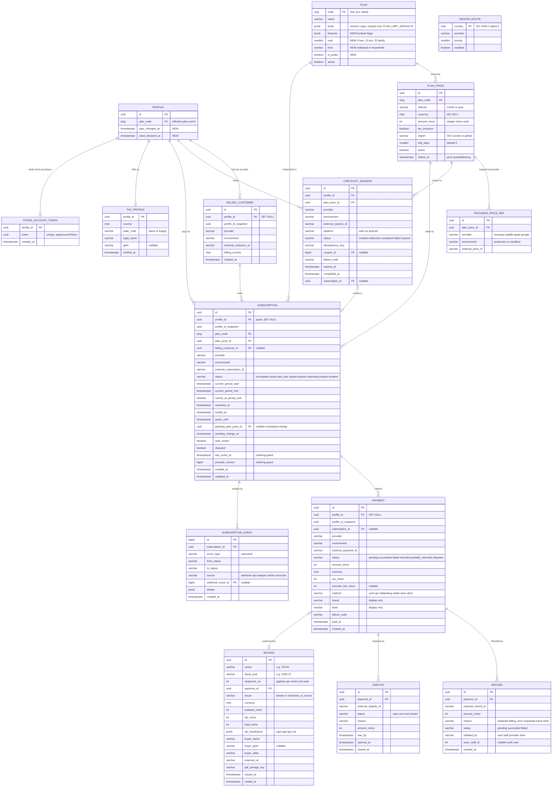
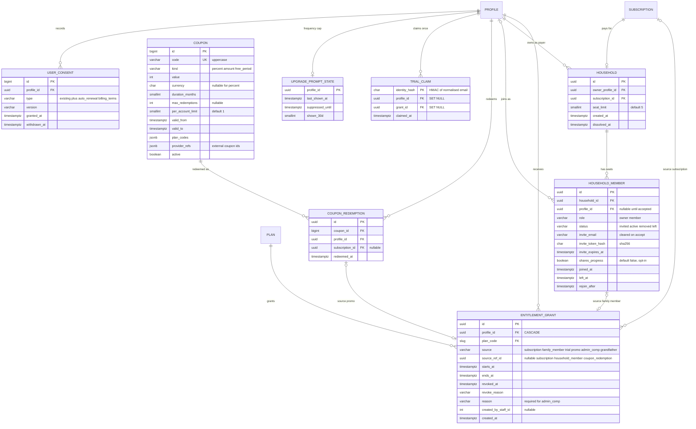
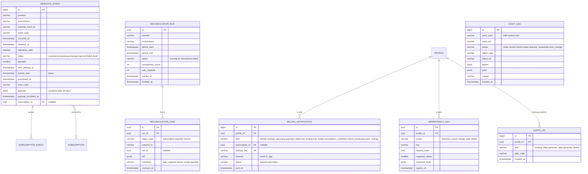

# Twister — Monetization ERD

**Status:** Draft v0.1 · **Owner:** Pawan · **Date:** 2026-10-03 · **Companion:** [`PRD-monetization.md`](./PRD-monetization.md)
**Baseline:** `docs/ERD.md`, `docs/features/06-erd-practice-features.md` and `api/twisters/models.py` (read on 2026-10-03). This document adds tables and changes three existing ones (`Plan`, `Profile`, `UserConsent`); everything else is untouched.

Database: **PostgreSQL (Supabase)**. Conventions follow the codebase: models live in `api/twisters/` (new package `twisters/billing/`, models imported by `twisters/models.py` so the Django app label and `twisters_` table prefix stay the same), enum columns are `TextChoices` with a `CheckConstraint` via the existing `_in()` helper, money is integer minor units, timestamps are `timestamptz` (UTC), and all multi-row invariants are enforced **in the database** where Postgres can (partial unique indexes, CHECKs, exclusion constraints), not only in code.

---

## 1. Design rules

1. **Provider-agnostic.** Provider identity is data (`provider`, `external_*_id`, `environment`), never schema. Adding a provider = new enum value + adapter.
2. **Entitlements are derived, subscriptions are facts.** Provider-synced facts (`Subscription`, `Payment`) feed `EntitlementGrant`s; `Profile.plan` is a denormalised cache of the resolver (PRD §9.6).
3. **Append-only where it matters:** `SubscriptionEvent`, `AuditLog`, `Payment`, `Refund`, `Invoice` (void, never edit). Enforced with DB privileges/triggers (§9).
4. **Idempotent by construction:** every external fact has a unique key `(provider, environment, external_id)`; every client-initiated write has an idempotency key.
5. **Financial records outlive the user.** Money tables use `ON DELETE SET NULL` on the profile plus a `profile_id_snapshot`, **unlike** the rest of the schema which cascades (ADR M-06). `purge_deleted_accounts` anonymises instead of deleting them (§11).
6. **No payment instrument data.** At most `brand` and `last4` (display only). No PAN, CVV, UPI VPA, bank account, or full billing address beyond what tax law requires.
7. **Sandbox is first-class.** `environment ∈ {production, sandbox}` on every provider-sourced row; reporting excludes sandbox.
8. **RLS deny-all** on every new table (same stance as `docs/ERD.md`): the browser never talks to PostgREST; Django connects with the pooler role.

---

## 2. Diagrams

### 2.1 Catalogue, checkout, subscriptions, payments



### 2.2 Entitlements, trials, households, promotions



### 2.3 Integration, operations and audit



---

## 3. Data dictionary

Legend: **PII** classes — `none`, `low` (ids, dates, amounts), `personal` (email, name, GSTIN, address), `restricted` (signed tokens, hashes of identity). **Del** = behaviour when the profile is purged (§11).

### 3.1 Changes to existing tables

| Table | Change | Reason |
|---|---|---|
| `twisters_plan` | Add `features jsonb default '{}'`, `rank smallint not null default 0`, `kind varchar(10) default 'individual'`, `is_public bool default true`. Seed rows `pro` (rank 10) and `family` (rank 20, kind `household`) with `active=false` until launch. `limits` semantics unchanged (merged over `PLAN_LIMIT_DEFAULTS`). Add keys `streak_freeze_max`, `generate_daily_limit`, `generate_max_stored`, `record_max_resolution` | Matrix in PRD §5.2 |
| `twisters_profile` | Add `plan_changed_at timestamptz null`, `adult_declared_at timestamptz null`. `plan_code` FK stays `PROTECT` | Resolver cache; PRD §11.4 |
| `twisters_userconsent` (`ConsentType`) | Add values `auto_renewal`, `billing_terms` (+ `CHECK` update) | PRD §11.1 |
| `twisters_quotahit` | Allow `limit` values `generate_daily`, `generate_stored` (field already `varchar(20)`) | Paywall evidence for AI limits |
| `twisters_featureflag` | Seed flags in PRD §12.6 (all **off**) | Staged rollout |
| Profile CHECK `profile_streak_freezes_range` | Replace the constant `settings.STREAK_FREEZE_MAX` with the DB maximum `5` (the *effective* cap becomes plan-driven in code); one migration, ships in M0 | Pro freeze cap 5 (PRD §5.2) |

### 3.2 New tables

| Table | Purpose | Natural/unique keys | FK on delete | PII | Retention |
|---|---|---|---|---|---|
| `billing_planprice` | Price rows per plan, interval, currency, region. Retired rows stay for grandfathering | `(plan_code, interval, currency, region)` where `retired_at is null` (partial unique) | plan `PROTECT` | none | forever |
| `billing_providerpriceref` | Maps a price to a provider's price/product id per environment | `(provider, environment, external_price_id)` | price `CASCADE` | none | forever |
| `billing_regionroute` | Country → provider routing (data-driven; ADR M-03) | `country` | — | none | forever |
| `billing_customer` | Our link to a provider customer | `(provider, environment, external_customer_id)`; `(profile_id, provider, environment)` | profile `SET NULL` | low | with finance records |
| `billing_checkoutsession` | Funnel + reconciliation of started checkouts | `(provider, environment, external_session_id)` where not null; `(profile_id, idempotency_key)` | profile `CASCADE`, price `PROTECT` | low | 30 days after terminal |
| `billing_subscription` | Provider-synced subscription facts | `(provider, environment, external_subscription_id)` | profile `SET NULL` | low | statutory |
| `billing_subscriptionevent` | Append-only transition log | `id` | subscription `CASCADE`* | low | statutory |
| `billing_payment` | Every payment attempt that reached a terminal state | `(provider, environment, external_payment_id)` | profile `SET NULL`, subscription `SET NULL` | low (brand/last4 display only) | statutory |
| `billing_refund` | Refunds | `(payment_id, external_refund_id)` | payment `PROTECT` | low | statutory |
| `billing_dispute` | Chargebacks | `(payment_id, external_dispute_id)` | payment `PROTECT` | low | statutory |
| `billing_invoice` | Tax invoices (ours on India path; link-out for MoR) | `(series, fiscal_year, sequence_no)` | payment `PROTECT` | personal | statutory (anonymise buyer fields on purge only if law allows **[verify]**) |
| `billing_invoicesequence` | Gapless counter per `(series, fiscal_year)` | `(series, fiscal_year)` | — | none | forever |
| `billing_taxprofile` | Optional GST/VAT buyer data | `profile_id` | profile `CASCADE` (copied onto invoices at issue time) | personal | until purge |
| `billing_storeaccounttoken` | `appAccountToken` per user | `profile_id`, `token` unique | profile `CASCADE` | restricted | until purge |
| `billing_entitlementgrant` | Time-boxed reason for a plan | see §7 | profile `CASCADE` | low | 2 years after end, then purge |
| `billing_trialclaim` | One trial per normalised identity, surviving account deletion | `identity_hash` | profile/grant `SET NULL` | restricted | 24 months |
| `billing_household` | Family container | one live household per owner; one per subscription | owner `CASCADE`, subscription `PROTECT` | low | with owner |
| `billing_householdmember` | Seats | one active seat per profile; `(household_id, profile_id)` | household `CASCADE`, profile `SET NULL` | personal (`invite_email` cleared on accept/expiry) | with household |
| `billing_coupon` / `billing_couponredemption` | Promotions | `code` unique; `(coupon_id, profile_id)` | redemption → profile `CASCADE` | low | forever / until purge |
| `billing_webhookevent` | Inbox for provider events | `(provider, environment, external_event_id)` | subscription `SET NULL` | personal in payload | payload scrubbed 90 d; row 13 months |
| `billing_reconciliationrun` / `…item` | Daily provider-vs-us diffs | — | item → run `CASCADE` | low | 13 months |
| `billing_notification` | Transactional billing messages sent (dedupe) | `dedupe_key` | profile `CASCADE` | low | 13 months |
| `billing_idempotencykey` | Safe retries of client writes | `(profile_id, scope, key)` | profile `CASCADE` | low | 48 h |
| `billing_upgradepromptstate` | Server-side frequency cap for upsell prompts | `profile_id` | profile `CASCADE` | none | until purge |
| `billing_auditlog` | Immutable log of staff/system/billing actions | `id` | none (no FKs; ids stored as text) | low | 7 years **[verify]** |

\* `SubscriptionEvent` cascades from `Subscription`, and `Subscription` is never hard-deleted (only anonymised), so the cascade is a guard rather than a path.

### 3.3 Column notes that matter

**`billing_planprice`**
- `amount_minor > 0` (free plan has no price rows). `tax_inclusive` is true for INR display prices **[verify]**.
- Existing subscribers keep `Subscription.plan_price_id` → the old row (`retired_at` set, `active=false`): that is the grandfathering mechanism (PRD §6.2).

**`billing_subscription`**
- `status` enum: `incomplete | active | past_due | unpaid | paused | canceling | expired | revoked` (PRD §9.4).
- `cancel_at_period_end` and `status='canceling'` are kept consistent by the state machine (`canceling` ⇔ `cancel_at_period_end and status was active`).
- `grace_until` set when entering `past_due`: `max(now + PAST_DUE_GRACE_DAYS, store-provided grace end)`.
- `last_event_at` + `provider_version` implement ordering (PRD §9.5 step 5); an event whose `(occurred_at, provider_version)` is not newer is ignored.
- `external_subscription_id`: Razorpay `sub_…`, Paddle `sub_…`, Apple `originalTransactionId`, Google `purchaseToken` (text, up to 4 KB; hash-indexed, see §8).
- `disputed` is a flag, not a state, so access rules (S-75) do not multiply states.

**`billing_payment`**
- `status` transitions are monotonic except refunds: `pending → succeeded|failed`, `succeeded → partially_refunded → refunded`, `succeeded → disputed → succeeded|refunded`.
- `amount_minor` is the gross charged amount including tax; `tax_minor` the tax part; net = `amount - tax - provider_fee`. Sum of `Refund.amount_minor` ≤ `amount_minor` (enforced by a trigger or a deferred constraint check in `service.refund()`).
- Store payments: one row per renewal transaction; `provider_fee_minor` null until a financial report is imported (Apple/Google reports in M5).

**`billing_entitlementgrant`** — see §7.

**`billing_webhookevent`**
- `status` flow: `received → processing → processed | ignored | failed → (retry) processing … → dead`.
- `locked_until` is the lease (same idiom as `MediaJob`/`ScoringJob`, D36).
- `payload` may contain emails/names; a job nulls it after 90 days and sets `payload_scrubbed_at`.

**`billing_trialclaim`**
- `identity_hash = HMAC_SHA256(TRIAL_PEPPER, normalise(email))`, where `normalise` lowercases, strips `+tag`, and removes dots for Gmail-like domains. Row survives account deletion (it contains no direct identifier), blocking delete-and-retry abuse for 24 months.

**`billing_householdmember`**
- `invite_token_hash = sha256(token)`; the token is 128-bit, shown only in the email link (same approach as share links, D2).
- `rejoin_after` implements the 24 h cooldown after leaving/removal.

---

## 4. Enumerations

| Enum | Values |
|---|---|
| `Provider` | `razorpay`, `paddle`, `apple`, `google`, `manual` |
| `Environment` | `production`, `sandbox` |
| `SubscriptionStatus` | `incomplete`, `active`, `past_due`, `unpaid`, `paused`, `canceling`, `expired`, `revoked` |
| `PaymentStatus` | `pending`, `succeeded`, `failed`, `partially_refunded`, `refunded`, `disputed` |
| `PaymentMethod` | `card`, `upi`, `netbanking`, `wallet`, `store`, `other` |
| `GrantSource` | `subscription`, `family_member`, `trial`, `promo`, `admin_comp`, `grandfather` |
| `CheckoutStatus` | `created`, `redirected`, `completed`, `failed`, `expired` |
| `WebhookStatus` | `received`, `processing`, `processed`, `ignored`, `failed`, `dead` |
| `HouseholdMemberStatus` | `invited`, `active`, `removed`, `left` (role: `owner`, `member`) |
| `DisputeStatus` | `open`, `won`, `lost`, `closed` |
| `NotificationKind` | `receipt`, `renewal_upcoming`, `payment_failed`, `trial_ending`, `trial_ended`, `subscription_ended`, `cancellation_confirmed`, `refund_processed`, `price_change` |
| `CanonicalEvent` | `checkout_completed`, `payment_succeeded`, `payment_failed`, `subscription_activated`, `renewed`, `cancel_scheduled`, `cancel_undone`, `past_due`, `recovered`, `paused`, `resumed`, `expired`, `revoked`, `refunded`, `dispute_opened`, `dispute_won`, `dispute_lost`, `plan_changed`, `price_change_notice` |

All enums are stored as `varchar` with `CHECK (col IN (...))` through `_in()`; adding a value is a migration that rewrites the CHECK (fast, metadata-only on Postgres ≥ 12 with `NOT VALID` then `VALIDATE`).

---

## 5. State machine, provider mapping and side effects

### 5.1 Canonical transitions (the single implementation in `billing/service.py`)

`apply(subscription, event)` runs inside one transaction holding `SELECT … FOR UPDATE` on the Subscription **and then** the payer's Profile row (fixed lock order: subscription → profile; household members are locked in ascending id order — prevents deadlocks).

| From | Canonical event | To | Side effects |
|---|---|---|---|
| (none) | `checkout_completed` + `payment_succeeded` | `active` | create Subscription, `Payment`, grant (`subscription`, ends at `current_period_end`), supersede active trial grant, receipt notification, `entitlement_changed` |
| `incomplete` | `payment_failed` / TTL | `expired` | checkout → `failed`/`expired` |
| `active`, `canceling` | `renewed` | same | extend period and grant `ends_at`, `Payment`, receipt |
| `active` | `payment_failed` | `past_due` | `grace_until` set, grant `ends_at = grace_until`, `payment_failed` notification schedule |
| `past_due` | `recovered` / `renewed` | `active` | clear `grace_until`, grant `ends_at = current_period_end` |
| `past_due` | `expired` (grace/retries over) | `unpaid` → `expired` per provider | grant ended, `Profile.plan` recomputed, `subscription_ended` notification |
| `active` | `cancel_scheduled` | `canceling` | `cancel_at_period_end = true`, confirmation |
| `canceling` | `cancel_undone` | `active` | clear flag |
| `canceling` | `expired` (period end) | `expired` | grant ended |
| `active` | `paused` | `paused` | grant ended at pause start |
| `paused` | `resumed` | `active` | new grant |
| any live | `plan_changed` | same status | update `plan_code`/`plan_price_id`; upgrade → immediate grant swap, downgrade → `pending_plan_price_id`, `pending_change_at` |
| any live | `refunded` (full, current period) | `revoked` | revoke grant now, `Payment.status=refunded` |
| any live | `dispute_opened` | same, `disputed=true` | keep access per policy S-75, alert |
| any live | `dispute_lost` | `revoked` | revoke grant, block checkout (staff review flag in `AuditLog`) |
| any live | `dispute_won` | same, `disputed=false` | log |
| terminal (`expired`, `revoked`) | any payment event | unchanged | recorded but flagged `needs_review` (e.g. late success after expiry creates a *new* subscription only if the provider says so) |

Invalid/unknown transitions are **not** errors: the event is stored `ignored` with a reason and a metric is incremented (convergence over strictness).

### 5.2 Provider event → canonical event (starting map; **[verify against current provider docs while building each adapter]**)

| Canonical | Razorpay | Paddle Billing | Apple ASSN V2 | Google RTDN |
|---|---|---|---|---|
| `checkout_completed` / `subscription_activated` | `subscription.authenticated`, `subscription.activated` | `subscription.created`, `subscription.activated` | `SUBSCRIBED` | `SUBSCRIPTION_PURCHASED` |
| `payment_succeeded` / `renewed` | `subscription.charged`, `payment.captured` | `transaction.completed` | `DID_RENEW` | `SUBSCRIPTION_RENEWED` |
| `payment_failed` | `payment.failed`, `subscription.pending` | `transaction.payment_failed` | `DID_FAIL_TO_RENEW` | `SUBSCRIPTION_IN_GRACE_PERIOD`, `SUBSCRIPTION_ON_HOLD` |
| `past_due` | `subscription.pending` | `subscription.past_due` | `DID_FAIL_TO_RENEW` (grace subtype) | `SUBSCRIPTION_IN_GRACE_PERIOD` |
| `recovered` | `subscription.charged` after pending | `subscription.updated` → active | `DID_RENEW` | `SUBSCRIPTION_RECOVERED` |
| `cancel_scheduled` | `subscription.cancelled` (at cycle end) / API cancel | `subscription.updated` (scheduled change) | `DID_CHANGE_RENEWAL_STATUS` (auto-renew off) | `SUBSCRIPTION_CANCELED` |
| `cancel_undone` | `subscription.resumed` | scheduled change removed | `DID_CHANGE_RENEWAL_STATUS` (on) | `SUBSCRIPTION_RESTARTED` |
| `paused` / `resumed` | `subscription.paused` / `.resumed` | `subscription.paused` / `.resumed` | — | `SUBSCRIPTION_PAUSED` / `…RESTARTED` |
| `expired` | `subscription.halted`, `subscription.completed`, `subscription.cancelled` (immediate) | `subscription.canceled` | `EXPIRED`, `GRACE_PERIOD_EXPIRED` | `SUBSCRIPTION_EXPIRED` |
| `plan_changed` | `subscription.updated` | `subscription.updated` | `DID_CHANGE_RENEWAL_PREF` | (new purchase token linkage) |
| `refunded` | `refund.processed` | `adjustment.created/updated` (refund) | `REFUND` | `SUBSCRIPTION_REVOKED` / voided purchase |
| `revoked` | — | — | `REVOKE` | `SUBSCRIPTION_REVOKED` |
| `dispute_*` | `payment.dispute.created/won/lost/closed` | `adjustment.*` (chargeback) | — | — |
| `price_change_notice` | — | `subscription.updated` | `PRICE_INCREASE` | `SUBSCRIPTION_PRICE_CHANGE_CONFIRMED` |

Signature/auth per provider (PRD §9.5): Razorpay HMAC-SHA256 of the raw body with the webhook secret; Paddle `Paddle-Signature` (`ts` + `h1`) HMAC with tolerance; Apple signed JWS (verify chain and bundle id); Google Pub/Sub push with verified JWT. The event id used for idempotency: Razorpay `x-razorpay-event-id`, Paddle `event_id`, Apple `notificationUUID`, Google Pub/Sub `messageId`.

---

## 6. Worked examples (rows after each step)

**A. New Pro monthly purchase (Razorpay, India)**
1. `CheckoutSession(status=created, idempotency_key=K1)` → provider session created → `redirected`.
2. Webhook `subscription.activated` → `WebhookEvent(received)` → sweeper → `Subscription(status=active, period_end=T+1m)`, `Payment(succeeded)`, `EntitlementGrant(source=subscription, plan=pro, ends_at=T+1m)`, `Profile.plan_code=pro`, `plan_changed_at=now`, `SubscriptionEvent(subscription_activated)`, `BillingNotification(receipt)`, `CheckoutSession(completed, subscription_id=…)`.

**B. Trial then purchase**
1. `TrialClaim(identity_hash)` + `EntitlementGrant(source=trial, plan=pro, ends=T+7d)`; `Profile.plan_code=pro`.
2. Day 5 `BillingNotification(trial_ending)`.
3. Day 6 purchase → grant `subscription` created; trial grant `revoked_at=now, revoke_reason=superseded` (resolver unaffected; no gap).

**C. Failed renewal then recovery**
`past_due` (grace_until = now+7d, grant.ends_at = grace_until) → emails day 0/3/6 → `subscription.charged` on day 4 → `active`, grant.ends_at = new period end.

**D. Family**
Payer buys `family` → `Subscription(plan=family)` + `Household(subscription_id)` + `HouseholdMember(role=owner,status=active)` and a `subscription` grant for the payer. Invite → `HouseholdMember(invited)`. Accept → `status=active, profile_id set, invite_email=null`, `EntitlementGrant(source=family_member, source_ref_id=member.id, plan=pro, ends_at = subscription.current_period_end)`. Renewal extends all member grants in the same transaction. Lapse ends them.

**E. Downgrade with over-quota content** — unchanged rows; only `Profile.plan_code` flips; `media/quota.py` simply sees Free limits; `retention_days` for existing recordings is recalculated by `expire_recordings` using each recording's own `expires_at` captured at creation (so Pro-created recordings keep the 12-month expiry unless the product decision is to shorten them — default: **keep**, per S-60).

---

## 7. Entitlement resolver and invariants

### 7.1 Algorithm (single function `entitlements.resolve(profile_id, now)`)
```sql
-- effective plan for a profile
SELECT p.code
FROM billing_entitlementgrant g
JOIN twisters_plan p ON p.code = g.plan_code AND p.active
WHERE g.profile_id = :pid
  AND g.starts_at <= :now
  AND g.ends_at   >  :now
  AND g.revoked_at IS NULL
ORDER BY p.rank DESC, g.ends_at DESC
LIMIT 1;
-- no row => 'free'
```
`recompute(profile_id)` runs under the Profile lock, calls `resolve`, and if the result differs updates `Profile.plan_code` and `plan_changed_at` and emits `entitlement_changed`. Triggers: after any grant insert/update/revoke, in `apply()`, in `expire_entitlements` (hourly; selects profiles with a grant whose `ends_at` passed since `plan_changed_at`), and lazily on login if `plan_changed_at` is older than the nearest `ends_at` (self-healing).

### 7.2 Database-enforced invariants (constraints)

```sql
-- grants
ALTER TABLE billing_entitlementgrant
  ADD CONSTRAINT grant_window CHECK (ends_at > starts_at),
  ADD CONSTRAINT grant_comp_reason CHECK (source <> 'admin_comp' OR (reason <> '' AND created_by_staff_id IS NOT NULL));

-- one grant per subscription / seat / redemption (renewals extend in place)
CREATE UNIQUE INDEX grant_one_per_source
  ON billing_entitlementgrant (source, source_ref_id)
  WHERE source_ref_id IS NOT NULL AND source IN ('subscription','family_member','promo');

-- one trial grant per profile, ever
CREATE UNIQUE INDEX grant_one_trial_per_profile
  ON billing_entitlementgrant (profile_id) WHERE source = 'trial';

-- subscriptions: one external id per provider/environment
CREATE UNIQUE INDEX sub_external_unique
  ON billing_subscription (provider, environment, external_subscription_id);

-- at most one *live* subscription per profile per provider (cross-provider duplicates are allowed
-- but flagged, PRD S-82)
CREATE UNIQUE INDEX sub_one_live_per_provider
  ON billing_subscription (profile_id, provider)
  WHERE status IN ('incomplete','active','past_due','paused','canceling') AND environment = 'production';

-- payments / events idempotency
CREATE UNIQUE INDEX payment_external_unique ON billing_payment (provider, environment, external_payment_id);
CREATE UNIQUE INDEX webhook_event_unique    ON billing_webhookevent (provider, environment, external_event_id);

-- households
CREATE UNIQUE INDEX member_one_active_seat
  ON billing_householdmember (profile_id) WHERE status = 'active';
CREATE UNIQUE INDEX household_one_per_subscription
  ON billing_household (subscription_id) WHERE dissolved_at IS NULL;
-- seat_limit enforced in service under the household row lock + a CHECK on seat_limit BETWEEN 2 AND 10

-- coupons
ALTER TABLE billing_couponredemption
  ADD CONSTRAINT redemption_once UNIQUE (coupon_id, profile_id);

-- invoices: gapless per series/year
ALTER TABLE billing_invoice
  ADD CONSTRAINT invoice_number_unique UNIQUE (series, fiscal_year, sequence_no);

-- money sanity
ALTER TABLE billing_payment  ADD CONSTRAINT payment_amount_nonneg CHECK (amount_minor >= 0 AND tax_minor >= 0 AND tax_minor <= amount_minor);
ALTER TABLE billing_refund   ADD CONSTRAINT refund_positive       CHECK (amount_minor > 0);
ALTER TABLE billing_planprice ADD CONSTRAINT price_positive       CHECK (amount_minor > 0);
```
Refund total ≤ payment amount is enforced by a `BEFORE INSERT` trigger on `billing_refund` (locks the payment row) and re-checked in code.

### 7.3 Concurrency rules
- **Lock order:** Subscription → Profile(payer) → Household → HouseholdMembers (ascending id) → member Profiles (ascending id). A test asserts the order using the existing `test_lock_queries` approach.
- **Quota checks** keep their current behaviour (`media/quota.py` under the Profile lock). Because `Profile.plan_code` changes under the same lock, an upload reserved under Pro finishes; the next reserve sees Free (S-64).
- **Invoice numbers:** allocated by `UPDATE billing_invoicesequence SET last_number = last_number + 1 … RETURNING` inside the issuing transaction (gapless; a rollback releases the number).
- **Webhook claim:** `UPDATE … SET status='processing', locked_until=now()+interval '2 min' WHERE id = (SELECT id … WHERE status IN ('received','failed') AND next_attempt_at <= now() ORDER BY occurred_at FOR UPDATE SKIP LOCKED LIMIT 1)`; a lease sweeper returns expired leases to `failed` (same pattern as D36).

---

## 8. Indexes and query patterns

| Query | Index |
|---|---|
| Entitlement resolve (per profile, active grants) | `billing_entitlementgrant (profile_id, ends_at DESC) WHERE revoked_at IS NULL` |
| Expiry sweeper (grants that ended) | `billing_entitlementgrant (ends_at) WHERE revoked_at IS NULL` |
| Profile's subscriptions (billing screen) | `billing_subscription (profile_id, status)` |
| Renewal reminders / grace expiry | `billing_subscription (current_period_end) WHERE status IN ('active','canceling')`; `(grace_until) WHERE status='past_due'` |
| Lookup by Google purchase token | `hash index` or `btree on md5(external_subscription_id)` + unique full-value index |
| Webhook claim | `billing_webhookevent (next_attempt_at, occurred_at) WHERE status IN ('received','failed')` |
| Dead-letter alerting | `billing_webhookevent (status) WHERE status='dead'` |
| Payments by subscription / date | `billing_payment (subscription_id, paid_at DESC)`; `(provider, paid_at)` for reconciliation |
| Funnel analytics | `billing_checkoutsession (created_at, status)`; `QuotaHit (created_at)` (existing) |
| Notifications dedupe | unique `dedupe_key` |
| Coupons | unique `code` (stored uppercase, lookups normalised) |
| Trial identity | PK `identity_hash` |
| Reconciliation | `billing_reconciliationitem (run_id, resolution)` |

Expected volumes (design target, 100k MAU, 3% paid): ~3k subscriptions, ~4k payments/month, ~30k webhook events/month (≈10 per payment incl. noise), < 1 GB total after a year — no partitioning needed. `WebhookEvent` is the only table that could grow fast; the 13-month row retention and 90-day payload scrub keep it small.

---

## 9. Security, privacy and access control

| Topic | Rule |
|---|---|
| **RLS** | `ENABLE ROW LEVEL SECURITY` on every `billing_*` table with **no policies** (deny-all for `anon`/`authenticated`); Django connects with the pooler role (bypass) — same stance as `docs/ERD.md`. A test fails if a new table lacks RLS |
| **Append-only tables** | Revoke `UPDATE, DELETE` on `billing_subscriptionevent`, `billing_auditlog`, `billing_payment` (status updates go through a narrow `SECURITY DEFINER` function or a separate role) — or, if the single-role pooler makes that impractical, a `BEFORE UPDATE OR DELETE` trigger that raises for those tables (except the allowed payment-status and refund-amount columns) |
| **PII minimisation** | Only data in §3.2; payment-instrument data limited to `brand`/`last4`; `invite_email` cleared on accept; `WebhookEvent.payload` scrubbed at 90 days; analytics never receive billing fields |
| **Secrets** | Provider keys/secrets in env only (`runbooks/secrets-and-rotation.md`); webhook secrets support **two active values** during rotation; `TRIAL_PEPPER` and `INVITE_TOKEN` salts rotate with a re-hash plan |
| **Staff access** | Django admin permissions: `billing.view_*` for support, `billing.comp_grant` and `billing.refund` for finance/owner; refunds ≥ `REFUND_TWO_PERSON_THRESHOLD` need a second approver recorded in `AuditLog` |
| **Export (D22)** | New whitelist section `billing`: plan, status, dates, amounts, currency, invoice numbers, last 4/brand; never provider ids that allow account takeover (no tokens, no hashes) |
| **Backups** | Included in Supabase PITR; restore rehearsal includes billing tables; after any restore, run `reconcile_billing --since <restore point>` before re-enabling checkout |
| **Encryption** | In transit (TLS), at rest (Supabase); the `restricted` hashes use HMAC with a server-side pepper so a DB leak does not reveal emails |

---

## 10. Migration plan (expand → backfill → contract; every step reversible)

| Step | Migration | Deploy order / notes |
|---|---|---|
| 1 | **Expand:** add nullable/defaulted columns to `Plan`, `Profile`; widen `ConsentType` CHECK; create all `billing_*` tables with RLS and constraints; seed `pro`/`family` plans `active=false`; seed flags `off` | Safe with the old code running (no reader uses them yet) |
| 2 | **Code:** resolver, enforcement helpers, admin, adapters behind flags. `Profile.plan_code` stays `free` for everyone | Feature flags off |
| 3 | **Backfill:** create `grandfather` grants for any staff/testers (none for public users); no change for existing users | Idempotent command `backfill_entitlements` |
| 4 | **Replace** `profile_streak_freezes_range` CHECK (max 5) with plan-driven code cap | One migration; `NOT VALID` then `VALIDATE` |
| 5 | **Enable** M0 flags on staging with provider sandboxes; run chaos drills (PRD §12.5) | |
| 6 | **Contract (later, not before M3):** none planned — new columns are permanent. Any removal is a separate release after two stable versions | |

Rollback: flags off + (if needed) deactivating Pro/Family plans (`active=false`); schema stays (it is additive). `migrate --plan` must be empty in production before and after each release (existing checklist). Migrations are tested by the existing migration tests pattern (`test_*_migrations.py`) including a fresh-DB apply and a data-preserving apply.

---

## 11. Account deletion, purge and anonymisation (changes to D14/D21)

At **deletion request** (`DELETE /me/`): in the same transaction as the existing steps, set every owned `Subscription` to cancel-at-period-end through the provider (no further charges), enqueue `BillingNotification(cancellation_confirmed)`, dissolve nothing yet, and let grants run to the period end. Checkout endpoints answer `403 account_pending_deletion`.

At **purge** (`purge_deleted_accounts`, existing order: media objects → Profile → Supabase user), insert these steps *before* deleting the Profile:
1. Cancel any still-live subscription **at the provider** immediately (store subscriptions cannot be cancelled server-side: send the user a final email explaining how to stop it, and record `needs_user_action`).
2. For `billing_subscription`, `billing_payment`, `billing_customer`, `billing_invoice` rows owned by the profile: set `profile_id = NULL` (FK is `SET NULL`), keep `profile_id_snapshot` only as an opaque uuid (not reversible without the deleted profile), null `billing_invoice.buyer_name`/`buyer_gstin` **only where the statute allows**, otherwise keep per retention **[verify]**.
3. Delete: grants, household memberships (dissolve households the profile owns; notify members), coupon redemptions, `TaxProfile`, `StoreAccountToken`, `UpgradePromptState`, `BillingNotification`, `IdempotencyKey`, `CheckoutSession` (all `CASCADE`).
4. Delete the provider **customer** record via API where supported (Paddle/Razorpay) after finance exports are archived; if the provider refuses (open disputes/refund windows), retry on next run and keep the account `pending` (same retry semantic as D21 for storage failures).
5. Keep `TrialClaim` (no direct identifier) and `AuditLog` entries (ids only).

**Retention job** (`prune_billing`, daily): scrub `WebhookEvent.payload` > 90 d; delete `CheckoutSession` terminal > 30 d, `IdempotencyKey` expired, `BillingNotification`/`ReconciliationRun` > 13 months, `TrialClaim` > 24 months, ended grants > 2 years.

---

## 12. Scheduled jobs (management commands, scheduled like the existing `manage-command.yml` workflows)

| Command | Cadence | Purpose | Safe when billing flags are off? |
|---|---|---|---|
| `process_billing_events` | `*/2 * * * *` | Claim and apply `WebhookEvent`s; lease sweeper | **Yes — always on** |
| `verify_pending_checkouts` | `*/5` | Fetch provider state for sessions with no webhook (S-32) | Yes |
| `expire_entitlements` | hourly | End time-based grants, recompute plans | **Always on** |
| `send_billing_notifications` | hourly | Trial ending, renewal upcoming, grace reminders (dedupe by key) | Only sends for existing subscribers |
| `apply_pending_plan_changes` | hourly | Downgrades at period end | Yes |
| `reconcile_billing` | daily | Provider vs ours, repair/alert | Yes |
| `prune_billing` | daily | Retention (§11) | Yes |
| `billing_metrics_snapshot` | daily | MRR/ARR/churn rollups (derived, rebuildable) | Yes |

---

## 13. Impact on existing code (checklist)

| Area | Change |
|---|---|
| `media/quota.py:limits_for` | No change required (reads `profile.plan.limits` merged over defaults). Add keys to Pro/Family rows |
| `generate/quota.py`, `GENERATE_DAILY_LIMIT`, `GENERATE_MAX_STORED` | Replace the settings constants with `plan.limits.generate_daily_limit` / `generate_max_stored` falling back to the settings values (Free unchanged) |
| `progress/streaks.py` freeze banking | Use `plan.limits.streak_freeze_max` instead of the constant (DB CHECK widened in step 4) |
| `errors.py` | Add `plan_required`, `adult_required` exists, `subscription_exists`, `trial_used`, `billing_unavailable` |
| `account/export.py` | Add `billing` whitelist section |
| `account/deletion.py`, `purge_deleted_accounts` | Steps in §11 |
| `practice/flags.py` + `web/src/lib/flags.ts` | New flags (`DEFAULT_FLAGS` all false) |
| `management/commands/plan_demand_report.py` | Add paywall funnel and trial metrics once events exist |
| `web` | New routes `/pricing`, `/account/billing`, upgrade sheet component; provider SDKs lazy-loaded; CSP changes for those routes only; analytics allow-list additions |
| `web/bundle-budget.json` | Add budgets for the new routes; keep Home and Practice Hub budgets unchanged |
| `.github/workflows/manage-command.yml` | Add the commands in §12 |
| Docs | `07-api-contract.md` (new endpoints), `15-rollout-and-flags.md` (flag matrix rows), `11-decisions-log.md` (ADRs M-01…M-14), runbooks (PRD §12.4) |

---

## 14. Schema test checklist (CI)

- Every `billing_*` table has RLS enabled and no policies.
- Every enum column has a CHECK and the model enum matches the CHECK.
- Unique/partial-unique indexes in §7.2 exist (introspection test).
- Property test: random event orders and duplicates produce the same final `Subscription`, `Payment` set and grants.
- Resolver tests: stacking, expiry boundary (`ends_at` exclusive), revoked grants, trial supersession, family lapse.
- Money tests: refunds never exceed payment; tax ≤ amount; integer minor units only.
- Lock-order test (no deadlock under concurrent renew + member leave + downgrade).
- Purge test: after `purge_deleted_accounts`, financial rows remain with `profile_id IS NULL`, no PII columns populated beyond the allowed set, no `invite_email`/payload residue.
- Export test: `billing` section contains only the whitelisted fields.
- Migration tests: fresh apply, apply over a populated DB, `migrate --plan` empty afterwards, reversible where applicable.
