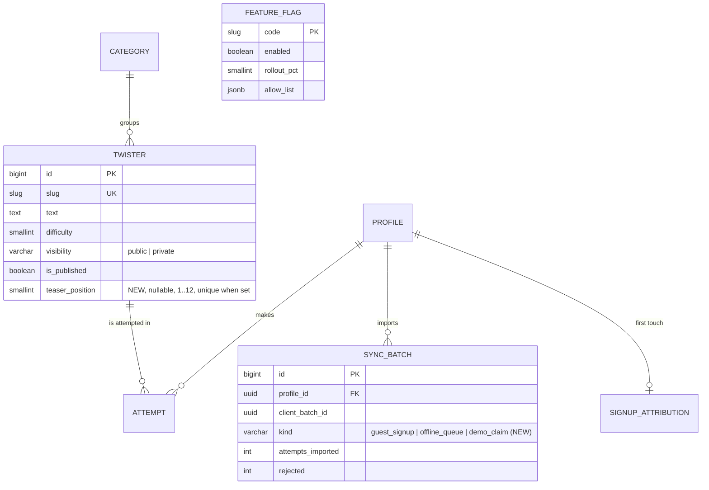
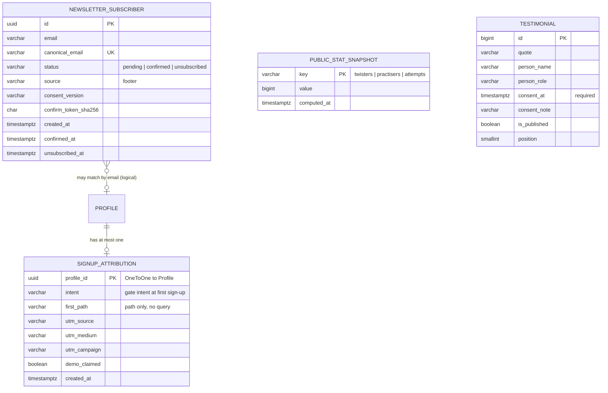
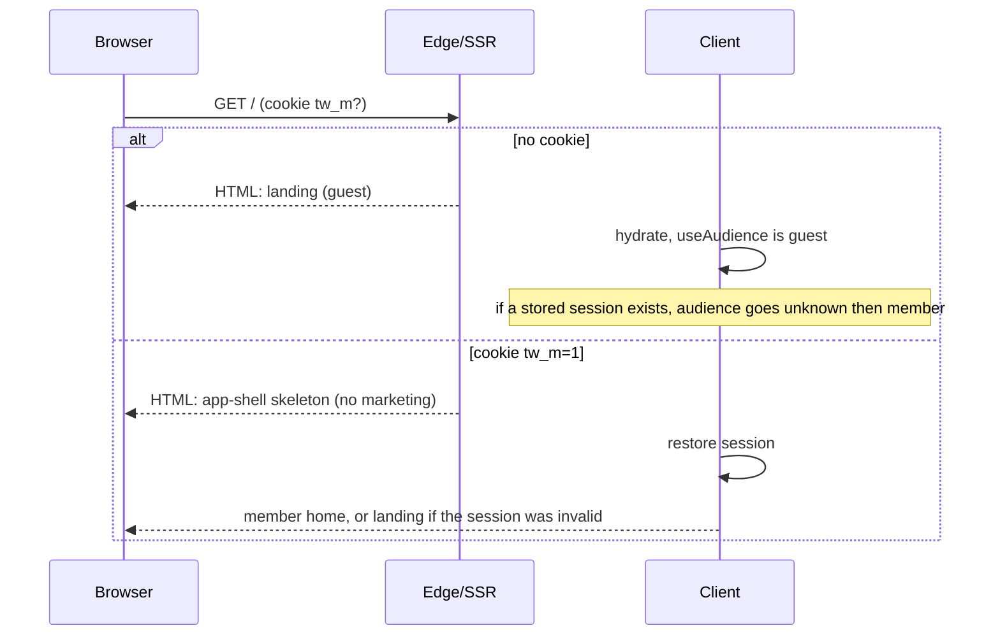
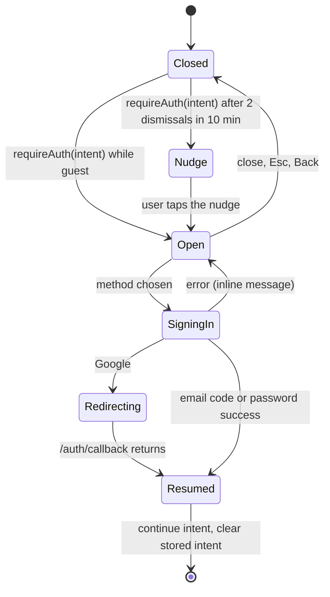

# Twister — Public Site & Sign-in Gate (ERD)

**Status:** Draft v0.2 · **Owner:** Pawan · **Last updated:** 2026-10-04
**Companion:** [PRD-public-site.md](PRD-public-site.md) · **Extends:** [ERD.md](ERD.md) · [features/06-erd-practice-features.md](features/06-erd-practice-features.md) · [features/07-api-contract.md](features/07-api-contract.md)

> ERD here follows this repo's convention (**E**ntity-**R**elationship **D**iagram plus the contract notes that go with it, like `ERD.md` and `ERD-monetization.md`). It covers the data model, the API contract, caching and abuse controls, and the client architecture that the PRD needs. Section numbers (§) in the PRD point here as "ERD §n".

Database: **PostgreSQL (Supabase)** through Django (`api/twisters/models.py`). The browser never talks to PostgREST, so **every new table gets RLS enabled with no policies** (same rule as `ERD.md`).

---

## 1. Scope and principles

1. **Small data footprint.** The public site is mostly presentation. We add **one column** to `Twister`, **three small tables** (+ one optional) and **one enum value**. Copy, demo content and design tokens live in code, not in the database.
2. **The API is the gate.** Anything an anonymous caller should not get is not returned. The UI never "hides" data it already holds.
3. **No new identity for anonymous visitors.** We do not create anonymous accounts, device ids or server-side visitor rows. Anonymous state is `sessionStorage` / `localStorage` on the device only.
4. **Reuse before invent.** Guest-to-account transfer reuses `SyncBatch` / `POST /sync/guest/`; flags reuse `FeatureFlag`; throttles reuse `IpRateThrottle`; errors reuse `ApiProblem`; unsubscribe reuses the signed-token pattern of reminders.
5. **Rollback is a flag.** Nothing here is destructive; turning `public_site` off restores today's behaviour.

---

## 2. Entities touched (existing → changed or read)



Existing entities **not** changed: `Profile`, `Attempt`, `Favorite`, `UserPreference`, `Recording`, `MediaAsset`, scoring tables. The public site only reads from them through existing endpoints.

---

## 3. New and changed entities

### 3.1 Overview



`PublicStatSnapshot` and `Testimonial` have no foreign keys: the first is derived by a job, the second is editorial content. The curated teaser is **a column on `Twister`** (§3.2), not a table.

### 3.2 `Twister.teaser_position` (changed table, P0)

| Column | Type | Rules |
|---|---|---|
| `teaser_position` | `smallint null` | `1..TEASER_SIZE` (config, default 12). **Unique when not null.** Only public, published twisters may have one. Set in Django admin (`list_editable`). |

Constraints:
```python
models.UniqueConstraint(fields=["teaser_position"], condition=Q(teaser_position__isnull=False),
                        name="twister_teaser_position_unique")
models.CheckConstraint(
    condition=Q(teaser_position__isnull=True)
    | Q(teaser_position__gte=1, visibility="public", owner__isnull=True, is_published=True),
    name="twister_teaser_public_only")
```
- The existing `twister_visibility_owner` check already keeps private rows unpublished; the new check makes it **impossible to leak a private twister into the teaser**.
- **Auto-fill when curated rows are fewer than `TEASER_SIZE`** (new database, test data, or one was unpublished): re-run the selection rule below over public published twisters. Pure function `progress/teaser.py::select_teaser()`; deterministic and unit tested. Auto-filled rows are **not** written back, so curation stays explicit.
- Index: the partial unique index doubles as the access path for ordering the curated head.

**Selection rule (decided; PRD §9.1).** For each level 1→4 take the first three twisters by `(difficulty, id)`; then, while a sound family (category) is missing, swap that family's earliest twister into its own level, replacing the level's pick from the most over-represented family (latest pick on ties). The same function produces the seed data and the fallback, and the CI check asserts the stored curation equals its output.

**Seed data (set via the existing seed file).** `seed_twisters` upserts with every key of an entry as a default, so adding `"teaser_position": N` to these twelve entries in `api/twisters/data/twisters.json` is enough (no data migration):

| `teaser_position` | slug | level | family |
|---|---|---|---|
| 1 | `sam-sam-sheep` | 1 | hissers |
| 2 | `fat-frogs` | 1 | th-tangles |
| 3 | `big-black-bug` | 1 | poppers |
| 4 | `she-sells-seashells` | 2 | hissers |
| 5 | `snake-slithers` | 2 | hissers |
| 6 | `unique-new-york` | 2 | vowel-vortex |
| 7 | `cooks-cook` | 3 | poppers |
| 8 | `red-lorry-yellow-lorry` | 3 | rollers |
| 9 | `truly-rural` | 3 | rollers |
| 10 | `six-sick-sheiks` | 4 | hissers |
| 11 | `pad-kid-poured` | 4 | poppers |
| 12 | `irish-wristwatch` | 4 | brain-benders |

The set is **identical for every anonymous caller** (no per-user or random ordering). Because the seed upserts without clearing keys on other entries, removing a twister from the teaser means setting its `teaser_position` to `null` in the file (or the admin).

### 3.3 `SyncKind.DEMO_CLAIM` (changed enum, P0)

`SyncBatch.kind` gains `demo_claim = "demo_claim"` (`max_length=14` already fits). Meaning: one idempotent import of a **demo result** captured before sign-up. Rules on the import (reusing `guest_sync.import_batch`):
- At most **one** `demo_claim` batch per profile (a partial unique index on `(profile_id)` where `kind = 'demo_claim'`).
- Exactly one attempt in the payload; its `created_at` must be within 24 h of receipt; the `twister` slug must be public.
- The transcript is **re-scored on the server**; the stored attempt is `provisional`, earns **no XP, streak or achievements** (existing guest-import rule), and is flagged `source=demo` in the batch receipt only (no new column on `Attempt`).
- A repeat of the same `client_batch_id` returns `200 Idempotent-Replay` with the same counts.

### 3.4 `SignupAttribution` (new table, P0)

First-touch context of a sign-up, so we can answer "which gate or page produced accounts" without a third-party tool.

| Column | Type | Notes |
|---|---|---|
| `profile` | `OneToOne → Profile`, PK, `on_delete=CASCADE` | At most one per account |
| `intent` | `varchar(16)` enum | `practise, save_demo, favourite, generate, record, locked_filter, locked_nav, hero_cta, header_cta, footer_cta, direct` |
| `first_path` | `varchar(120)` | **Path only**: query and fragment are stripped client-side and again server-side |
| `utm_source`, `utm_medium`, `utm_campaign` | `varchar(40)` each, blank allowed | Whitelisted charset `[a-z0-9_.-]`, lower-cased, truncated |
| `demo_claimed` | `boolean` | Set when a `demo_claim` batch succeeds |
| `created_at` | `timestamptz` | |

Rules:
- Written by `POST /me/attribution/` **once**, right after the first authenticated session on a device that holds a pending attribution record (`localStorage` `twister.attr.v1`, created on the landing visit). Create-if-absent; later calls return `200` with the stored row and do not change it.
- **No IP, user agent, referrer URL or device id.** Disclosed in `/privacy`; included in `GET /me/export/`; removed with the profile (FK cascade, existing deletion purge).
- Never used for ranking, pricing or access decisions.

### 3.5 `NewsletterSubscriber` (new table, P1, behind flag `newsletter`)

Independent of `ReminderPreference` (practice reminders are transactional and tied to an account; a newsletter is marketing and can be for non-members).

| Column | Type | Notes |
|---|---|---|
| `id` | `uuid` PK | |
| `email` | `varchar(254)` | As typed, trimmed |
| `canonical_email` | `varchar(254)`, **unique** | Via the same canonicaliser as `Profile.canonical_email` (`emailpolicy.py`): one row per inbox |
| `status` | enum `pending`, `confirmed`, `unsubscribed` | |
| `source` | `varchar(16)` | `footer` |
| `consent_version` | `varchar(8)` | The wording the person saw (`v1`) |
| `confirm_token_sha256` | `char(64)` | Hash of the confirmation token; the raw token exists only in the email |
| `created_at`, `confirmed_at`, `unsubscribed_at` | `timestamptz` | |

Rules: double opt-in (a `pending` row older than 7 days is deleted by a daily job); disposable domains rejected with the same neutral response as any other success; unsubscribe is one click through a signed token (same mechanism as `public/unsubscribe/<token>/`); an unsubscribed address is **never re-added** by a repeat sign-up form submission (the row stays `unsubscribed`; resubscribe requires the confirm email again).

### 3.6 `PublicStatSnapshot` (new table, P0)

Cheap, cacheable numbers for social proof, computed offline so a landing request never aggregates `Attempt`.

| Column | Type | Notes |
|---|---|---|
| `key` | `varchar(24)` PK | `twisters`, `practisers_30d`, `attempts_30d` |
| `value` | `bigint` | |
| `computed_at` | `timestamptz` | |

- Written by management command `refresh_public_stats` (hourly cron, same pattern as `build_leaderboard`, e.g. `41 * * * *`).
- **Display floor** (config `PUBLIC_STAT_FLOOR`, default 500): the API returns `practisers` and `attempts` as `null` while below it, and the UI then omits the claim (PRD §15.2). `twisters` is always returned (it is a live count from the catalogue, not a snapshot, so it is never stale).
- Counting rules: `practisers_30d` counts distinct profiles with a **non-provisional or provisional attempt** in the last 30 days, excluding profiles pending deletion; never exposes per-user data.

### 3.7 `Testimonial` (new table, P2, optional)

Only real, consented quotes. A row without `consent_at` can never be published (`CheckConstraint(is_published=False OR consent_at IS NOT NULL)`). Fields: `quote` (≤ 280), `person_name`, `person_role`, `consent_at`, `consent_note` (where the consent is recorded), `is_published`, `position`. Read through the landing endpoint only when at least one published row exists; otherwise the section does not render (no placeholders).

### 3.8 Feature flag rows (data, no schema)

| `code` | Seed | Meaning |
|---|---|---|
| `public_site` | off, then on at launch | Master switch. **Off = guest-first behaviour** (PRD §19) |
| `landing_demo` | on | The demo card on `/` |
| `newsletter` | off | Footer newsletter |

Anonymous visitors evaluate flags only when `enabled` **and** `rollout_pct ≥ 100` (existing rule, `docs/features/15`), which is exactly what a kill-switch needs. A percentage experiment on anonymous traffic is **not** supported (see PRD Q3).

### 3.9 Constants (settings, not tables)

`TEASER_SIZE=12`, `TEASER_MIN_VALID=8`, `PUBLIC_STAT_FLOOR=500`, `DEMO_CLAIM_MAX_AGE_HOURS=24`, `ANON_DETAIL_RATE="60/min"`, `NEWSLETTER_RATE="5/h"` (per IP), `NEWSLETTER_PENDING_DAYS=7`.

---

## 4. API contract

Conventions follow `features/07-api-contract.md`: `/api/v1`, uniform error envelope `{"error":{code,message,details,request_id}}`, `X-Request-Id` on every response, additive within `/v1`. 🔓 = anonymous allowed, 🔐 = signed in.

### 4.1 `GET /public/landing/` 🔓 (new)
One call for everything the landing page needs from the server. Server-rendered through the route loader on first load.

```json
{
  "library_total": 205,
  "teaser": [ { "slug":"…","text":"…","difficulty":1,"difficulty_label":"Easy","origin":"classic",
                "tip":"…","category":"hissers","word_count":8,
                "best_score":null,"mastery":null,"is_favorite":false } ],
  "facets": { "levels": {"1":12,"2":14,"3":12,"4":6},
              "categories": {"hissers":9,"…":0} },
  "stats": { "twisters":205, "categories":6, "levels":4,
             "practisers": null, "attempts": null, "as_of":"2026-10-04T05:41:00Z" },
  "testimonials": []
}
```
- `teaser` uses the **same serializer as the list**, with all member-only fields `null/false`.
- Caching: `Cache-Control: public, max-age=60, s-maxage=300, stale-while-revalidate=3600`. No `Vary` on auth (the response is identical for everyone; if a member calls it, they still get the anonymous shape).
- Throttle: global `anon` rate. Failure mode: the web app renders from static fallbacks in `content/landing.ts` and `content/demo.ts`.

### 4.2 `GET /twisters/` 🔓 (changed behaviour for anonymous callers)

| Caller | Behaviour |
|---|---|
| **Signed in** | Unchanged |
| **Anonymous** | Results are limited to the **teaser set** (curated head + auto-fill), in `teaser_position` order. `difficulty`, `category`, `origin` and `search` filters apply **within** that set. `status`, `sort` and `ordering` parameters are ignored. `page` ≥ 2 → `401` with code **`auth_required`**. |

Anonymous response shape (extends the normal pagination envelope):
```json
{ "count": 12, "next": null, "previous": null, "results": [ … ],
  "library_total": 205, "locked": true }
```
- `locked: true` tells the client to render the unlock affordances; `library_total` is the real number (a selling point, §E-14 in the PRD).
- Error code `auth_required` is an `ApiProblem(401, "auth_required", "Sign in to see more twisters.")`, deliberately distinct from the generic `unauthenticated`, so the client opens the gate with the right message.
- Caching for anonymous responses: `public, max-age=60, stale-while-revalidate=300` (existing `ANON_FACET_CACHE` pattern). Authenticated responses stay `private, no-store`.
- Implementation point: `TwisterViewSet.list` / `filter_queryset` (`api/twisters/views.py`) and `progress/browse.refine`. The branch is `if not request.user.is_authenticated` and is guarded by the `public_site` flag (off → current behaviour).

### 4.3 `GET /twisters/facets/` 🔓 (unchanged)
Public totals across the **whole** catalogue (counts only), by design (PRD E-14).

### 4.4 `GET /twisters/{slug}/` 🔓 (unchanged shape, new throttle)
Text, tip and metadata stay public for every **public** slug (SEO). Private slugs remain 404 for non-owners. Add an IP-scoped throttle `public_twister` (`ANON_DETAIL_RATE`, 60/min/IP, `IpRateThrottle`, applies **only to anonymous** callers). Responses keep today's headers; private twisters stay `private, no-store`.

### 4.5 `POST /sync/guest/` 🔐 (extended)
Existing endpoint. New accepted value `kind: "demo_claim"` with the constraints in §3.3. Example:
```json
{ "client_batch_id": "6f1c…", "kind": "demo_claim",
  "attempts": [ { "client_attempt_id": "…", "twister": "she-sells-sea-shells",
                  "transcript": "she sells sea shells by the sea shore",
                  "duration_ms": 4100, "created_at": "2026-10-04T05:50:12Z",
                  "stt": { "engine": "text_layer", "confidence": null } } ],
  "favorites": [] }
```
Responses: `201 {attempts_imported:1, favorites_imported:0, rejected:0}`; replay → `200` + `Idempotent-Replay: true`; a second claim under a **different** batch id → `200` with `rejected:1` and `details.reason: "demo_already_claimed"` (not an error: the UI says "You already saved a demo score").

### 4.6 `POST /me/attribution/` 🔐 (new)
Body `{ "intent": "practise", "first_path": "/twisters/peter-piper", "utm": {"source":"x","medium":"social","campaign":"launch"} }` → `201` (created) or `200` (already exists; stored values returned unchanged). Validation: intent in the enum, `first_path` starts with `/`, query stripped, ≤ 120 chars; UTM values sanitised per §3.4. Throttle: user rate; idempotent by design.

### 4.7 Newsletter (P1, flag `newsletter`) 🔓
- `POST /public/newsletter/` `{ "email": "…", "source": "footer", "website": "" }` → **always `202`** with a neutral body (no enumeration). `website` is a honeypot: non-empty → `202` and no row. IP throttle `NEWSLETTER_RATE`. Disposable or malformed addresses → `202` and no email sent.
- `GET /public/newsletter/confirm/{token}/` → sets `confirmed` (idempotent), redirects to `/` with `?subscribed=1`.
- `GET|POST /public/newsletter/unsubscribe/{token}/` → one-click, idempotent (same signed-token mechanism as reminders, `UnsubscribeThrottle`).
- Emails use the existing mail settings; never sent while `EMAIL_*` is unset (the job refuses to run, like reminders).

### 4.8 `GET /flags/` 🔓 (unchanged)
Returns `public_site`, `landing_demo`, `newsletter` like any other flag. `DEFAULT_FLAGS` in `web/src/lib/flags.ts` gets `public_site: true`, `landing_demo: true`, `newsletter: false` as the pre-answer fallback (as built: the public site ships on and the server flag is the kill switch, so a slow flags call still renders the landing instead of flashing the old home).

### 4.9 Errors added
| Status | Code | When |
|---|---|---|
| 401 | `auth_required` | Anonymous request beyond the teaser (`page ≥ 2`) |
| 429 | `rate_limited` | Throttles above (existing code) |
| 200 | (receipt) `details.reason: demo_already_claimed` | Second demo claim |

---

## 5. Client architecture

### 5.1 Auth view state (single source of truth)
```ts
type Audience = 'unknown' | 'guest' | 'member'
// unknown: supabase-js is restoring a stored session (mayHaveSession() && loading)
// guest:   no stored session, or the restore finished with none
// member:  session present
```
A tiny hook `useAudience()` derives it from `useAuth()` and `mayHaveSession()`. Rules: `unknown` renders skeletons only; `guest` renders public views; `member` renders the app. **No component decides by `session` alone** for public/private views.

### 5.2 Rendering the right view at `/`

- `tw_m` is a **hint**, not authority: constant value `1`, `SameSite=Lax; Path=/; Max-Age=30d`, **set on `SIGNED_IN`/`TOKEN_REFRESHED`, cleared on `SIGNED_OUT`** (in `AuthProvider`). The server never trusts it for data; the API verifies the JWT as today.
- Responses that depend on the cookie send `Vary: Cookie` and are not CDN-cached for longer than 60 s.
- The server-side read of the cookie happens in the root route's server-only step (a TanStack Start server function / request context; **verify the exact API against the pinned `@tanstack/react-start` version** when implementing, because the package is on `latest`).
- `flags` for the landing: the SSR loader fetches `/flags/` once (anonymous, cached 60 s) and passes the evaluated `public_site` to the client so the first paint is correct; the client then follows the normal `useFlags()` refresh.

### 5.3 Components and files (proposed)
```
web/src/
  content/
    landing.ts              # typed copy: sections, FAQ, personas (PRD Appendix A)
    demo.ts                 # 3 demo twisters (text, tip, slug); CI-checked
  lib/
    gate/
      intent.ts             # types, serialise/parse, 30-min expiry, safePath reuse
      useGate.tsx           # context + requireAuth(intent, ctx), dismiss memory
      inAppBrowser.ts       # UA detection for E-24
    public/
      useAudience.ts        # unknown | guest | member
      hintCookie.ts         # set/clear tw_m
      attribution.ts        # capture on landing, flush after first sign-in
      teaser.ts             # client filter/search over the 12
  components/
    public/
      PublicHeader.tsx  PublicFooter.tsx  ProseLayout.tsx
      GateSheet.tsx  RequireAuth.tsx  LockedCard.tsx  UnlockPanel.tsx
      landing/ Hero.tsx  DemoCard.tsx  ProofStrip.tsx  PromiseText.tsx  HowItWorks.tsx
               ModesStack.tsx  Personas.tsx  TeaserCarousel.tsx  PrivacyBand.tsx
               Compatibility.tsx  Faq.tsx  FinalCta.tsx
      motion/  Reveal.tsx ScrollText.tsx StickyStage.tsx StackedCards.tsx Marquee.tsx
               SnapCarousel.tsx Parallax.tsx LottieOnView.tsx FooterWordmark.tsx
    practice/GatedStage.tsx          # replaces the hub for guests on /twisters/$slug
  routes/
    index.tsx               # splits: PublicLanding (lazy) | MemberHome (lazy) by audience
    twisters.index.tsx      # guest: teaser view; member: unchanged
    twisters.$slug.tsx      # guest: info page + GatedStage; member: hub unchanged
    privacy.tsx  terms.tsx  about.tsx  $.tsx (404, P1)
    s.$token.tsx  r.$token.tsx   # add public chrome + "Beat this" band
```
Changes in existing files:
- `routes/__root.tsx`: choose `PublicHeader`/`Header` and mount `PublicFooter` by audience and route; mount `GateProvider`; add `DemoClaim` beside `GuestSync`.
- `components/header/destinations.ts`: unchanged for members; guests get anchors via `PublicHeader`.
- `components/practice/SpeakAndScore.tsx` and `lib/usePracticeSubmit.ts`: keep the guest code path **behind `!publicSite`** (rollback), remove nothing yet.
- `components/progress/FavoriteButton.tsx`: guest tap → `requireAuth('favourite')` when `public_site` is on.
- `lib/observability/events.ts`: add the events of PRD §16 to `EVENT_RULES` and `EventProps`.
- `lib/flags.ts`: add the three flag defaults.
- `e2e/guest.spec.ts`: update the `/favorites` expectations for gated copy.

### 5.4 Gate state machine

- Any `session` change to non-null while `Open` → `Resumed`.
- Opening writes `?gate=<intent>` with `replace`; closing removes it.

### 5.5 Client storage inventory (all non-sensitive, all wrapped in try/catch via `lib/storage.ts`)
| Key | Store | Content | TTL / clearing |
|---|---|---|---|
| `twister.returnTo` | `sessionStorage` | same-origin path (existing) | taken on sign-in |
| `twister.gate.v1` | `sessionStorage` | `{intent, slug?, mode?, demoResultId?, exp}` | 30 min; cleared on resume |
| `twister.gate.dismiss.v1` | `sessionStorage` | dismiss timestamps | 10 min window |
| `twister.demo.v1` | `sessionStorage` | `{slug, transcript, durationMs, score, at}` | 24 h; cleared after claim |
| `twister.attr.v1` | `localStorage` | `{intent, first_path, utm, at}` | until first successful `POST /me/attribution/`; 30-day cap |
| `twister.guest.v1` | `localStorage` | legacy guest attempts/favourites (existing) | imported then cleared by `GuestSync` |
| `tw_m` | cookie | constant `1` (hint) | 30 d; cleared at sign-out |

### 5.6 Loaders and data fetching
| Route | Server-side loader | Client queries |
|---|---|---|
| `/` (guest) | `GET /public/landing/` + `GET /flags/` | none until the carousel/FAQ interactions need nothing more |
| `/twisters` (guest) | teaser list from `GET /twisters/` | `facets` (public, cached) |
| `/twisters/$slug` | `GET /twisters/{slug}/` (already) | `related` taken from the cached teaser |
| `/privacy`, `/terms`, `/about` | none (static) | none |

Query keys include the audience (`['twisters', s, audience]`) so a sign-in invalidates the teaser cache and shows the full library immediately.

---

## 6. Migrations, jobs and checks

### 6.1 Migrations (one per concern, additive and reversible)
1. `00xx_twister_teaser_position`: column + the two constraints (§3.2).
2. `00xx_synckind_demo_claim`: enum value + partial unique index `(profile_id) WHERE kind='demo_claim'`.
3. `00xx_signup_attribution`: table + RLS.
4. `00xx_public_stat_snapshot`: table + RLS + seed rows (`twisters`, `practisers_30d`, `attempts_30d`, value 0).
5. `00xx_public_flags`: `FeatureFlag` rows `public_site` (off), `landing_demo` (on), `newsletter` (off).
6. P1: `00xx_newsletter_subscriber`; P2: `00xx_testimonial`.

Next migration numbers follow the repo (after `0017`, check the latest in `api/twisters/migrations/`). RLS for each new table:
```sql
alter table twisters_signupattribution    enable row level security;
alter table twisters_publicstatsnapshot   enable row level security;
alter table twisters_newslettersubscriber enable row level security;
alter table twisters_testimonial          enable row level security;
```
Rollback: dropping the new tables and the column is safe because nothing else references them; the enum value can stay unused.

### 6.2 Jobs
| Job | Schedule | Does |
|---|---|---|
| `refresh_public_stats` | hourly (`41 * * * *`) | Recomputes `PublicStatSnapshot` (no per-user data) |
| `purge_pending_newsletter` | daily | Deletes `pending` rows older than `NEWSLETTER_PENDING_DAYS` (P1) |

Both are plain management commands added to the existing `manage-command.yml` workflow, harmless while their flags are off.

### 6.3 Data lifecycle
| Data | Export (`/me/export/`) | Deleted with account |
|---|---|---|
| `SignupAttribution` | included | cascade |
| `SyncBatch` (`demo_claim`) | included (existing) | cascade |
| `NewsletterSubscriber` | **not** in the export (not account data) unless the email matches; on account deletion we also delete a matching row | by email match at purge time |
| Browser keys (§5.5) | n/a | cleared at sign-out where applicable; `sessionStorage` dies with the tab |

### 6.4 CI and operational checks
- **`manage.py check_public_site`** (run in CI and daily): fails when fewer than `TEASER_MIN_VALID` public published twisters resolve for the teaser, when any curated twister is private or unpublished, when a teaser level or any of the six sound families has no representative, when the stored curation differs from `select_teaser()`, and when a slug in `web/src/content/demo.ts` is missing, not public, or not in the teaser. The web repo exports the demo slugs to a small JSON read by the check (`web/scripts/export-demo-slugs.mjs`), so API and web cannot drift.
- Existing checks stay: bundle ratchet (`web/bundle-budget.json`: add the guest `/` entry), `sync-disposable-domains --check`, `tsc`, Prettier, ESLint, Ruff.
- Playwright: public suites listed in PRD Appendix B; a11y project extended to guest public routes in dark, light and reading themes.

---

## 7. Capacity, caching and abuse summary

| Surface | Cache | Throttle | Abuse note |
|---|---|---|---|
| `GET /public/landing/` | public, s-maxage 300, SWR 1 h | `anon` 120/min | Static for everyone, one DB read per revalidation |
| `GET /twisters/` (anon) | public, 60 s, SWR 300 | `anon` 120/min | Teaser only; `page ≥ 2` is a cheap 401 |
| `GET /twisters/{slug}/` (anon) | as today | `public_twister` 60/min/IP | Slug crawling accepted and bounded (PRD E-13) |
| `GET /twisters/facets/` | public, 60 s | `anon` | Counts only |
| `POST /me/attribution/` | none | user | Idempotent create-if-absent |
| `POST /sync/guest/` (demo) | none | `attempts_sync` 10/min | One claim per account, re-scored on the server |
| Newsletter endpoints | none | 5/h/IP + honeypot | No enumeration; double opt-in |

Expected load impact is small: the landing and anonymous list are cacheable and identical for everyone; the only new write paths are attribution (once per account) and the optional newsletter.

---

## 8. Open items and resolved decisions
Resolved in v0.2: footer content (LinkedIn plus a maker credit, no legal links), the 12 teaser twisters and the demo set, and "no A/B test, ship behind the kill switch". The FeatureFlag schema therefore stays unchanged (no `anon_rollout_pct`). Still open (PRD §20.2): whether a claimed demo score earns any server credit (recommendation: no), the accent-font decision, the cookie-consent banner, and the data-controller wording inside `/privacy` and `/terms`.
