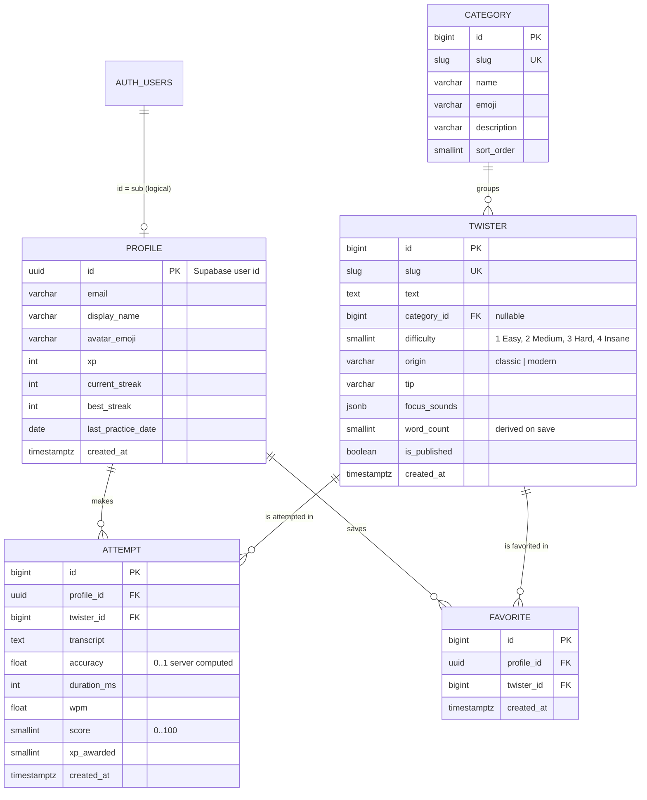

# Twister — Entity Relationship Diagram

Database: **PostgreSQL (Supabase)**. Auth users live in Supabase's `auth.users`; our `Profile.id` equals the Supabase user's `sub` claim (no hard FK across schemas — the Django API creates the profile lazily on first authenticated request).



## Constraints & indexes
- `Twister.slug`, `Category.slug` unique. Indexes on `Twister.difficulty`, `Twister.origin`, `Twister.is_published`.
- `Favorite (profile_id, twister_id)` unique.
- `Attempt` indexes: `(twister_id, -score)` for leaderboards, `(profile_id, -created_at)` for history.
- `Attempt.profile_id`/`twister_id` cascade on delete; `Twister.category_id` is `SET NULL`.

## Derived values
- `Profile.level = 1 + xp // 200` (computed, not stored).
- Streak: increments if last practice was yesterday, resets to 1 if older, unchanged if already practised today (UTC).

## Supabase security notes
The browser talks to Django, not directly to PostgREST, so **enable RLS on all `public` tables with no policies** (deny-all for the anon/authenticated roles). Django connects with the `postgres` pooler role which bypasses RLS.

```sql
alter table twisters_attempt  enable row level security;
alter table twisters_profile  enable row level security;
alter table twisters_favorite enable row level security;
alter table twisters_twister  enable row level security;
alter table twisters_category enable row level security;
```

## Planned extensions
`Tag`/`TwisterTag` (M:N sounds), `Challenge` + `ChallengeEntry` (daily/weekly ranks), `Friendship`, `UserTwister` (submissions + moderation status), `Badge`/`UserBadge`.
