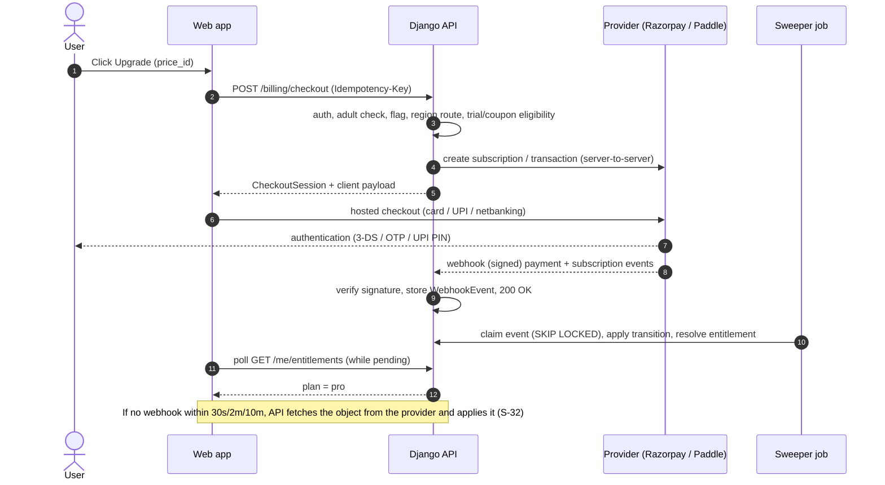
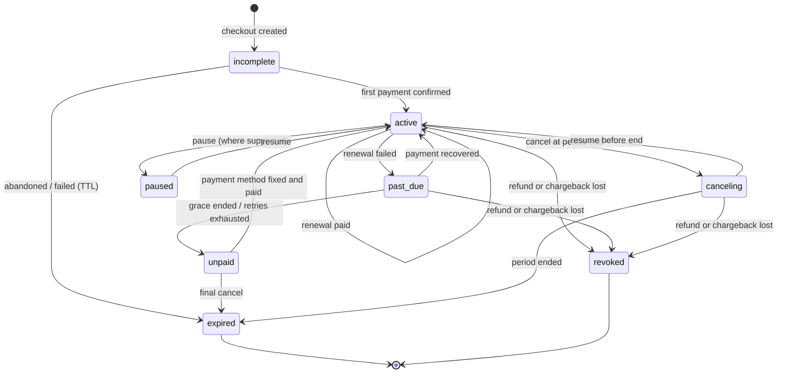

# Twister — Monetization PRD (Free · Pro · Family)

**Status:** Draft v0.1 · **Owner:** Pawan · **Date:** 2026-10-03 · **Companion:** [`ERD-monetization.md`](./ERD-monetization.md)
**Extends:** `docs/PRD.md`, `docs/features/00-overview-and-roadmap.md`, `docs/features/11-decisions-log.md` (D1, D6, D11, D14, D21, D26). Where this document changes an earlier decision it says so in §16 (ADR M-01…).

> **Not legal or tax advice.** Every regulatory and provider-specific statement below is marked **[verify]** where it must be re-checked against current official documentation or counsel *before* implementation. Prices are starting hypotheses, not commitments.

---

## 0. How to read this document

| § | Content | Read if you are… |
|---|---|---|
| 1–4 | Why, who, goals, principles | Everyone |
| 5–6 | Plans, entitlement matrix, pricing | Product, design, growth |
| 7 | Scenario catalogue (free users, paid users, every lifecycle edge) | Product, QA, support, backend |
| 8 | Functional requirements (by epic) | Backend, web, mobile |
| 9 | Billing architecture: providers, flows, webhooks, reconciliation | Backend, ops |
| 10 | Native apps (Apple / Google) | Mobile, legal |
| 11 | Compliance, privacy, consumer protection | Owner, legal, backend |
| 12 | Non-functional requirements (security, reliability, observability) | Eng lead, SRE |
| 13 | Rollout plan, flags, exit gates | Eng lead |
| 14 | Metrics and guardrails | Product, growth |
| 15 | Risks and open questions | Everyone |
| 16 | Decisions (ADRs) | Everyone |

---

## 1. Context and problem

Twister today is free: guest-first practice (Read-along, Speak & score, Record), scores, XP, streaks, 27 achievements, daily twister, favourites, Generate Twister (Gemini), cloud recordings with share links (flag-gated), and reminders. It runs on Vercel (web + Django API), Supabase (Auth + Postgres + Storage) and a Fly worker. A Plan table and per-plan limits already exist (`Plan.limits`, `Profile.plan`, D11) but only `free` is defined, there is no billing, and `QuotaHit` + `plan_demand_report` already collect cap-hit evidence.

Costs that scale with usage and are currently absorbed: object storage and egress (recordings, voice clips), LLM calls (Generate Twister), worker minutes (spot-checks, record analysis, transcoding), email, Sentry/PostHog volume, and support.

**Opportunity.** A meaningful minority of engaged users (speakers, learners, parents, coaches) will pay for *more storage, more AI, deeper coaching, and polish*, provided the core practice loop stays free and trustworthy.

## 2. Goals and non-goals

### 2.1 Goals
1. Launch a **freemium subscription** (Free, Pro, Family) on **web** and **native iOS/Android**, with one **provider-agnostic entitlement system** as the single source of truth.
2. Reach **sustainable unit economics**: worst-case infrastructure cost per Pro user ≤ 25% of net revenue per Pro user (§6.3).
3. Be **production-grade from day one**: PCI-scope-minimal, idempotent webhooks, reconciliation, audit trail, kill switches, runbooks, tested failure modes.
4. **Never harm the free experience**: no regression for existing users; the core loop (practise → score → streak) stays free forever.
5. Be **compliant by design** in India (primary market), the EU/UK, the US and both app stores (§11).

### 2.2 Non-goals (v1)
- Advertising (conflicts with the 13+/kid-adjacent posture and consent surface; see ADR M-08).
- A public marketplace, creator payouts, or user-to-user payments.
- Lifetime plans (perpetual liability for storage/LLM cost; revisit after 6 months of data, ADR M-07).
- Teams/Classroom (designed for in the data model via the seat/household abstraction; shipped later, §13 M6).
- Metered pay-as-you-go credits (the schema can support it; not launched, ADR M-09).

## 3. Users and willingness to pay

| Persona | Pays for | Likely plan |
|---|---|---|
| Presenter / professional | Keep a private progress diary, share takes with a coach, deeper analytics | Pro (annual) |
| Language learner (en-IN heavy) | Weak-sound reports, personalised practice plan, unlimited AI twisters on chosen sounds | Pro |
| Parent (kids 13–17) | One bill, shared progress, safe sharing | Family |
| Coach / teacher (later) | Seats, dashboards | Teams (M6) |
| Casual player | Nothing; ~90–95% of users | Free (also the growth engine) |

## 4. Product principles for monetization

1. **Free is real.** Practising, scoring, streaks, achievements, daily twister, favourites, Read-along, basic recording (local download), score cards, export and deletion are free forever. We charge for *server-cost* and *depth*, never for "trying" or for basic honesty of feedback.
2. **Ask late, explain why.** Paywalls appear only on explicit upgrade intent or a concrete limit hit, never at first run, never mid-take. (Mirrors "ask for permissions late", `00` §2.2.)
3. **Never lose a take.** A quota or payment problem must never destroy work: a recording over quota stays local and downloadable; downgrades never delete user content immediately (§7.4).
4. **No dark patterns.** Price, renewal period, trial end and cancel path are stated before purchase; cancelling is as easy as subscribing; no pre-ticked upsells, no fake urgency, no confirm-shaming. (India dark-pattern guidelines, FTC/state auto-renewal laws, store rules — **[verify]**.)
5. **Server-authoritative.** Entitlements are computed and enforced on the server. The client displays; it never decides.
6. **Fail safe for the customer.** If billing infrastructure is down or events are late, paying users keep access (fail-open to last known entitlement); free users are never charged by mistake (fail-closed on charging).
7. **Provider-agnostic.** Razorpay, Paddle, Apple and Google are adapters behind one internal model; swapping or adding a provider needs no schema change.
8. **Data-driven limits.** All numbers live in `Plan.limits` / `PlanPrice` rows (D1/D11 principle), tunable without a deploy.
9. **Everyone can leave.** Data export (D22) and account deletion (D21) are never gated by plan or payment state.

---

## 5. Plans and entitlement matrix

### 5.1 Plans

| Plan code | Audience | Billing | Notes |
|---|---|---|---|
| `free` | Everyone | — | Today's behaviour, unchanged (existing users keep every current limit) |
| `pro` | Individuals | Monthly, Annual | 7-day card-less trial once per account (§7.2) |
| `family` | One payer + up to 4 members (5 seats), members 13+ | Monthly, Annual | Each member gets Pro entitlements; payer must be 18+ (§11.4) |
| `pro_comp` / `pro_promo` | Staff-granted | none | Implemented as **grants**, not plans (ERD §7) |

`teams` / `classroom` are reserved codes; not sold in v1.

### 5.2 Entitlement matrix (the contract)

Rows with a number are `Plan.limits` keys; rows with ✅/— are `Plan.features` booleans. **Free values equal today's code defaults** (`PLAN_LIMIT_DEFAULTS`, `GENERATE_*`, `STREAK_FREEZE_MAX`).

| Area | Capability | Free | Pro | Family (per member) | Key |
|---|---|---|---|---|---|
| **Core practice** | Read-along, Speak & score, Train/Word drill, Test, history | ✅ unlimited | ✅ | ✅ | — |
| | Streaks, XP, levels, 27 achievements, daily twister, favourites, weekly boards (when on) | ✅ | ✅ | ✅ | — |
| | On-device Accurate mode (when launched) | ✅ | ✅ | ✅ | — (costs us nothing; honesty is not paywalled) |
| | Guest practice and sync (D12) | ✅ | ✅ | ✅ | — |
| **Streak** | Banked streak freezes (cap) | 2 | 5 | 5 | `streak_freeze_max` (requires migration of the DB CHECK, ERD §3.1) |
| **Record / cloud** | Local record + download | ✅ unlimited | ✅ | ✅ | — |
| | Stored cloud recordings | 5 | 100 | 100 | `recordings_max` |
| | Max recording length | 3 min | 10 min | 10 min | `recording_ms_max` |
| | Cloud storage total | 100 MB | 5 GB | 5 GB | `storage_bytes_max` |
| | Retention from creation | 30 days | 12 months | 12 months | `retention_days` |
| | Share-link max lifetime | 7 days | 90 days | 90 days | `share_max_days` |
| | Voice clip length / size | 60 s / 2 MB | 180 s / 6 MB | same | `voice_clip_ms_max`, `voice_clip_bytes_max` |
| | Record resolution | 720p | up to 1080p | up to 1080p | `record_max_resolution` |
| | Caption/transcript export | — | ✅ | ✅ | `caption_export` |
| **AI** | Generate Twister per day | 5 | 30 (fair use) | 30 each | `generate_daily_limit` |
| | Stored private generated twisters | 50 | 300 | 300 | `generate_max_stored` |
| | "Generate for my weak sounds" | — | ✅ | ✅ | `generate_from_weak_sounds` |
| **Coaching** | Phoneme/word trend analytics, weak-sound report | Summary (last 7 days) | Full history + trends | ✅ | `analytics_full` |
| | Personalised daily practice plan | — | ✅ | ✅ | `practice_plans` |
| | Weekly progress email | — | ✅ | ✅ | `weekly_report` |
| | Take comparison (A/B playback with score delta) | — | ✅ | ✅ | `take_compare` |
| **Sharing & identity** | Score cards | ✅ (branded) | ✅ no watermark, themes | ✅ | `score_card_themes` |
| | Pro badge / avatar frames | — | ✅ | ✅ | `pro_badge` |
| **Family** | Household progress summary (opt-in per member) | — | — | ✅ (payer) | `household_view` |
| **Support** | Priority support queue | — | ✅ | ✅ | `priority_support` |
| **Data rights** | Export, delete account, delete recordings | ✅ always | ✅ | ✅ | **never gated** |

**Gating rule of thumb:** gate (a) things with variable server cost, (b) depth beyond the free summary, (c) cosmetics. Never gate safety, privacy, accessibility, data rights or the practice loop.

**Mid-take rule:** limits are checked at *reserve* time (before a take starts uploading), not mid-recording; if reservation fails the take is saved locally and the UI offers "Download now" and "Upgrade to save to the cloud".

### 5.3 Enforcement model
- Every gated endpoint calls `entitlements.require(profile, feature_or_limit)` which reads the resolved plan (cached on `Profile.plan`) and raises the existing 402 envelope: `quota_exceeded` for numeric limits (unchanged shape, `details.limit`), and a new `plan_required` (`details.feature`, `details.min_plan`) for boolean features.
- Existing code paths (`media/quota.py:limits_for`, `generate/quota.py`) keep working untouched because `Plan.limits` is merged over `PLAN_LIMIT_DEFAULTS` exactly as today (D1). Adding Pro is a **data** change plus new feature checks.
- The client receives the same matrix from `GET /me/entitlements/` (§8, E2) and uses it only to render UI affordances.

## 6. Pricing, trials and offers

### 6.1 Price hypotheses (stored as data in `PlanPrice`; validate before launch)

| Plan | India (INR, GST-inclusive display **[verify]**) | Global (USD, tax handled by merchant of record) |
|---|---|---|
| Pro monthly | ₹149 | $4.99 |
| Pro annual (default selected, ~45% off) | ₹999 | $32.99 |
| Family monthly | ₹299 | $8.99 |
| Family annual | ₹2,299 | $59.99 |

Method: willingness-to-pay survey (Van Westendorp) among 200+ active users, then A/B on annual-first vs monthly-first paywalls. App-store prices must snap to Apple/Google price tiers; web prices may differ (store fee pass-through is allowed, but cross-platform *price steering in the app UI* is not — §10).

### 6.2 Trial, intro and promo
- **Pro trial:** 7 days, **server-granted, no card required**, once per account (and per normalised email identity), triggered by explicit "Try Pro free" tap. Rationale: card-on-file trials convert poorly in India where recurring charges need a mandate (UPI AutoPay / e-mandate) **[verify]**; the card-less trial maximises activation, and conversion happens at trial end with a normal checkout. Native stores may additionally run their own introductory offers (M3).
- **Promo/coupon codes:** percent/amount/free-period, expiry, redemption caps, per-account limit, plan scope. Provider-side coupons are mirrored for the provider that bills the plan.
- **Win-back:** 30/60-day lapsed offers (M5), always opt-in email, with unsubscribe.
- **Student/educator and regional (PPP) pricing:** by country price rows, not code branches (M5).
- **Grandfathering:** a price change never alters an existing subscriber's price without notice and consent; legacy `PlanPrice` rows stay linked to existing subscriptions (ERD §3.3).

### 6.3 Unit-economics guard
For each Pro limit, compute worst-case monthly cost per user and keep the sum ≤ 25% of net revenue (price − GST/VAT − store/provider fees):

```
worst_case_cost = storage_gb_max * (storage + egress rate)
                + generate_daily_limit * 30 * llm_cost_per_generation * fair_use_factor
                + recording_minutes_budget * worker_cost_per_minute
                + email + support allowance
```

Inputs come from the **cost dashboard (open item C2 in `12-implementation-status.md`) — a launch prerequisite (§13 M0)**. Until it exists, ship Pro limits at the lower end of the matrix and raise them with data.

---

## 7. Scenario catalogue

Each scenario has an ID (S-xx) used in tests and support playbooks. "Entitlement" means the resolved plan after §9.6. Server events referenced are in the ERD (§5).

### 7.1 Visitor and free-user scenarios

| ID | Scenario | Required behaviour |
|---|---|---|
| S-01 | Guest practises (no account) | Full core loop; no paywall, no pricing prompts. Gated features show a quiet "Sign in to save" (D12), not a price |
| S-02 | Guest taps a cloud/AI/analytics feature | Prompt to sign in first; guest data syncs (D12) **before** any checkout so nothing is lost |
| S-03 | Free user hits `recordings_max`, `storage_bytes_max`, `recording_ms_max` | 402 `quota_exceeded` with `details.limit`; UI shows what to free up *or* upgrade; take stays local; `QuotaHit` recorded (existing) |
| S-04 | Free user hits daily generate limit | 402 `quota_exceeded(generate_daily)` with `resets_at`; quota is never refunded by deletion (D26 unchanged) |
| S-05 | Free user opens a Pro-only feature (practice plan, full analytics, take compare) | Feature shows a teaser/sample state; CTA "See Pro"; direct API calls return 402 `plan_required` |
| S-06 | Free user, existing recordings older than `retention_days` | Expire as today (`expire_recordings`), T-3 day email (existing); upgrade CTA included once, never repeatedly |
| S-07 | Under-13 / unknown age | No paywall exposure for purchase; cloud blocked as today (D6); no pricing UI |
| S-08 | 13–17 user (self-declared) | Can use a Family seat paid by a guardian; cannot purchase (§11.4) |
| S-09 | Pending-deletion account (D21) | Cannot start checkout (403 `account_pending_deletion`); existing subscription is set to cancel at period end immediately (§7.6) |
| S-10 | Free user in a region with no configured provider | Pricing page shows "Not available in your region yet" + waitlist; no broken checkout |
| S-11 | Free user clicks "Upgrade" on web | Sign-in → adult confirmation (if absent) → region route → provider checkout (§9.2) |

### 7.2 Trial scenarios

| ID | Scenario | Required behaviour |
|---|---|---|
| S-20 | First "Try Pro free" tap | Create grant `source=trial`, 7 days, entitlement = Pro; show end date; no card |
| S-21 | Second trial attempt (same account / same normalised email / same store account token) | 409 `trial_used`; offer the paid plan with first-period promo if available |
| S-22 | Trial ends without purchase | Grant expires → entitlement recomputed → Free; **content kept** (§7.4); one "trial ended" email; no repeated nags |
| S-23 | Trial day 5 | One reminder (email + in-app): what ends, price, how to continue |
| S-24 | Trial user subscribes before the end | Trial grant is **superseded** by the subscription grant at purchase; remaining trial days are not added to the paid period (simple, documented); no double entitlement window |
| S-25 | Trial abuse (email aliasing, throwaway accounts) | Normalise email (strip `+tag`, Gmail dots), require verified email/Google sign-in, rate-limit trial grants per IP/device fingerprint hash; accept residual risk, monitor `trial→paid` anomalies |

### 7.3 Purchase scenarios

| ID | Scenario | Required behaviour |
|---|---|---|
| S-30 | Successful first purchase (web) | Checkout session → provider payment → webhook → subscription `active` → grant → `Profile.plan='pro'` → UI updates via entitlement polling (p95 ≤ 10 s from payment) |
| S-31 | Webhook arrives before the browser returns | Fine: entitlement already `pro`; success page just reads state |
| S-32 | Browser returns "success" but webhook never arrives | Server polls provider API after 30 s / 2 min / 10 min (verification job), never trusts the client; if still unconfirmed, shows "Payment processing — we'll email you" and reconciliation resolves it within 24 h |
| S-33 | Payment fails at checkout (card decline, UPI timeout, 3-DS/OTP failure) | No entitlement; clear provider-mapped message; checkout session `failed`; retry allowed; no duplicate subscription |
| S-34 | User double-clicks / retries Checkout | `Idempotency-Key` returns the same session; one subscription only |
| S-35 | User already has an active subscription and starts another (any provider) | 409 `subscription_exists`; deep link to manage; if the existing one is a store subscription → "Manage in App Store/Play" (S-80) |
| S-36 | Purchase with a coupon | Validate server-side; apply at provider; redemption recorded once per account; invalid/expired → 422 with reason |
| S-37 | Currency / country mismatch (VPN, foreign card) | Region is decided by billing country on the provider, not IP alone; if INR price vs non-IN card, route to global provider or reject with clear message — never silently charge a different currency |
| S-38 | Tax (GST/VAT) | India path: tax-inclusive price and a GST-compliant invoice **[verify]**; global path: merchant of record computes/remits; we store tax amounts on `Payment` for reporting |
| S-39 | Purchase while signed in on two devices | Same account, same result; entitlement polled by both |
| S-40 | Purchase for a different email than the account | Account identity is the Supabase user id; provider email is informational only; no entitlement attaches by email match |

### 7.4 Active paid-user scenarios

| ID | Scenario | Required behaviour |
|---|---|---|
| S-50 | Successful renewal | `Payment` row, period advanced, no UI change, receipt email (provider or ours), `renewal_upcoming` reminder ≥ 24 h before (RBI pre-debit notice is mandatory on the India card/UPI path **[verify]**) |
| S-51 | Upgrade monthly → annual or Pro → Family | Immediate switch with provider proration; new price/period; entitlement never dips; invoice shows proration |
| S-52 | Downgrade annual → monthly or Family → Pro | Takes effect at period end (`pending_change`); user sees the date; cancellable before it applies |
| S-53 | Cancel | `cancel_at_period_end=true`; entitlement stays until `current_period_end`; confirmation email; "Resume" available until then; reason survey optional (never mandatory, never blocks) |
| S-54 | Resume after cancel (before end) | Clears cancel flag, no new charge until the next period |
| S-55 | Resubscribe after expiry | New subscription; trial NOT re-granted; previous data intact; if within retention window recordings are still there |
| S-56 | Update payment method | Provider-hosted/SDK flow; we never see PAN/CVV; success webhook updates `payment_method_brand/last4` display fields only |
| S-57 | Price increase for existing subscribers | ≥ 30 days notice (email + in-app), consent where required by provider/law **[verify]**; old price honoured until consent/period end |
| S-58 | Pause (where provider/store supports it) | Entitlement → Free during the pause; data kept; auto-resume date shown |
| S-59 | Email/name change | Sync display fields to provider customer; entitlement unaffected |
| S-60 | Pro-only data after downgrade/expiry (over-quota) | **Never delete on downgrade.** Over-quota state: existing recordings stay readable and downloadable until their own retention expiry (grandfathered *read* for 30 days after downgrade, then normal Free retention applies); new reservations blocked; user sees "N recordings over your limit"; shares created under Pro keep working until their expiry; analytics beyond the free summary become locked (read-only teaser) but underlying data is retained |
| S-61 | Generated twisters above Free `generate_max_stored` after downgrade | All kept and practisable; cannot generate new ones until under the limit (matches D26 "can always list and delete") |
| S-62 | Extra streak freezes above Free cap after downgrade | Banked freezes above the cap are kept until used (never revoked); no new freezes bank above the Free cap |
| S-63 | Pro badge/themes after downgrade | Reverts to default display; previously created score cards stay valid |
| S-64 | Concurrent downgrade and in-flight upload | Quota checks run under the Profile row lock (existing convention); an upload reserved under Pro completes; the next reservation sees Free |
| S-65 | Pro user uses features offline (native/PWA) | Entitlement cached with `valid_until` (72 h); local-only Pro features work until then; server features always re-check |

### 7.5 Failure, dunning and revocation

| ID | Scenario | Required behaviour |
|---|---|---|
| S-70 | Renewal payment fails | Subscription → `past_due`; **grace of 7 days** (or the store's grace if longer) with Pro access retained, in-app banner + email on day 0/3/6; provider retries per its dunning schedule |
| S-71 | Grace ends unpaid | `past_due` → `unpaid`/`expired`; entitlement → Free; data kept (S-60); "Update payment method" CTA persists on the billing screen |
| S-72 | Payment recovers during grace/after | `active`; entitlement restored instantly; no penalty |
| S-73 | UPI AutoPay / e-mandate rejected, expired or revoked by the customer | Treated as failed renewal (S-70) with message "Re-authorise your payment method" **[verify]** |
| S-74 | Full refund granted | `Payment` → refunded; **revoke Pro immediately** if refund ≥ 100% of the current period; partial refund does not revoke; refund policy page defines windows |
| S-75 | Chargeback / dispute opened | Flag subscription `disputed`; keep access while the dispute is open **only** for the first dispute on a good-standing account; on loss → revoke, block re-purchase until review; evidence pack assembled from `Payment`, `SubscriptionEvent`, usage logs |
| S-76 | Apple/Google refund or revocation notification | Mirror immediately: revoke grant, mark payment refunded, log event; if acknowledgement missed (Google) the store refunds — reconcile |
| S-77 | Fraud signals (stolen card pattern, rapid retries) | Provider risk tools + our rate limits; auto-hold new checkouts per profile after N failures/hour |

### 7.6 Cross-platform, family, account lifecycle

| ID | Scenario | Required behaviour |
|---|---|---|
| S-80 | Subscribed on web, opens native app | Entitlement visible (multi-platform service allowed); the native app does **not** show a web purchase CTA unless the region/policy permits **[verify]**; "Manage on web" informational text only if allowed |
| S-81 | Subscribed via Apple/Google, opens web | Entitlement visible; manage links point to the store |
| S-82 | Subscribed twice (web + store, or two stores) | Highest entitlement wins; no stacking of time; banner "You have two subscriptions — cancel one" with provider-specific links; support playbook for refund of duplicate |
| S-83 | "Restore purchases" | Native: re-validate current store receipts and re-link by account token; idempotent; works after reinstall/new device |
| S-84 | Store purchase made while signed out / on a different Twister account | Purchase is bound by `appAccountToken` / obfuscated account id to the account that started it; a different account tapping Restore gets "belongs to another account" (never silently transferred); support-assisted transfer only |
| S-85 | Family: payer invites a member | Token invite (hashed, 7-day expiry); member accepts while signed in; seat count enforced under lock; member gets `family_member` grant |
| S-86 | Family: member leaves / is removed | Grant revoked immediately; member keeps their own content under Free rules (S-60); seat is free again; removed member can join another household after 24 h cooldown |
| S-87 | Family: payer's subscription lapses or is cancelled | All member grants end with the payer's period (no member keeps access); members notified; payer can resume |
| S-88 | Member already has their own Pro | Highest entitlement wins; no stacking; offer to cancel their own to avoid double billing |
| S-89 | Payer deletes their account | Household dissolves at purge; members downgrade; members notified at deletion request |
| S-90 | Account deletion requested with an active subscription | At request: stop renewal (cancel at period end, never charge during the 30-day grace); entitlement continues to period end; at purge: provider customer deleted/anonymised, financial records retained pseudonymised per statutory retention (§11.6) |
| S-91 | Deletion cancelled within grace | Subscription may be resumed by user; no automatic re-purchase |
| S-92 | Account merge/email change at identity provider | Entitlement follows Supabase user id; if user id changes (new provider login) → support-assisted migration playbook (S-84) |
| S-93 | Admin comp / promo / support credit | Time-boxed `EntitlementGrant` with reason and actor; visible in the audit log; expires automatically |
| S-94 | Employee/QA test accounts | Provider sandbox environments only; `environment` stored on every record; production metrics exclude sandbox |

### 7.7 Platform and infrastructure failure modes

| ID | Scenario | Required behaviour |
|---|---|---|
| S-100 | Duplicate webhook delivery | No-op via unique `(provider, external_event_id)`; 200 OK |
| S-101 | Out-of-order webhooks (e.g. `cancelled` before `charged`) | Apply by provider event timestamp / subscription version; stale events are recorded and ignored; state converges |
| S-102 | Missed/lost webhook | Daily reconciliation compares provider state to ours and repairs; alert on mismatch count > 0 |
| S-103 | Webhook with bad signature / old timestamp | 400, no state change, rate-limited, security log (no payload logged) |
| S-104 | Our API down when the provider sends events | Providers retry; processing is idempotent; backlog drained by the sweeper (§9.5) |
| S-105 | Provider outage at checkout | `503 billing_unavailable`; no entitlement change; status banner; flag `billing_enabled` can hide upgrade CTAs |
| S-106 | Provider outage during renewal | Nothing happens on our side; grace logic runs off provider-reported states; **no auto-downgrade without a provider-confirmed failure or period end + grace** |
| S-107 | Clock skew / timezone | All times UTC `timestamptz`; entitlement ends at provider-reported period end, not at local midnight |
| S-108 | Poison message (webhook that always errors) | Retry with backoff up to N attempts → `dead`, alert, replay tool after fix; never blocks the queue |
| S-109 | Kill switch: `billing_enabled=off` | Hides **new** purchase CTAs and refuses new checkouts. **Never** stops webhook ingestion or revokes/blocks existing entitlements |
| S-110 | Rollback of a bad release | Expand/contract migrations (ERD §10) keep the previous version compatible; flags default to safe values |
| S-111 | Price/limit change in `Plan.limits` | Takes effect on next request; cached `Profile.plan` unaffected because limits are read from the plan row; documented blast radius |
| S-112 | Entitlement cache stale after grant change | Resolver writes `Profile.plan` in the same transaction as the grant; client refreshes on focus and every 60 s while a purchase is pending |

---

## 8. Functional requirements

Priority: **P0** launch-blocking · **P1** launch · **P2** fast-follow. "Web", "Native" and "API" name the surface.

### E1 — Plans, prices, entitlements (API, P0)
| ID | Requirement |
|---|---|
| E1.1 | `Plan.limits` + new `Plan.features` define every entitlement; `limits_for(profile)` keeps merging over `PLAN_LIMIT_DEFAULTS` |
| E1.2 | One resolver computes the effective plan from active grants (§9.6) and writes `Profile.plan` in the same transaction under the Profile row lock |
| E1.3 | `GET /plans/` public, cacheable, region-aware prices; `GET /me/entitlements/` private, `no-store` |
| E1.4 | Enforcement helpers `require_feature` / `require_limit` produce the existing 402 envelope (`quota_exceeded`, new `plan_required`) |
| E1.5 | Entitlement changes emit an analytics event and a row in the audit trail |

### E2 — Paywall and upgrade UX (Web + Native, P0)
| ID | Requirement |
|---|---|
| E2.1 | Pricing page (`/pricing`): plan cards, monthly/annual toggle (annual preselected, both visible), full price, renewal terms, trial terms, region/currency, tax note, links to Terms/Refund/Cancellation |
| E2.2 | Contextual upgrade sheet on limit hit (S-03/S-04/S-05) naming exactly what was hit and what Pro changes; dismissible; never blocks core practice; never shown mid-take |
| E2.3 | Pre-checkout confirmation: plan, price, tax, renewal cadence, "cancel anytime in Account → Billing", explicit consent checkbox record for auto-renewal (`UserConsent: auto_renewal`, versioned) |
| E2.4 | Post-purchase success screen reading **server** state, with polling and a graceful "processing" state (S-31/S-32) |
| E2.5 | Billing screen (`/account/billing`): current plan, status chip, next renewal or end date, payment method display (brand + last 4), invoices/receipts, change plan, cancel, resume, update payment method, manage-in-store links, duplicate-subscription banner |
| E2.6 | Cancel flow: ≤ 3 taps, one optional reason, shows exactly when access ends, confirmation email; no dark patterns, no forced call/chat |
| E2.7 | Accessibility: WCAG 2.2 AA (existing standard), keyboard and screen-reader complete, `prefers-reduced-motion` respected, price and terms readable at 200% zoom |
| E2.8 | Pro touch-points elsewhere are subtle: usage meters ("3 of 5 recordings"), a Pro badge, locked-feature teasers with sample data (P1) |
| E2.9 | Free-user surface cap: at most one proactive upgrade prompt per 7 days outside explicit intent (frequency-capped server-side) |

### E3 — Checkout and subscription lifecycle (API, P0)
| ID | Requirement |
|---|---|
| E3.1 | `POST /billing/checkout/` requires auth, adult declaration (§11.4), `Idempotency-Key`, `price_id`, `platform`; returns provider-specific client payload; creates `CheckoutSession` |
| E3.2 | Provider routing by billing country via `RegionRoute` data (e.g. IN → Razorpay, others → Paddle — **subject to ADR M-03 verification**) |
| E3.3 | Subscription state machine (§9.4) implemented once; adapters only translate provider events into canonical transitions |
| E3.4 | Cancel, resume, change plan, update payment method endpoints (idempotent; return the new canonical state) |
| E3.5 | Server-side verification job for checkouts that returned client-side but have no webhook yet (S-32) |
| E3.6 | Coupons: validate, apply, redeem; per-account and global caps; auditable |
| E3.7 | Trials: `POST /billing/trial/` grants a 7-day Pro grant once per account/identity (S-20…S-25) |
| E3.8 | Invoices/receipts: list and download (provider-hosted link or our PDF on the India path); GST-compliant fields **[verify]** |

### E4 — Webhooks and reconciliation (API/Ops, P0)
| ID | Requirement |
|---|---|
| E4.1 | One public, CSRF-exempt endpoint per provider; reads the **raw body**, verifies signature in constant time, rejects stale timestamps, persists to `WebhookEvent` and acknowledges within 2 s; heavy work happens in the sweeper |
| E4.2 | Idempotent: unique `(provider, external_event_id)`; replays are safe |
| E4.3 | Sweeper (`process_billing_events`, every 1–5 min via the existing GitHub-schedule/management-command pattern, `SELECT … FOR UPDATE SKIP LOCKED`) applies events in order, retries with exponential backoff and jitter, dead-letters after N attempts, alerts |
| E4.4 | Daily `reconcile_billing` compares provider subscriptions/payments with ours for the last N days, auto-repairs safe diffs, reports the rest; mismatch > 0 pages the owner |
| E4.5 | Admin replay of a dead/failed event with a reason (audited) |

### E5 — Family plan (API + Web + Native, P1, M4)
| ID | Requirement |
|---|---|
| E5.1 | Payer creates a household; up to 4 invitees by email link; seat limit enforced transactionally |
| E5.2 | Members 13+; a 13–17 member requires the payer to be an adult (the payer is always 18+) |
| E5.3 | Member-controlled sharing of progress to the payer (opt-in per member, revocable); default is **no sharing** |
| E5.4 | Seat moves, removals, 24 h cooldown, payer-lapse behaviour per S-85…S-89 |

### E6 — Native store billing (Native + API, P0 for native launch, M3)
See §10. Server validation of every purchase; notification endpoints; restore; account binding; sandbox/production separation.

### E7 — Notifications (API, P0)
| Kind | Trigger | Channel |
|---|---|---|
| `receipt` | Successful payment | Email (provider receipt or ours) |
| `renewal_upcoming` | ≥ 24 h before charge (and 7 days for annual) | Email + in-app |
| `payment_failed` | Failure; day 0/3/6 of grace | Email + banner |
| `trial_ending` | Trial day 5 | Email + in-app |
| `trial_ended` / `subscription_ended` | Expiry | Email (once) |
| `cancellation_confirmed` | Cancel | Email |
| `refund_processed` | Refund | Email |
| `price_change` | ≥ 30 days before | Email + in-app |

Transactional billing emails are separate from the opt-in practice reminders (D27) and are **not** controlled by that preference, but each carries support contact info; marketing/win-back emails require opt-in with one-click unsubscribe (D27 pattern, RFC 8058). All are de-duplicated by `dedupe_key`.

### E8 — Admin and support tooling (P1)
Django admin (existing) gains: customer 360 (profile, subscriptions, payments, grants, events, webhook trail), actions to **comp / extend / revoke** (reason required, audited, role-gated), **refund** (two-person rule above a configurable amount), replay webhook, dissolve household, export evidence pack for disputes. Support macros and runbooks (§13.4).

### E9 — Analytics (P0)
Allow-listed events only (no PII, no payment data, no transcripts — matches `00` §6.5): `paywall_viewed`, `upgrade_cta_clicked`, `checkout_started`, `checkout_completed`, `checkout_failed`, `trial_started`, `trial_converted`, `subscription_canceled`, `subscription_resumed`, `payment_failed`, `entitlement_changed`, `quota_hit` (existing). Server-side events are the source of truth for revenue; client events measure funnel only.

### E10 — Data rights integration (P0)
Export (`GET /me/export/`) gains a **billing** whitelist section (plan, status, dates, amounts, invoice numbers; no provider secrets or full payment-method data). Deletion follows S-90 and ADR M-06.

---

## 9. Billing architecture

### 9.1 Principles
1. **Hosted/SDK checkout only** (Razorpay Standard Checkout, Paddle.js overlay/hosted pages, StoreKit/Play Billing). PAN/CVV/UPI credentials never touch our servers → **PCI DSS SAQ A** scope.
2. **Webhooks are the source of truth** for state changes; client redirects are hints.
3. **Inbox pattern**: persist → ack → process → mark. Exactly-once *effect* via idempotency, not exactly-once delivery.
4. **Canonical model, thin adapters.** Adapters are pure translation (provider payload → `CanonicalEvent`) plus API calls (create session, cancel, fetch). All business logic lives once in `billing/service.py`.
5. **Money = integer minor units + ISO-4217 currency.** Never floats.
6. **Everything append-only that matters for audit** (`SubscriptionEvent`, `AuditLog`, `Payment`).

### 9.2 Provider strategy (see ADR M-03)

| Surface | Provider | Why | Key notes **[verify all against current docs]** |
|---|---|---|---|
| Web, buyer in India | **Razorpay Subscriptions** | UPI AutoPay, cards, netbanking mandates, INR settlement | Pre-debit notification and additional-factor rules for recurring charges; mandate limits; we are the seller and must issue a GST tax invoice |
| Web, rest of world | **Paddle Billing (merchant of record)** | MoR handles VAT/GST/sales tax, invoicing, many local methods, chargeback handling | Confirm seller eligibility for the Twister entity, payout country and INR support before committing; if unavailable, fall back to a second MoR/Stripe + tax tool (the adapter boundary makes this a swap) |
| iOS | **Apple In-App Purchase (StoreKit 2) + App Store Server API/Notifications V2** | Required for digital subscriptions sold inside the app | `appAccountToken` binds purchases to our user |
| Android | **Google Play Billing + Play Developer API + Real-time Developer Notifications (Pub/Sub)** | Required for Play-distributed apps | `obfuscatedExternalAccountId`; acknowledge within the required window or Google refunds |
| Staff / promo | **Manual grants** | Support, partnerships | No provider involved |

A decision matrix, sandbox tests and a signed-off checklist are an M0 exit criterion. **The provider pair is a hypothesis; the architecture does not depend on it.**

### 9.3 Checkout flow (web)



### 9.4 Subscription state machine



**Entitlement by state**

| State | Pro access | Notes |
|---|---|---|
| `incomplete` | No | Waiting for payment |
| `active` | Yes | |
| `canceling` | Yes until `current_period_end` | `cancel_at_period_end = true` |
| `past_due` | Yes until `grace_until` | Banner, dunning emails (S-70) |
| `paused` | No | Store/provider-supported only |
| `unpaid`, `expired` | No | Data retained (S-60) |
| `revoked` | No, immediately | Refund / dispute lost / fraud |

Trials are **grants**, not subscription states (§7.2).

### 9.5 Webhook processing contract
1. `POST /api/v1/webhooks/{provider}/` — `@csrf_exempt`, no auth header, **signature is the auth**. DRF throttling by IP with generous limits; body size cap (e.g. 256 KB).
2. Read the raw bytes before any parsing; verify HMAC (Razorpay `X-Razorpay-Signature`, Paddle `Paddle-Signature` with timestamp tolerance) or JWS (Apple signed payloads) or Pub/Sub JWT (Google) **[verify]**; constant-time compare; reject if timestamp older than the tolerance (5 min).
3. Insert `WebhookEvent(status='received')` with `ON CONFLICT DO NOTHING` on `(provider, external_event_id)`; return `200` immediately. Never return 5xx for duplicates.
4. Sweeper claims rows (`status='received' AND next_attempt_at <= now()` ordered by `occurred_at`), runs the adapter's `to_canonical()`, then `service.apply()` in one DB transaction that also updates `Subscription`, `Payment`, `SubscriptionEvent`, grants and `Profile.plan`.
5. Ordering: each subscription stores `last_event_at` and `provider_version`; an event older than the stored value is `ignored` (S-101).
6. Failures: `attempts += 1`, `next_attempt_at = now + min(2^n, 3600)s + jitter`; after 8 attempts → `dead` + alert.
7. Payload hygiene: payload JSON retained 90 days then scrubbed to metadata (contains emails/names); signature and secrets never logged; Sentry scrubbing extended to billing keys.
8. Deployment note: Vercel serverless functions cannot host long-running consumers, so the sweeper is a management command run by schedule (like `sweep_pending_attempts`) and optionally by the Fly worker; the webhook handler itself stays fast and stateless.

### 9.6 Entitlement resolution (single algorithm)

```
active_grants = grants where starts_at <= now < ends_at and revoked_at is null
effective     = max(active_grants by plan.rank) or 'free'
```
- Grant **sources**: `subscription`, `family_member`, `trial`, `promo`, `admin_comp`, `grandfather`.
- No stacking of durations; highest rank wins; ties by latest `ends_at`.
- Subscription grants are created/extended/ended **only** by `service.apply()`; a subscription never writes `Profile.plan` directly.
- The resolver runs: after any grant change, and in the hourly `expire_entitlements` sweeper for time-based expiry. Reads also treat an expired grant as inactive (belt and braces) so a late sweeper cannot extend access.
- `Profile.plan` stays the denormalised effective plan so existing quota code and queries (`profile__plan`) are unchanged.

### 9.7 Reconciliation and finance
- `reconcile_billing` (daily): pulls provider subscriptions and payments updated in the window, diffs against ours, records `ReconciliationRun`/`ReconciliationItem`.
- Monthly finance close: payouts vs `Payment` totals per provider/currency; fees, tax, refunds, chargebacks reported separately (ERD §12).
- Revenue metrics (MRR, ARR, churn) are computed from `Subscription` + `Payment`, excluding `environment='sandbox'` and `source in (trial, comp)`.

---

## 10. Native apps (Apple App Store and Google Play)

> Policies change frequently and differ by region. Everything here is a **design default pending counsel review [verify]**.

1. **Digital subscriptions sold inside a store-distributed app use the store's billing** (StoreKit 2 / Play Billing). Web checkout is available on the web only.
2. **No steering by default.** The native paywall shows store prices only. Whether a region permits external purchase links or alternative billing is a per-region feature flag (`store_external_links`), off until counsel approves, because rules differ (US, EU, India, South Korea, Japan, …).
3. **Honour entitlements bought elsewhere.** A user subscribed on web sees Pro in the app (multi-platform service). The app does not advertise the web price.
4. **Server-side validation of every purchase.** Client sends the signed transaction (Apple JWS) or purchase token (Google); the API verifies with the store's server API, checks bundle/package id, environment, product id ↔ `ProviderPriceRef`, and the account token, then upserts the `Subscription`.
5. **Account binding.** Generate a per-user UUID `store_account_token`, pass it as `appAccountToken` (Apple) / obfuscated account id (Google) at purchase; reject purchases whose token maps to a different profile (S-84).
6. **Notifications.** Apple App Store Server Notifications V2 and Google RTDN feed the same `WebhookEvent` inbox. Statuses to handle include renewal, grace/billing retry, expiry, refund, revoke, price-increase consent, upgrade/downgrade/crossgrade (Apple) and RECOVERED/ON_HOLD/PAUSED/REVOKED (Google).
7. **Acknowledge/finish transactions** promptly (Google requires acknowledgement within the stated window or refunds automatically; Apple `finish()` after entitlement is persisted).
8. **Restore purchases** control on the paywall and in Settings (store requirement).
9. **Sandbox vs production** strictly separated by `environment` on every row; Apple's sandbox and Google licence-test accounts in CI/QA.
10. **Store commissions** are a cost input in §6.3; enrol in the reduced-commission programmes for small businesses **[verify eligibility]**.
11. **Review readiness:** required disclosures on the paywall (price, period, auto-renew, how to cancel, links to Terms and Privacy), working Restore, no references to web prices in-app, age rating consistent with 13+ and in-app purchases.
12. **Kids/Families categories** are not targeted; the app is 13+ (D6). Family plan is a household purchase by an adult.

---

## 11. Compliance, privacy and consumer protection

| Area | Requirement (design default) | Owner |
|---|---|---|
| **PCI DSS** | SAQ A: hosted/SDK payment only; no card data in logs, DB, analytics or error reports; CSP allows only provider script/frame/connect domains | Eng |
| **India — RBI recurring payments** | Respect pre-debit notification and additional-factor-authentication rules, mandate limits and cancellation rights for cards/UPI AutoPay **[verify current circulars]**; surface "next charge" clearly | Eng, Legal |
| **India — GST** | Digital service to consumers is taxable; show tax-inclusive price; issue compliant tax invoices with sequential numbers on the Razorpay path; SAC code, place of supply, GSTIN capture for business buyers per tax advisor **[verify]** | Finance |
| **India — Consumer protection** | Consumer Protection (E-Commerce) Rules, and CCPA guidelines against dark patterns (subscription traps, drip pricing, forced action, confirm-shaming) **[verify]** | Product, Legal |
| **India — DPDP Act 2023 and Rules** | Lawful basis/consent notices, purpose limitation, data-principal rights (access, correction, erasure, grievance officer), breach notification, **verifiable parental consent for anyone under 18** **[verify Rules, phase-in dates]** — see §11.4 | Legal |
| **EU/UK** | GDPR/UK-GDPR; consumer withdrawal right for digital services (14 days) with explicit waiver where immediate access is given; clear pre-contract information; MoR handles VAT | Legal |
| **US** | FTC ROSCA and state automatic-renewal laws (clear disclosure, express consent, easy cancel, renewal reminders); sales tax via MoR **[verify current status of federal "click-to-cancel" rule]** | Legal |
| **App stores** | Apple App Review Guidelines (3.1.x), Google Play Payments policy **[verify]** | Mobile |
| **Records retention** | Invoices/financial records kept for the statutory period (confirm with accountant; commonly several years) **[verify]**, pseudonymised after account deletion | Finance |
| **Policies to publish before launch** | Terms of Service (subscription terms), Privacy Policy (payment processors listed as sub-processors), **Refund & Cancellation Policy**, Pricing page disclosures, contact/grievance details | Owner |

### 11.1 Consent records
`UserConsent` (existing) gains types `auto_renewal` and `billing_terms`, each versioned with the text shown, timestamp and IP-hash/user-agent, written in the same transaction as checkout creation.

### 11.2 Refund policy (default, subject to Legal)
Monthly: no pro-rated refunds after the period starts, except billing errors and statutory rights. Annual: full refund within 7 days of the first charge if the user has not exceeded fair-use limits; otherwise case-by-case. Store purchases follow the store's refund process; we mirror outcomes. Billing errors and duplicate charges are always refunded.

### 11.3 Data protection
Billing data is personal data: minimised (we store provider ids, plan, amounts, dates, tax, brand + last 4, billing country/state); encrypted in transit and at rest (Supabase); RLS deny-all on new tables; access restricted to the API role and staff with audit; payloads scrubbed after 90 days; included in export; honoured on erasure subject to legal retention (ADR M-06).

### 11.4 Age and purchase eligibility
- Existing: 13+ to use the product (D6); under-13 blocked from cloud.
- Purchase requires the buyer to declare **18+** (`Profile.adult_declared_at`), asked once at first checkout with a plain-language prompt.
- A 13–17 user cannot purchase. They can receive a Family seat paid by an adult (this is the "parent buys" route that avoids collecting a minor's payment data and fits DPDP's parental-consent expectations **[verify with counsel]**).
- No behavioural advertising or tracking of under-18s; PostHog events for minors exclude any identifiers beyond the hashed id already used.
- This is a **change to the age model** (current `AgeBand` has `13plus` only): ADR M-05.

### 11.5 Security controls
Webhook signature + replay protection; idempotency keys; per-user checkout rate limits (e.g. 10/hour); admin RBAC with two-person rule for refunds/comps above thresholds; secrets in the existing `runbooks/secrets-and-rotation.md` flow with quarterly rotation and dual-secret acceptance during rotation; CSP: add the provider domains to `script-src`, `frame-src`, `connect-src` only on `/pricing` and billing routes (the CSP is currently report-only; update `web/e2e/csp.spec.ts` and keep the accurate-CSP test green); SRI where the provider supports it; no payment scripts on practice routes (also protects the 225 KB budget).

### 11.6 Retention and deletion
| Data | Retention |
|---|---|
| `Payment`, `Invoice`, `Refund`, `Dispute` | Statutory period, then deleted; after account purge the profile link is nulled and identifying fields hashed/removed, keeping amounts, dates, tax and invoice numbers |
| `Subscription`, `SubscriptionEvent` | Same as payments (they explain the payments) |
| `WebhookEvent.payload` | 90 days then scrubbed |
| `CheckoutSession`, `IdempotencyKey` | 30 / 2 days |
| `UserConsent` (billing types) | Legal period (open question D21 in `11`) |

---

## 12. Non-functional requirements

### 12.1 Reliability and correctness
- **Entitlement latency:** payment confirmed → `Profile.plan` updated: p95 ≤ 10 s, p99 ≤ 60 s.
- **Availability:** entitlement read endpoints ≥ 99.9% (served from `Profile.plan`, no external call). Webhook ingestion ≥ 99.95% (small, DB-only handler).
- **Zero lost events:** every received event ends `processed|ignored|dead`; dead > 0 pages the owner.
- **Reconciliation mismatches:** 0 unresolved after 24 h.
- **Idempotency everywhere:** checkout create, webhook apply, cancel/resume/change, refunds, grants.
- **Atomicity:** one DB transaction per applied event; resolver runs under the Profile row lock (existing `test_lock_queries` convention).
- **Fail-open for customers, fail-closed for charges** (principle 6).

### 12.2 Performance
Entitlement endpoint p95 < 100 ms; paywall/billing pages within the existing route budgets (billing code is code-split and loaded only on `/pricing`, `/account/billing` and the upgrade sheet; provider SDKs lazy-loaded on user intent); API p95 < 400 ms (existing).

### 12.3 Security
See §11.5. Additionally: SSRF-safe provider calls (fixed hosts), timeouts (10 s) and one retry, circuit breaker per provider, least-privilege API keys (restricted keys, read-only for reconciliation where supported), no secrets in the client bundle (publishable keys only), dependency pinning for provider SDKs, SAST/secret scanning in CI.

### 12.4 Observability
- Structured logs with `billing.*` event names; no PII/payloads (lengths and ids only, like D24).
- Sentry: tag `provider`, `event_type`; scrub emails, tokens, signatures.
- Dashboards/alerts: webhook lag (oldest `received`), dead count, apply error rate, checkout success rate by provider/method, entitlement latency, reconciliation diffs, refund and chargeback rates, grace-state counts.
- Runbooks to add under `docs/runbooks/`: `billing-webhook-backlog.md`, `billing-reconciliation-mismatch.md`, `billing-provider-outage.md`, `billing-chargeback-response.md`, `billing-secret-rotation.md`, `entitlement-repair.md`, `billing-kill-switch.md`.

### 12.5 Testing strategy
- **Unit:** state machine (property-based: any event order converges), resolver, proration/date maths, quota helpers.
- **Contract:** recorded provider webhook fixtures (sandbox captures) pinned in `api/tests/fixtures/billing/*.json`, one generated-vector file per provider like `engine_vectors.json` (D31 pattern); signature verification vectors.
- **Integration:** fake provider adapter (the `fake` backend pattern from D24: blank keys ⇒ fake provider in dev/CI, **never** in production — boot check refuses `fake` when `DEBUG=0`).
- **E2E (Playwright):** pricing → mock checkout → entitlement → gated feature; failure and cancel paths; axe on pricing/billing pages (existing a11y job); CSP spec updated.
- **Native:** StoreKit config files and Play licence testers in CI/QA; restore flow on a clean install.
- **Chaos/failure drills before each flag step:** duplicate, reorder, drop, delay and corrupt webhooks; provider 5xx; DB failover.
- **Migrations:** `migrate --plan` empty in prod; reversible expand/contract (ERD §10).
- **Money tests:** golden tests for tax-inclusive/exclusive amounts, rounding (banker's vs half-up declared once), proration, refunds.

### 12.6 Operability
Feature flags (extend `FeatureFlag`): `billing_enabled`, `pricing_page`, `checkout_razorpay`, `checkout_paddle`, `store_billing_ios`, `store_billing_android`, `family_plan`, `trial`, `coupons`, `store_external_links`. Staged rollout per `15-rollout-and-flags.md` §3 with additional stop-ship criteria (§13.3). Secrets as env vars (`RAZORPAY_KEY_ID/SECRET/WEBHOOK_SECRET`, `PADDLE_API_KEY/WEBHOOK_SECRET`, `APPLE_*`, `GOOGLE_*`) validated at boot (the API refuses to start in production without the secrets for enabled providers).

---

## 13. Rollout plan

### 13.1 Phases and exit gates

| Phase | Theme | Ships | Exit gate to next phase |
|---|---|---|---|
| **M0** Foundations (no money moves) | Entitlements + instrumentation | Schema (ERD), resolver, `Plan.features`, Pro/Family plan rows (inactive), enforcement helpers, admin comp/grant, cost dashboard (C2), analytics events, legal pages drafted, provider eligibility verified, `/pricing` behind flag in **waitlist mode** | Resolver + state machine tests green; cost model signed off; counsel review started; waitlist ≥ target (e.g. 300) |
| **M1** Web Pro — India | Razorpay, monthly + annual, card-less trial, billing screen, India invoices | Allow-list → 10% → 50% → 100% | Entitlement p95 ≤ 10 s; webhook dead = 0; reconciliation clean 14 days; refund rate < 5%; support load acceptable |
| **M2** Web Pro — global | Paddle MoR (or fallback) | Same staged rollout | Same gates + tax/payout verified |
| **M3** Native | Apple + Google, restore, RTDN/ASSN | TestFlight/Internal track → staged release | Store review passed; sandbox + production purchase verified end-to-end; no duplicate-subscription incidents |
| **M4** Family + promos | Household, seats, coupons | Flag by flag | Seat-integrity tests; abuse review |
| **M5** Optimise | Annual default tests, win-back, PPP/student pricing, upgrade-prompt tuning | Experiments | Guardrails (§14) hold |
| **M6** Teams/Classroom | Seats, dashboards, invoices (B2B) | Separate PRD | — |

### 13.2 Order of enabling (kill-switch aware)
`pricing_page` (waitlist) → `trial` (internal) → `checkout_razorpay` allow-list → widen → `checkout_paddle` → store flags → `family_plan` → `coupons`. `billing_enabled=off` is the global switch for **new** purchases only (S-109).

### 13.3 Stop-ship criteria (additional to `15` §3)
Any of: duplicate charge reported; entitlement not granted > 60 s after a confirmed payment for > 0.5% of purchases; any dead webhook unresolved > 4 h; reconciliation mismatch unresolved > 24 h; chargeback rate > 0.5%; free-user D7 retention down ≥ 1 pp vs control; support tickets about billing > 15 per 1,000 purchases.

### 13.4 Launch checklist (extends `15` §4)
- [ ] Provider accounts KYC-complete, live keys in the `production` environment, webhook secrets set, endpoints reachable and signature-tested from the provider dashboard
- [ ] Sandbox end-to-end for every path in §7 marked "web" and "native"
- [ ] Terms, Privacy, Refund & Cancellation, pricing disclosures published; consent text versions set
- [ ] GST registration/invoice numbering and tax settings verified with the accountant; MoR tax settings verified
- [ ] CSP updated and enforced for billing routes; axe clean
- [ ] Runbooks written and rehearsed once (kill switch, replay, reconciliation)
- [ ] Alerts wired (dead events, lag, reconciliation, chargebacks, refund spike)
- [ ] Backups/PITR confirmed and a restore rehearsed with billing tables
- [ ] Support macros and the customer-360 admin view in place; staff roles assigned
- [ ] Existing-user comms: "nothing you have today is being taken away" notice

---

## 14. Metrics and guardrails

| Metric | Hypothesis target (first 90 days after M1) |
|---|---|
| Paywall view → checkout started | ≥ 12% |
| Checkout started → paid | ≥ 45% (UPI/cards) |
| Free → paid (active users, 90 days) | 2–4% |
| Trial started → paid | ≥ 18% |
| Annual share of new subscriptions | ≥ 40% |
| Monthly logo churn (paid) | ≤ 7% |
| Involuntary churn (failed payments not recovered) | ≤ 2 pp of total churn |
| Refund rate | < 3% of payments |
| Chargeback rate | < 0.3% |
| Net revenue / paying user vs worst-case cost | cost ≤ 25% (§6.3) |
| Entitlement latency p95 | ≤ 10 s |
| Reconciliation mismatches | 0 |

**Guardrails (must not degrade):** free D1/D7 retention, practice attempts per session, Aha rate, Lighthouse mobile ≥ 90, API p95, a11y violations, NPS of free users.

Revenue reporting excludes sandbox, trials and comps; cohorts by acquisition channel and plan; cap-hit data from `QuotaHit` feeds paywall copy and limit tuning.

---

## 15. Risks and open questions

### 15.1 Risks

| Risk | Impact | Mitigation |
|---|---|---|
| Paywall hurts engagement/retention of the free loop | Core growth loss | Principles 1–2, guardrails, holdout group, kill switch, frequency cap |
| Card-less trial abuse | Cost, low conversion | Identity normalisation, per-device rate limits, monitor, shorter trial if abused |
| India recurring-payment friction (mandates, failed auto-debits) | High involuntary churn | UPI AutoPay + annual default, pre-debit emails, clear re-auth flow, grace period |
| Provider eligibility/fees differ from assumptions | Re-plan | M0 verification; adapter boundary; second-provider fallback |
| App-store policy or fee changes | Margin/UX changes | Config-driven pricing and flags; per-region policy flag |
| Webhook/state bugs charge or lock out customers | Trust, refunds, legal | Idempotency, fail-open, reconciliation, drills, staged rollout |
| DPDP/minors compliance gap | Legal exposure | Adult-only purchase, parent-pays Family, counsel review, consent logging |
| Storage/LLM costs exceed model | Margin | Cost dashboard, fair-use, limit tuning (data-driven), per-user cost alerts |
| Double billing across platforms | Support load, chargebacks | Detection banner, duplicate refund playbook |
| Supabase Pro / D7 prerequisite not met | Pro storage promises unmet | Cloud recording limits only advertised once `record_cloud` is live (§13.2 prerequisite) |
| Scope creep (credits, ads, lifetime) | Delay | Non-goals §2.2, ADRs |

### 15.2 Dependencies on existing roadmap
Pro's cloud-recording value requires: Supabase **Pro** (D7), `record_cloud` and `share_links` flags on (see `12` §2 B), the cost dashboard (C2), and the worker deployed. If these slip, ship Pro with AI + coaching + cosmetics first and **do not advertise cloud limits** until live.

### 15.3 Open questions (owner decisions)
1. Seller entity and country for provider accounts; Paddle seller eligibility for the entity and INR support (blocks ADR M-03).
2. Final prices and trial length (survey + A/B).
3. Is the existing mobile app a Capacitor/RN wrapper or fully native (affects billing SDK, release cadence)? The repo currently contains only the web app and a PWA manifest.
4. GST registration status and invoicing approach; accountant sign-off on retention periods.
5. Refund policy text; support staffing and hours.
6. Whether consent-log retention after deletion is permitted longer than the profile (D21 open item).
7. Family plan: should members under 18 be visible to payer by default (we propose opt-in only)?
8. Do we offer a lifetime plan after month 6 (ADR M-07)?

---

## 16. Decisions (ADRs)

| ID | Decision | Supersedes / relates to |
|---|---|---|
| **M-01** | Introduce paid plans now. D11's "no billing until demand is proven" is **superseded**: we proceed on the owner's decision but keep the evidence loop (`QuotaHit`, `plan_demand_report`, waitlist, A/B) to tune limits and prices | D11 |
| **M-02** | Model: **Free + Pro + Family**, monthly/annual, card-less 7-day trial; no ads, no lifetime, no credits at launch | — |
| **M-03** | Billing providers: **Razorpay (India web)**, **Paddle MoR (global web)**, **Apple IAP**, **Google Play Billing**, behind one provider-agnostic schema; subject to M0 eligibility verification | — |
| **M-04** | Entitlements are **grants** resolved by one algorithm; `Profile.plan` is a denormalised cache; subscriptions never write it directly | D1, D11 |
| **M-05** | Add `Profile.adult_declared_at`; purchases require 18+; 13–17 may use Family seats; no change to the 13+ product age | D6 |
| **M-06** | Financial records survive account purge (pseudonymised, statutory retention); personal/billing identifiers anonymised; export includes billing | D14, D21, D22 |
| **M-07** | No lifetime plan at launch (perpetual storage/LLM cost); revisit at month 6 | — |
| **M-08** | No advertising | — |
| **M-09** | Credits/consumables not launched; schema leaves room via `UsageCounter`-style tables if needed | D26 |
| **M-10** | Webhooks use the inbox pattern with signature auth, idempotency and a scheduled sweeper (no queue infrastructure on Vercel) | D36 (same queue idioms) |
| **M-11** | Fail-open entitlements for paying customers; kill switch affects only new purchases | — |
| **M-12** | Free limits stay at today's values; paywalls never appear at first run or mid-take | D1, D26 |
| **M-13** | Core "honesty" features (Accurate mode, basic scoring, mistakes view) are never paywalled | `00` §2 principle 4 |
| **M-14** | The `fake` billing provider is dev/CI only and cannot start in production | D24 pattern |

---

## Appendix A — API surface (summary; full contract goes in `07-api-contract.md` when M0 starts)

| Method & path | Auth | Purpose |
|---|---|---|
| `GET /plans/` | public | Plans, features, limits, prices for the caller's region |
| `GET /me/entitlements/` | user | Effective plan, limits, features, source, `valid_until`, subscription summary |
| `GET /me/billing/` | user | Subscription(s), next charge, payment-method display, invoices |
| `POST /billing/trial/` | user | Start card-less trial |
| `POST /billing/checkout/` | user + adult | Create checkout session (`Idempotency-Key`) |
| `GET /billing/checkout/{id}/` | user | Session status (polling) |
| `POST /billing/subscription/cancel/` · `resume/` · `change-plan/` · `payment-method/` | user | Lifecycle actions |
| `POST /billing/coupons/validate/` · `redeem/` | user | Promo handling |
| `POST /billing/store/verify/` · `restore/` | user (native) | Validate store purchase, restore |
| `POST /household/` · `/invites/` · `/invites/{token}/accept/` · `DELETE /household/members/{id}/` · `POST /household/leave/` | user | Family seats |
| `POST /webhooks/{razorpay|paddle|apple|google}/` | signature | Provider events |
| `GET /me/export/` | user | (existing) adds `billing` section |
| Admin actions | staff | comp, extend, revoke, refund, replay, dissolve household |

**Errors (existing envelope):** `402 quota_exceeded` (unchanged), `402 plan_required`, `403 adult_required`, `403 account_pending_deletion` (existing), `409 subscription_exists`, `409 trial_used`, `409 store_subscription_active`, `422 price_unavailable_in_region`, `422 coupon_invalid`, `429 rate_limited` (existing), `503 billing_unavailable`.

## Appendix B — Configuration keys

`BILLING_ENABLED_PROVIDERS`, `TRIAL_DAYS` (7), `PAST_DUE_GRACE_DAYS` (7), `ENTITLEMENT_CACHE_TTL_S` (72 h offline), `REFUND_TWO_PERSON_THRESHOLD`, `WEBHOOK_TOLERANCE_S` (300), `WEBHOOK_MAX_ATTEMPTS` (8), `WEBHOOK_PAYLOAD_RETENTION_DAYS` (90), `CHECKOUT_RATE_LIMIT` (10/h), `UPGRADE_PROMPT_MIN_INTERVAL_DAYS` (7), `HOUSEHOLD_MAX_SEATS` (5), `HOUSEHOLD_REJOIN_COOLDOWN_H` (24), provider secrets (§12.6).

## Appendix C — Glossary
**Entitlement** what a user may do now. **Grant** a time-boxed reason for an entitlement. **MoR** merchant of record (legal seller that handles tax). **Dunning** retry/communication flow for failed renewals. **Inbox** table storing incoming webhooks before processing. **Reconciliation** comparing provider records with ours.
