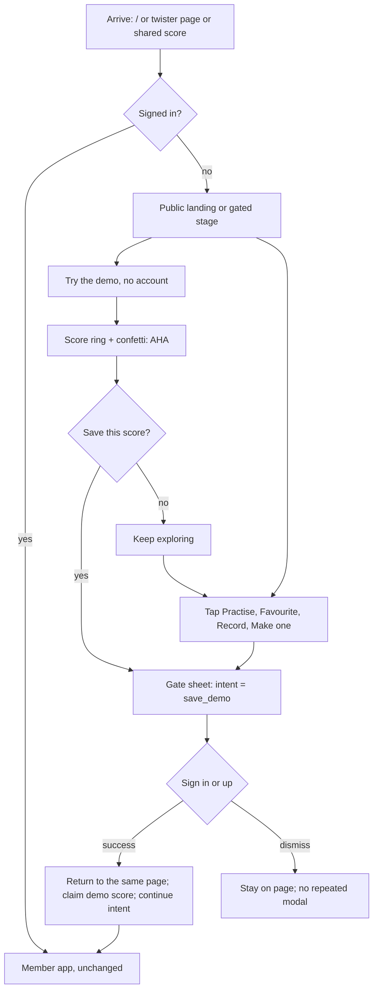
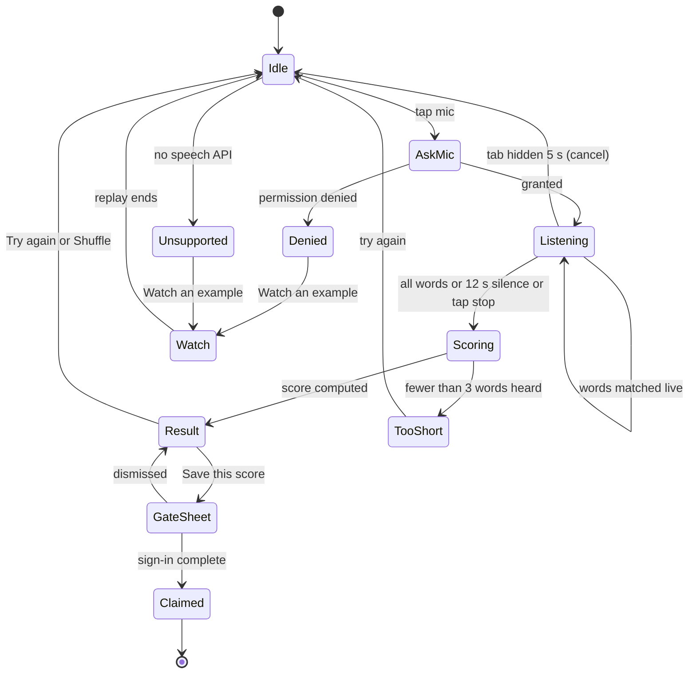
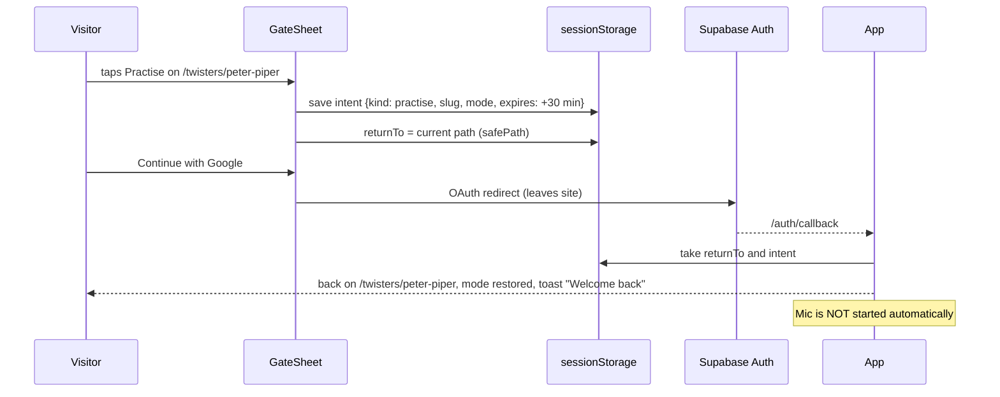

# Twister — Public Site & Sign-in Gate (PRD)

**Status:** v0.3 (implemented) · **Owner:** Pawan · **Last updated:** 2026-10-04 (v0.2: footer without legal links, LinkedIn credit, fixed teaser set, no A/B test)
**Companion:** [ERD-public-site.md](ERD-public-site.md) (data model, API contract, client architecture)
**Builds on:** [PRD.md](PRD.md) · [PRD-monetization.md](PRD-monetization.md) · [features/00-overview-and-roadmap.md](features/00-overview-and-roadmap.md) · [features/11-decisions-log.md](features/11-decisions-log.md)

> **TL;DR.** Today a logged-out visitor lands on a utility home screen and can practise immediately with no account (guest-first, decision D12). This PRD turns the logged-out experience into a **product-selling public site** in the style of a modern Framer page (the getbreakout.ai experience): a story told by scrolling, a no-account **interactive demo that delivers the AHA moment**, and a **sign-in gate** on every real use of the app. Only a **curated teaser** of the twister library is public. Signed-in users keep the app they have today.

> **Implementation status (2026-10-04): P0 and the P1 landing sections are built, uncommitted.** Deviations from this document, all deliberate:
> - **Gate:** `GateSheet` explains why, then hands off to `/login` (or Google) with a return path instead of embedding the password form. The demo score and arrival tags survive the round trip (`sessionStorage` and `localStorage`).
> - **Teaser constraint:** the database refuses a private curated twister or a duplicate slot, but allows unpublishing one (the rule refills). 
> - **Not built:** newsletter (flag reserved, off), testimonials, accent serif font, branded 404. Newsletter, testimonials and the serif font stay deferred.
> - **Bundle:** the landing is one lazy chunk (~10 KB gzip plus motion scroll helpers); first-load stays at 189.8 KB (`/`) and 213.7 KB (twister page). Confetti was made lazy to pay for the shared chrome.
> - **Tests:** API `tests/test_public_site.py` (46 tests), web unit tests under `src/content`, `src/lib/public`, `src/lib/gate`, and Playwright `e2e/public.spec.ts` plus four new axe targets (all green).

---

## 1. Why we are doing this

### 1.1 What exists today (read from the codebase, 2026-10-04)
- `/` (`web/src/routes/index.tsx`) is the same screen for everyone: a hero with "Can you say red lorry, yellow lorry ten times?", today's twister card, "Pick your level" and "Sound families". It explains very little about *why Twister* or *what you get*.
- `/twisters` (Browse) lists the whole library, with search and filters, to anyone.
- `/twisters/$slug` runs the full Practice Hub (Read along, Speak & score, Train, Record) for guests. Guest attempts are scored on the device and kept in `localStorage` (`twister.guest.v1`) until `GuestSync` imports them on sign-up.
- The header shows only **Browse** and a small **Sign in** button to guests. There is **no footer, no privacy page, no terms page, no about or contact page** anywhere in `web/src/routes`.
- The docs say the opposite of what we now want: PRD §4/F1 "Anyone can browse/practise without an account", ARCHITECTURE decision 3 "Guest-first: no signup wall before the Aha moment", features/00 principle 1 "Zero-friction first", D12 "Guests practise locally".

### 1.2 The problem
1. **No pitch.** A first-time visitor is never told the aim of the product, the outcome they will get, or why it is better than a list of tongue twisters. Selling the product is left to a hero line and a card.
2. **No reason to sign up.** Everything works without an account, so sign-up has to be sold on "saving", which is weak. Our own target (≥ 15% of guests who finish an attempt sign up) has no mechanism behind it other than a soft banner.
3. **No trust surface.** No footer, legal or contact pages. We tell users the product "listens to your voice" without a privacy page to back that up.
4. **The whole library is the front door.** Browse and every twister page expose all content and all user-centric features (favourites, history, status filters) to people who are not users.

### 1.3 The change in one table

| | Today (guest-first) | After this PRD (account-first, with a demo) |
|---|---|---|
| Logged-out `/` | Utility home, same as members | Scroll-driven **marketing site** that sells the product |
| First "wow" | Practise a real twister as a guest | **Interactive demo** on the landing page, no account (ephemeral) |
| Practising (Read along, Speak, Train, Record) | Open to guests | **Requires sign-in** (gate sheet, returns to the same twister) |
| Browse `/twisters` | Full library, filters, search | **Curated teaser** (12) with locked placeholders and honest totals |
| Twister page | Full practice hub | Text, tip, why-it's-hard, *Listen*; practice stage replaced by a **gated stage** |
| Favourites, stats, history, generate | Guest-visible with "saved on this device" | Gated; one consistent **sign-in gate** everywhere |
| Footer and legal | None | Full footer (no legal links, by decision) with LinkedIn and a maker credit; Privacy and Terms pages exist but are linked elsewhere (§12.2); About |
| Signed-in users | App | **Unchanged** (same URLs, same screens) |

---

## 2. Decision: reversing "guest-first"

This is a deliberate reversal of D12 and of the "zero-friction" principle, so it is recorded here and must be appended to the decisions log (see §20).

**Why it is acceptable:** the demo moves the zero-friction moment *earlier and out of the app*: a visitor still hears their own voice turn words green within ~30 seconds of landing, with no account. What is gated is **using** the product (saving progress, the library, the practice modes), not **seeing it work**.

**What we give up, honestly:**
- Some visitors who would have practised as guests will leave at the gate. We mitigate with the demo, context-specific gate copy, in-place sign-in (no page navigation) and a one-tap Google option. We measure it (§16) and keep a **kill switch** that restores guest-first behaviour (§19).
- Organic search traffic to individual twister pages now lands on a gated stage. We keep those pages **indexable with full text** so the long-tail SEO value is not thrown away (§10).
- We lose "Aha-rate ≥ 60% of new visitors complete an attempt in session one" as written. It is replaced by demo-based metrics (§3.3).

**Legacy device data is never thrown away.** Anyone who already has `twister.guest.v1` on their device keeps it; it is imported at their next sign-in (§17, E-32).

---

## 3. Goals, non-goals, success metrics

### 3.1 Goals
- **G1 — Sell the product.** In under 60 seconds of scrolling, a stranger can say what Twister is, who it is for, what they get, and why it is better than a list.
- **G2 — Deliver the AHA before the ask.** A visitor can speak into their mic (or watch a scrubbed example if they cannot) and see words light up, a score ring fill and confetti, **without an account**.
- **G3 — Convert intent into accounts.** Every "use" action opens one consistent, low-friction gate that returns the person to what they were doing.
- **G4 — Protect the library.** Logged-out visitors see a curated teaser; the real catalogue, filters, favourites and history are for members. The teaser is enforced **by the API**, not only by hiding UI.
- **G5 — Look and feel like a modern Framer site**: scroll-driven storytelling, generous space, pastel gradient panels, bento grids, sticky stacked cards, a big footer with an oversized wordmark. Fast and accessible (§13, §18).
- **G6 — Keep members' app unchanged** and keep SEO intact.

### 3.2 Non-goals
- No pricing page or paid plan (D11: only `free` exists; see PRD-monetization). The footer and nav have **no Pricing link** until there is something to show.
- No blog or CMS in P0/P1 (a "Learn" section is P2).
- No fake social proof, logos, awards or testimonials (§15). If we have none, we show none.
- No chatbot or live-chat launcher (Breakout has one; we do not).
- No scroll-jacking or custom smooth-scroll library (§13).
- No change to scoring, XP, streak or the practice modes themselves.
- No new auth provider; we reuse Supabase Auth (email/password, email code, Google) and the existing forms.
- Not localised (English only).

### 3.3 Success metrics (targets are **hypotheses to calibrate after two weeks of data**)

| Metric | Definition | Target |
|---|---|---|
| Demo start rate | sessions with `demo_started` ÷ landing sessions with ≥ 15 s engaged | ≥ 35% |
| Demo completion | `demo_completed` ÷ `demo_started` | ≥ 60% |
| Demo → sign-up | sign-ups attributed to `save_demo` or within the same session ÷ `demo_completed` | ≥ 25% |
| Visitor → sign-up | new accounts ÷ unique landing visitors (excl. bots) | ≥ 6% |
| Gate conversion | `signup_completed` ÷ `gate_opened`, by intent | ≥ 30% |
| Scroll reach | sessions reaching the teaser carousel (S8) ÷ landing sessions | ≥ 40% |
| Time to first scored attempt (new accounts) | sign-up → first attempt | median < 3 min |
| LCP / CLS / INP (mobile, p75) | Core Web Vitals on `/` | ≤ 2.5 s / ≤ 0.05 / ≤ 200 ms |
| Lighthouse (mobile) | Performance, Accessibility, SEO | ≥ 90 / ≥ 95 / ≥ 95 |

**Guardrails** (a regression here pauses rollout): organic sessions to `/twisters/*` down more than 10% week-on-week after launch; sign-up error rate; gate dismiss-then-bounce rate; p95 API latency (PRD §4: < 400 ms).

---

## 4. Audience and entry points

| Visitor | How they arrive | What they need from the public site |
|---|---|---|
| **Searcher** | Google: "peter piper tongue twister" → `/twisters/<slug>` | The twister text and tip immediately (what they searched for), then a reason to practise it here |
| **Shared-link viewer** | A friend's score card `/s/<token>` or recording `/r/<token>` | "Beat this score": a one-tap path to the demo or sign-up |
| **Direct / social / referral** | Home page | The pitch, the demo, proof it works, trust |
| **Returning member** | Bookmark or typed URL | No marketing at all: straight to their home. No flash of the landing page (E-01) |
| **Crawler / link-preview bot** | Googlebot, WhatsApp, Slack | Server-rendered text, correct meta and Open Graph, no dependence on JS or auth |

Personas from PRD §3 stay: casual player, language learner, speaker/presenter. We add **actor/voice-over** as a landing-page persona tab (copy only; no product change).

### 4.1 Journey (logged-out)

---

## 5. Reference study: what we are borrowing from getbreakout.ai

Observed live on 2026-10-04 (page inspection and screenshots; animation details below are what the page structure and behaviour show, and should be re-checked side by side during design):

| Observation on getbreakout.ai | What it does for them | Twister adaptation |
|---|---|---|
| Built in **Framer**; ~1,000 elements carry transforms; no scroll-jack library | Smooth, GPU-friendly motion that feels native | Use `motion` (already installed, `LazyMotion` + `m`) with transform/opacity only; no Lenis/GSAP |
| Hero: big two-tone headline with an **italic serif accent word** ("Pageview to *pipeline*"), a one-sentence chained subhead, one primary CTA, a soft purple-to-white gradient wash | Instantly memorable promise | "Tongue-tied to *tongue-twisting*" with a chained subhead; our existing violet/pink/cyan glows |
| Hero visual is a **tabbed product panel with an auto-advancing gradient progress bar** ("Inbound / Outbound / 1:1") | Shows the product in action before any scrolling | Hero tabs cycle **Read along / Speak & score / Record** with a progress bar; real buttons; paused for reduced motion |
| **Stacked sticky cards**: three sibling cards, `position: sticky` with `top` 20/40/60 px inside one tall wrapper; each is a tinted pastel panel with an accordion on the left and an animated diagram on the right | Each "agent" gets its own stage while the page keeps moving | The three practice modes become three stacked pastel cards (§7, S6) |
| Scroll-triggered **Lottie** animations ("Trigger Lottie 1–3") and fade-in text as sections enter | Rewards scrolling | Reuse `lottie-react` + the two Lottie files we own; reveal-on-scroll with `whileInView` (already used in `index.tsx`) |
| **Logo/ring "Connections"** section (concentric rings of tool logos) | "Works with everything" | "Sound-family orbit": rings of sound chips (S, SH, TH, R/L, P/B, K/G) — decorative, not a claim about integrations |
| Case-study **carousels** with arrows | Social proof you can browse | Twister **teaser carousel** (S8). Real content only. |
| "Data protection" band with certifications | Reduces buying anxiety | Privacy band: what happens to your voice, in plain words (S9) — only claims we can back |
| Final **gradient CTA card** then a footer with brand + tagline, badge row, **five link columns**, a legal bar (company, Privacy, Terms, Contact; **we keep only a maker credit and LinkedIn**) and an **oversized faded wordmark** cropped at the bottom edge over a gradient wash | A confident, finished ending | Same structure, our content (§12) |
| Floating chat launcher, G2 badges, compliance seals, cookie banner covering the first screen | — | **Not copied**: no chat, no awards/seals we do not hold, and consent UI must not cover the hero CTA |

---

## 6. Information architecture and route matrix

Same URLs, different view by auth state (chosen model). "Member" = signed in; "Guest" = not.

| Route | Guest | Member | Indexed? | Notes |
|---|---|---|---|---|
| `/` | **Landing** (new, §7) | Personal home (today's `Home`) | Yes (guest view) | Split into `PublicLanding` and `MemberHome`; see E-01 for the no-flash rule |
| `/twisters` | **Teaser browse** (§9) | Full browse | Yes | API returns teaser only for guests |
| `/twisters/$slug` | Info page + **gated stage** (§10) | Practice Hub | Yes (all public slugs) | Text and tip are server-rendered for everyone |
| `/login` | Sign-in page (existing) | Redirects to `returnTo` | No | Still exists for deep links and OAuth |
| `/auth/callback`, `/reset-password` | Existing | Existing | No | Unchanged |
| `/practice`, `/stats`, `/favorites`, `/profile`, `/account`, `/generate`, `/my-twisters`, `/recordings` | **`RequireAuth` gate view** (§11.5) | Existing | No (`noindex`) | Replaces today's mix of per-page guest prompts |
| `/s/$token`, `/r/$token` | Shared score or recording + **"Beat this" band** | Same | No | Add public chrome and CTA (§12.3) |
| `/privacy`, `/terms` | **New** | New | Yes | Required before launch (§12.2). **Not linked from the footer**; linked from the sign-in gate, the sign-up/login pages, the privacy band (S9) and Account |
| `/about` | **New** | New | Yes | P1. There is no `/contact` page: people reach Pawan through LinkedIn (§12.1) |
| `/learn/*` | Future (P2) | | | Not in scope now |
| `/sitemap.xml` | Add `/privacy`, `/terms`, `/about`; keep all public twister slugs | | | See §18.3 |
| 404 | Branded 404 with link to `/` and `/twisters` | Same | No | P1 |

**Header.** Guests see the **public header** (§7, S0); members keep the current app header. Both are the same `<header>` slot chosen by auth state.

---

## 7. Landing page (`/` for guests)

### 7.1 Principles
- **One idea per screen.** Each section has a single headline, one supporting sentence, one visual.
- **Show, do not tell.** Every claim sits beside a UI frame built from our real components (score ring, word chips, streak flame, mode switcher). All numbers in frames are labelled "sample".
- **CTA rhythm.** A primary CTA appears in the hero, after the demo, after the modes, in the carousel's locked tail, and in the final card. Same label everywhere: **Start free**. Secondary: **Try it now**.
- **Text first.** The `<h1>` is the LCP element. No hero image.

### 7.2 Section map

Each section lists: purpose → content → scroll behaviour → mobile → reduced motion → data source.

**S0 — Sticky glass nav**
- Brand (`BrandLink`), anchors **How it works · Modes · Privacy · FAQ**, `ThemeMenu`, ghost **Sign in**, primary **Start free**.
- Scroll: transparent at top; after 24 px it gains the existing `bg-background/75 backdrop-blur-xl` and border; height 64 → 52 px. The active anchor highlights as its section enters (scroll-spy via `IntersectionObserver`).
- Mobile: brand + **Start free** + menu button (sheet). No horizontal scrolling nav.
- Reduced motion: no height animation, only the colour change.

**S1 — Hero**
- Eyebrow: *Say it fast. Say it right.* (existing tagline).
- H1: **Tongue-tied to *tongue-twisting*.** (accent word in the serif italic and `text-gradient`).
- Subhead (chained, mirrors Breakout's structure): *Twister turns every word you say into a signal, every signal into a fix, and every fix into a streak.*
- CTAs: **Try it now** (primary: scrolls to and focuses the demo card S2) · **Start free** (secondary, opens gate with intent `hero_cta`).
- Under the CTAs: three trust chips, each backed by fact: *Free · Runs in your browser · No audio stored unless you choose to save a recording*.
- Visual: the **tabbed product panel** (Read along / Speak & score / Record). Auto-advances every 6 s with a gradient progress bar; pauses on hover, focus and when off-screen; stops entirely under reduced motion (user advances manually). Background: existing body radial glows plus two blurred parallax orbs (translateY at 0.15× scroll).
- Mobile: panel sits below the CTAs; tabs become a horizontally scrollable segmented control.
- Data: static copy. No API call is required to render the hero (the daily twister is **not** needed here).

**S2 — The AHA demo** (full spec in §8)
- A floating glass card (the existing `Card variant="glass"`) containing one real twister, a mic button, live word highlighting, score ring, confetti and a **Save this score** CTA.
- Sits at the bottom of the hero viewport on desktop (right column) and immediately below the hero on mobile.

**S3 — Proof strip**
- Real, derived numbers only: *N twisters · 4 levels · 6 sound families · 3 practice modes* (from `GET /public/landing/` stats; fall back to static copy if the call fails).
- A slow, infinite **marquee of real twister snippets** (the teaser set, first 5 words each). Pauses on hover; static row under reduced motion.
- "Loved by N practisers" appears **only** when the snapshot is above the floor (§15, ERD `PublicStatSnapshot`).

**S4 — Promise, scroll-revealed**
- One large sentence whose words go from 20% to 100% opacity as you scroll through it: *"Most tongue-twister sites give you a list. Twister gives you a coach."*
- Implementation: `useScroll({ target, offset: ['start 0.8', 'end 0.4'] })` → per-word `useTransform`. Reduced motion: fully visible.

**S5 — How it works (sticky, 3 steps)**
- Left column pins (`position: sticky; top: var(--nav-h)`); right column swaps a UI frame as you scroll through three steps with a vertical progress line:
  1. **Pick a twister** — level, sound family, your daily one.
  2. **Say it** — words light up *as you speak* (the frame replays the lime/cyan/pink highlight).
  3. **See what tripped you** — score ring, slow words, the sound that slipped, a drill.
- The frame for step 2 is **scroll-scrubbed**: words highlight in proportion to scroll position. This gives the AHA even to someone who never taps the mic.
- Mobile (< 768 px) and reduced motion: no pinning; three stacked blocks, each with its frame, reveal on enter.

**S6 — Three modes as stacked sticky cards** (the Breakout "agents" pattern)
- One tall wrapper, three pastel cards (violet / lime / pink tints, theme-aware) with `position: sticky; top: calc(var(--nav-h) + 12px * i)`.
- Each card: title, one-line outcome, an accordion of 4 capabilities on the left, an animated frame on the right. Opening an accordion item swaps the frame.
  - **Read along** — *Hear the rhythm, then match it.* Pace slider (70 → 150 wpm), listen first, loops.
  - **Speak & score** — *Say it. See every word.* Word-by-word verdicts, score, the sound that slipped, drill the weak words.
  - **Record** — *Watch yourself get better.* Camera and screen layouts, highlights, share a score card. (Cloud saving and share links stay behind their flags; copy only claims what is on.)
- Scroll: when the next card slides over, the previous one scales to 0.96 and dims 8% (scroll-linked). Reduced motion and mobile: cards simply stack, no sticky.
- Copy for any mode that is **flagged off at launch is omitted** (e.g. cloud recordings), not teased.

**S7 — Who it is for (persona tabs)**
- Tabs: **Presenters · Language learners · Actors & voice-over · Anyone who likes a challenge**. Each: two sentences, one recommended teaser twister (links to its page), one outcome line.
- Keyboard: arrow keys move between tabs (WAI-ARIA tabs pattern).

**S8 — Meet the twisters (teaser carousel)**
- Horizontal scroll-snap carousel of the 12 teaser twisters as `TwisterCard`s (text visible), with arrow buttons and drag/swipe. Tail card: **"+N more inside"** (N = `library_total − 12`) with **Start free**.
- Cards link to `/twisters/$slug` (info + gated stage). Level filter chips above the carousel filter the teaser client-side.
- Reduced motion: native scrolling only, arrows still work (`behavior: 'auto'`).

**S9 — Your voice, your device (privacy band)**
- Three facts, each with an icon, written to be literally true (see §15.3): what stays on the device, what is sent (text of your attempt, score), what is stored only if you choose (recordings), how to delete everything (account deletion, D14). Link to `/privacy`.
- This is the section that replaces Breakout's SOC 2 band; we only state what we do.

**S10 — Works where you are**
- Honest compatibility: Chrome, Edge and Safari (live word-by-word), Android and iOS browsers, Firefox (typed fallback, no live mic). Detects the visitor's browser and shows a one-line "You're on X: everything works" or "On Firefox you'll use typed mode".
- Decorative **sound-family orbit** (concentric rotating rings of sound chips) as the visual.

**S11 — FAQ**
- 8 questions (§Appendix A) in an accordion; `FAQPage` JSON-LD. One open at a time on mobile.

**S12 — Final CTA card**
- Large gradient card, headline *Ready to say it right?*, primary **Start free**, secondary **Try the demo again**. The card scales from 0.96 to 1 as it enters.

**S13 — Footer** (§12.1)

### 7.3 Persistent elements
- **Mobile sticky CTA bar** appears after the hero has left the viewport: *Try it now* · *Start free*. It respects `env(safe-area-inset-bottom)`, hides while a gate sheet or keyboard is open, and never overlaps the consent banner (stacking order is defined in §13.4).
- **Back to top** button after S8 (keyboard-focusable, `aria-label`).

---

## 8. The AHA demo (no account, ephemeral)

### 8.1 Promise
A visitor says one short twister and, in about 30 seconds, sees: words light up as they speak, a score ring fill, confetti (≥ 80), and a copy line that names what happened ("You slipped on *shells*").

### 8.2 Rules
- **Fixed content, no API dependency.** The demo twisters are bundled in `web/src/content/demo.ts` (text, tip, target words, slug of the matching database twister). The page renders and the demo works even when the API is down. A CI test asserts every bundled slug exists and is public (ERD §6.4).
- **Choice:** one **default** demo twister plus a **Shuffle** that cycles through three, all taken from the teaser and all six words or fewer: `she-sells-seashells` (default), `fat-frogs`, `sam-sam-sheep` (§9.1). Short on purpose, so the first try usually succeeds.
- **Engine:** the existing speech layer (`lib/speech.ts`) and the mirrored client scoring (`lib/speak/score.ts`). **No** Accurate-mode model download, **no** attempts API call, **no** audio recorded. The feature-detect uses the same checks as Speak & score.
- **Lazy:** the demo's JS (speech, confetti, Lottie) loads when the card first enters the viewport or on pointer-enter of *Try it now*. Nothing speech-related is in the first-load bundle (budget, §18.1).
- **Result persistence:** the result is kept in `sessionStorage` (`twister.demo.v1`: `{slug, transcript, durationMs, score, at}`) for 24 h so a sign-up round-trip (OAuth redirect) cannot lose it. Nothing is persisted on the server until the visitor signs in (§8.4).

### 8.3 States

### 8.4 Claiming the demo score
- On **Save this score** the gate opens with intent `save_demo`, carrying a `demoResultId` (the `sessionStorage` key).
- After sign-in, a small `DemoClaim` effect (next to `GuestSync`) posts the result to the existing `POST /sync/guest/` with `kind: "demo_claim"` (ERD §3.3 and §4.5). The server **re-scores the transcript**, stores it as a **provisional** attempt, and awards no XP or streak (existing guest-import rules). The UI says: *"Your first score, 87, is saved. Practise now to start your streak."*
- Abuse limits: one claim per account, the result must be < 24 h old, and the batch id is idempotent, so a refresh or retry never duplicates it.

### 8.5 Fallbacks
- **Unsupported browser or mic denied:** the card swaps the mic for **Watch an example**: a scripted, clearly labelled *Sample take* where words light up and a score fills. The CTA stays **Start free**.
- **Embedded in-app browsers** (Instagram, Facebook, LinkedIn, TikTok): mic and Google sign-in often fail; show a one-line **Open in your browser** hint (E-24).
- **No JS:** the demo card renders as a static image-free explanation with a **Start free** link (E-37).

---

## 9. Browse (`/twisters`) for guests

**Goal:** show enough to make the library feel rich and worth joining, without handing it over.

- **Header block** (above the list): H1 *Pick your tongue-twister*, one line of value (*"205 twisters, 4 levels, 6 sound families — here's a taste."* (205 is today's seed count) The numbers come from the API, not hard-coded) and a **Start free to unlock all** button.
- **Teaser list:** the 12 curated twisters (§9.1), using the existing `TwisterCard`, in `teaser_position` order. **Fixed and identical for every logged-out visitor**: no personalisation, rotation or randomising, so search results, shared links and the landing carousel always match.
- **Filters:** level and sound-family chips remain, showing **real facet totals** (public data). Clicking a chip filters *within the teaser* and shows *"Showing 3 of 14 Hard twisters. Start free to see all 14."* with an inline unlock panel (not a modal). Status and sort controls are hidden for guests (the existing `signedIn` prop on `BrowseFilters` already supports this).
- **Search:** works within the teaser (client-side match on the 12). If nothing matches, show *"No match in the preview. Start free to search all N twisters."* The search text is **not** sent to the server for guests.
- **Locked placeholders:** after the 12, a row of 6 **locked cards** (lock icon, level and sound chips are decorative, **no real text** or slugs). Tapping one opens the gate (intent `locked_filter`). We never blur real data: it is simply not sent (see E-08).
- **Pagination:** none for guests. The API refuses page > 1 with `401 auth_required` (ERD §4.2) and the client never asks.
- **Next/previous** on twister pages follows the teaser order for guests (`browseContext`).
- **Empty/error states:** reuse `EmptyState` and `ErrorState`; if the teaser call fails, show the static fallback list built from `content/demo.ts` plus an error banner (never an empty page).

### 9.1 The curated 12 (decided)
**Rule.** Take the **first three twisters of each level** in catalogue order (the seed file order, which is also `id` order: `Twister.Meta.ordering = ["difficulty", "id"]`), **then repair coverage** so all six sound families (categories) appear: while a family is missing, swap its earliest twister into its own level, replacing that level's pick from the most over-represented family (latest pick on ties). The rule is deterministic and runs the same way in the seed data, the API fallback and the CI check (ERD §3.2, §6.4).

**Why a repair step is needed.** The plain first three per level cover only four families (Hissers 6, Poppers 3, Rollers 2, Brain Benders 1) and miss **TH Tangles** and **Vowel Vortex**. The repair changes exactly two picks.

| # | Level | Slug | Twister (opening words) | Sound family | Note |
|---|---|---|---|---|---|
| 1 | Easy | `sam-sam-sheep` | Sam's shop stocks short spotted socks. | Hissers | first of level |
| 2 | Easy | `fat-frogs` | Fat frogs flying past fast. | TH Tangles | **swap**: replaces `zebra-zoo` (Hissers) |
| 3 | Easy | `big-black-bug` | A big black bug bit a big black bear. | Poppers | first of level |
| 4 | Medium | `she-sells-seashells` | She sells seashells by the seashore. | Hissers | first of level |
| 5 | Medium | `snake-slithers` | Six slippery snails slid slowly seaward. | Hissers | first of level |
| 6 | Medium | `unique-new-york` | Unique New York, unique New York. | Vowel Vortex | **swap**: replaces `chester-cheetah` (Hissers) |
| 7 | Hard | `cooks-cook` | How can a clam cram in a clean cream can? | Poppers | first of level |
| 8 | Hard | `red-lorry-yellow-lorry` | Red lorry, yellow lorry, red lorry, yellow lorry. | Rollers | first of level |
| 9 | Hard | `truly-rural` | Truly rural, truly rural, truly rural. | Rollers | first of level |
| 10 | Insane | `six-sick-sheiks` | The sixth sick sheik's sixth sheep's sick. | Hissers | first of level |
| 11 | Insane | `pad-kid-poured` | Pad kid poured curd pulled cod. | Poppers | first of level |
| 12 | Insane | `irish-wristwatch` | Irish wristwatch, Swiss wristwatch. | Brain Benders | first of level |

Result: Hissers 4, Poppers 3, Rollers 2, TH Tangles 1, Vowel Vortex 1, Brain Benders 1. 10 of 12 are literally the first three of their level; 2 are swaps. *(Read from `api/twisters/data/twisters.json` on 2026-10-04; if the seed file changes, rerun the rule; the CI check will tell you.)* Because the data is a seed, "first" depends on seed order; a fresh database reproduces it, and the explicit `teaser_position` column (ERD §3.2) is what makes it stable afterwards.

**Demo twisters** (separate from the teaser, but all three are inside it): `she-sells-seashells` (default, the most recognisable and six words), `fat-frogs` (five words) and `sam-sam-sheep` (six words). Short and Easy/Medium, so the first try usually succeeds.

---

## 10. Twister page (`/twisters/$slug`) for guests

Keep it **indexable and useful**; replace only the *practice stage*.

- **Always visible (server-rendered):** the twister text, level and sound badges, coaching tip, "why it's tricky" (from `lib/twisterCard` helpers), word count, and a **Listen** button using the device's speech synthesis (no account, no network, no data sent).
- **Gated stage:** where the Practice Hub renders, guests see a framed panel: the mode switcher (Read along · Speak & score · Record) with lock icons, a **non-functional, clearly illustrative** preview (illustration, not real UI state), and a primary button **Start free to practise this twister**. Any mode tab, the mic, or the button opens the gate with intent `practise` and `{slug, mode}`.
- **Direct link to a mode** (`?mode=record`): the gate opens only on interaction, never on load; after sign-in the person returns to that mode (E-12).
- **Favourite star:** for guests it opens the gate (intent `favourite`); there are no local-only favourites any more.
- **Related twisters:** a strip of up to 4 *teaser* twisters (not the neighbours of a non-teaser twister) to keep guests moving and to keep internal links to indexable pages.
- **Unknown or removed slug:** same as today (*"This twister was removed"*), plus links to Browse.
- **Private twisters** (generated by a member, D25): guests get a plain 404; the API already hides them.
- **SEO:** title, description and canonical as today; the loader keeps running on the server for first loads so link previews work.

---

## 11. The sign-in gate

### 11.1 One mechanism, many triggers
A single `GateSheet` component and a `useGate()` hook. Components never navigate to `/login` themselves for in-app intents; they call `requireAuth(intent, context)`.

| Intent | Trigger | Gate headline (example) | After sign-in |
|---|---|---|---|
| `practise` | Mic, mode tab or Practise button on a twister | *Sign in to practise "Peter Piper"* | Back on the same twister and mode; **never auto-start the mic** (browsers require a gesture) |
| `save_demo` | **Save this score** after the demo | *Save your 87* | Claim the demo, then go to the same twister's page |
| `favourite` | Star on a card or page | *Sign in to save favourites* | Star is applied, no navigation |
| `generate` | Make one | *Sign in to make your own* | Land on `/generate` (if flagged on) |
| `record` | Record tab | *Sign in to record yourself* | Same twister, Record mode |
| `locked_filter` | Locked card, locked filter or search miss | *Unlock all N twisters* | Same list, now full |
| `locked_nav` | Any member-only route | *Sign in to see your progress* | The requested route |
| `hero_cta` / `header_cta` / `footer_cta` | Start free buttons | *Start free* | `returnTo = /twisters` (today's default) |

### 11.2 Sheet design
- **Desktop:** a centred dialog (existing `Dialog`). **Mobile:** a bottom drawer (existing `vaul` drawer) that rises above the keyboard (`visualViewport` aware).
- **Content:** context headline, three one-line benefits (*Save every score · Track streaks and XP · Drill the sounds you miss*), **Continue with Google**, then email options (**email code** is the default; password sign-in/sign-up one tap away), and legal small print (*13+, Terms, Privacy*). Reuses `PasswordAuthForm`, `EmailRequestForm`, `CodeForm` and `authFlow` rules unchanged.
- **In place:** email-code and password sign-in complete **inside the sheet** and the sheet closes, so page state (including a demo result) survives. Google leaves the site and returns through `/auth/callback`; the intent is restored from `returnTo` + the stored intent (§11.4).
- **URL:** the open sheet adds `?gate=<intent>` (replace, not push) so Back closes it and a refresh keeps it open. The param is stripped on close.
- **Accessibility:** focus moves into the sheet, is trapped, returns to the trigger on close; `Esc` closes; an `aria-live` region announces errors; works with the keyboard open on mobile.

### 11.3 Anti-annoyance rules
1. **Only on user intent.** No timed pop-ups, no scroll-depth or exit-intent modals. Ever.
2. **Dismiss memory:** after two dismissals in a session, further triggers show an **inline nudge** (a banner under the control) for 10 minutes instead of a modal.
3. **Not during the demo.** Nothing interrupts a recording in progress.
4. **No dark patterns:** a visible close button, no pre-ticked marketing opt-ins, no countdowns.

### 11.4 Intent persistence

- Intent expires after 30 minutes or when the person navigates to an unrelated route.
- `returnTo` accepts same-origin paths only (`safePath`), as today.
- If `sessionStorage` is blocked, fall back to `/twisters` (today's default) and show a neutral toast (E-20).

### 11.5 `RequireAuth` for member-only routes
One wrapper replaces the per-page guest prompts in `/practice`, `/stats`, `/favorites`, `/profile` and friends: it renders a short **preview of what the page does** (title, a blurred *illustration*, three bullets) and the gate content inline (not a modal), with `redirect` set to the current path. `noindex` stays. While `useAuth().loading`, it renders the page skeleton, not the gate (E-02).

### 11.6 Server side
The gate is UX; the **API remains the authority** (ERD §4): attempts, favourites, history, recordings, generate and every `/me/*` call already require a valid JWT; the anonymous twister **list** is now teaser-only; the single-twister endpoint stays public but throttled.

---

## 12. Footer, legal and shared-link pages

### 12.1 Footer (public pages; also shown to members on public routes)
Modelled on the Breakout footer's structure, with only content that exists:

1. **Closing band** (above the footer, shared with S12): gradient card with **Start free**.
2. **Brand block:** mark + *Twister*, one-line description (*"Practise tongue twisters out loud and watch every word light up."*), and three factual trust chips (*Free · Runs in your browser · 13+*).
3. **Link columns** (3):
   - **Product:** How it works · Practice modes · Browse twisters · Today's twister
   - **Practise by sound:** the six sound families by name (Hissers, Poppers, Rollers, TH Tangles, Vowel Vortex, Brain Benders; names come from the API), each linking to the *teaser* filter
   - **Connect:** **LinkedIn** (https://www.linkedin.com/in/pawankumar1201), inline SVG icon + label, `target="_blank" rel="noopener noreferrer"`. This is the only social link and the only contact route.
4. **Newsletter (P1, flag `newsletter`)**: one email field, double opt-in (ERD §3.5). Off by default; the footer is complete without it.
5. **Maker bar:** *© 2026 Twister* on the left and **Made with love by Pawan** on the right, where "Pawan" links to the same LinkedIn profile and the heart is an `aria-hidden` icon (the accessible text is "Made with love by Pawan"). **No Privacy, Terms or Contact links** in the footer, by decision.
6. **Oversized wordmark:** "Twister" in outlined/gradient display type spanning the footer width, cropped by the bottom edge over a violet-to-pink wash. As the footer enters, the wordmark rises from 24 px below and fades to its resting opacity (scroll-linked). It is `aria-hidden` and decorative.
7. **Controls:** theme toggle (dark / light / reading); **back to top**.
- Responsive: three columns → two at tablet → a single stacked list at < 480 px (no accordions needed with three short columns). Min touch target 44 px (`pointer-coarse`).

### 12.2 New static pages
**Where Privacy and Terms are linked, since the footer does not carry them:** the sign-in gate small print (every sign-up path), the `/login` page, the privacy band on the landing page (S9 links *Read the privacy policy*), Account → Privacy, and the sitemap. This keeps them one tap from every point where someone shares data or agrees to terms.

> **Heads-up (verify before launch):** Google's OAuth consent-screen branding review generally asks for a privacy-policy link on the app's **homepage**. The S9 link on `/` is placed to satisfy that without a footer link; confirm against Google's current requirements when the OAuth consent screen is published, and add a discreet homepage link if they require it in a specific place.

- **`/privacy`**: what we collect (account email, display name, attempts and scores, optional recordings), what stays on the device (audio by default), where speech recognition happens (**must disclose** that some browsers' built-in recognition may send audio to the browser vendor's service, as PRD §8 already notes), analytics (PostHog) and error reporting (Sentry), retention and deletion (D14), minimum age 13 (D6), contact. **Drafted for legal review before launch.**
- **`/terms`**: acceptable use, age 13+, content ownership of recordings, no warranties on scores, termination, governing law. **Needs legal review.**
- **`/about`** (P1): why Twister exists, who makes it, how scoring works at a high level, how to reach us.
- All three use a shared `ProseLayout`, are server-rendered, and are linked from the sign-in gate small print.

### 12.3 Shared score and recording pages
`/s/$token` and `/r/$token` get the public header and footer and a **"Beat this score"** band: the sharer's score (as already shown) plus *Try the same twister* (opens the **demo** if the twister is a demo twister, otherwise the gated twister page) and **Start free**. These pages stay `noindex`. Reported or expired links keep their current messages.

---

## 13. Scroll and motion system (Framer-style behaviour)

### 13.1 Patterns (a small, reusable library under `web/src/components/public/motion/`)
| Pattern | Used in | Mechanism |
|---|---|---|
| `Reveal` (fade + rise 14 px, once) | Most blocks | `m.div` + `whileInView`, `viewport={{ once: true, margin: '-10% 0px' }}`; stagger by 60 ms (same values as `index.tsx` today) |
| `ScrollText` (word-by-word opacity) | S4 | `useScroll` on the paragraph, `useTransform` per word |
| `StickyStage` (pinned column with swapping frame) | S5 | CSS `position: sticky` + a `useScroll` progress index; frame swaps with `AnimatePresence` |
| `StackedCards` | S6 | CSS sticky with `top` offsets; `useScroll({target: wrapper})` drives `scale` and `opacity` of earlier cards |
| `TabsProgress` | S1 | Timer with a gradient bar; pauses on hover, focus, hidden tab |
| `Marquee` | S3 | CSS `translateX` keyframes, duplicated track, paused on hover |
| `SnapCarousel` | S8 | CSS `scroll-snap-type: x mandatory`; arrow buttons call `scrollBy` |
| `Parallax` (orbs) | S1, S12 | `useScroll` + `useTransform` on `translateY`, ≤ 0.2× |
| `LottieOnView` | S5, S6 | `lottie-react` started when in view, once (`success.json`, `pulse.json`) |
| `FooterWordmark` | S13 | `useScroll` on the footer, `translateY` and `opacity` |

### 13.2 Rules
1. **Animate only `transform` and `opacity`.** No layout-thrashing properties (`height`, `top`, `box-shadow` in loops). The one exception, nav height, uses a CSS transition on a class toggle.
2. **No scroll-jacking.** Native scroll everywhere; no wheel hijacking, no smooth-scroll library. Pinned sections never trap the user (they are sticky, not locked).
3. **Reduced motion is a first-class design**, not "off": `useReducedMotion()` returns static, fully visible layouts with the same content order (no pinned stages, no marquee, no auto-advancing tabs, no parallax). The global CSS rule in `styles.css` already disables CSS animation; scroll-linked JS animation must branch explicitly.
4. **Small screens:** under 768 px, pinned and stacked behaviours become simple vertical stacks with `Reveal`.
5. **`position: sticky` works with our body** because `body` uses `overflow-x: clip` (not `hidden`). Do **not** change that, and never put `overflow: hidden/auto` on an ancestor of a sticky element (E-33).
6. **Viewport units:** use `svh` for full-height sections (iOS toolbar), never `100vh` (E-34).
7. **Motion budget:** no more than ~12 simultaneously animating elements; offscreen animations are paused (`IntersectionObserver` or `useInView`).
8. **Feature set:** keep `LazyMotion` with `domAnimation` (`strict` stays on). Scroll-linked motion uses `useScroll`/`useTransform`, which are not in the `m` feature bundle and add a small chunk; load them only inside the lazily imported landing sections.

### 13.3 Timing tokens
Durations: 150 ms (hover), 300 ms (UI), 600 ms (reveal), 900 ms (hero). Easing: `cubic-bezier(0.22, 1, 0.36, 1)` for entrances. Springs: stiffness 120, damping 20 for the stacked-card scale.

### 13.4 Layering
Nav (z-30, as today) < mobile sticky CTA (z-30) < consent banner (z-40) < gate sheet (z-50) < toasts (z-60). The consent banner sits **bottom-left, compact** and never covers the hero CTA or the demo's mic button on a 375 × 667 viewport (E-35).

---

## 14. Visual design extensions

Reuse everything that exists: tokens in `styles.css` (dark `#0b0a16`, violet `--brand`, pink, cyan, lime), `Card variant="glass"`, `BrandMark`, `Badge`, `Button`, `ScoreRing` from `AuthShowcase`.

- **Typography:** Bricolage Grotesque (display) and Inter (body) stay. Add one accent: a **serif italic** (candidate: *Instrument Serif Italic*, Google Fonts, `display=swap`, Latin only, ~one request) used **only** for the single accent word in section headlines and the demo's score caption. Fonts load from `fonts.googleapis.com` / `fonts.gstatic.com`, both already in the CSP. If it misses the performance budget, fall back to `text-gradient` on the display face.
- **Frames:** rounded-3xl glass panels; "device frames" for product shots (a thin 1 px border, soft top highlight, inner shadow), built from live components with `aria-hidden` and "sample" captions.
- **Pastel panels (S6):** theme tokens, not literals: tinted `color-mix(in srgb, var(--brand) 12%, var(--card))` (violet), lime and pink equivalents. In the **reading** theme (no gradients) panels use flat `--muted`.
- **Bento grid (feature overview, P1):** 12-column grid, mixed 2×1, 1×1, 1×2 tiles; each tile has one micro-animation that plays on first view and on hover.
- **Spacing:** sections 96–140 px vertical on desktop, 64–80 px on mobile; content max-width 1152 px (the app container is 1152 px: `max-w-6xl`), backgrounds may bleed to the viewport edge.
- **Themes:** all three themes (dark, light, reading) must pass AA contrast on every section; dark is the default (`data-theme="dark"` in the root document).
- **Iconography:** `lucide-react` (already used). Social icons are inline SVG.
- **Imagery:** none required for launch. Frames are code-drawn, so there are no image bytes and no layout shift.

---

## 15. Content rules

1. **No fabricated proof.** No invented testimonials, customer logos, ratings, "as seen in", awards, security certifications or user counts. Testimonials (P2) require a real person's written consent stored with the row (ERD `Testimonial`).
2. **Numbers come from data.** Library counts come from the API. Usage numbers show only above a floor (default 500 practisers, config) and are labelled with the as-of date.
3. **Privacy claims must be literally true** and match `/privacy`. The approved phrasing:
   - *"Your voice isn't recorded unless you press Record and choose to save it."*
   - *"In some browsers, the browser's built-in speech recognition may process audio using the browser maker's service. Twister only receives the text and score."*
   - *"Accurate mode (when enabled) runs on your device."* (only while that flag is on)
   - Avoid absolute claims like "never leaves your device" (PRD §8 warns about Chrome's behaviour).
4. **Scores are illustrations** in frames: captioned *Sample*.
5. **Tone:** playful, direct, short sentences; avoid medical or therapy claims (no "cure your lisp"). Not a speech-therapy product (PRD §3 parks that persona).
6. **Age:** 13+ everywhere it is relevant (D6).
7. **Copy lives in code** (`web/src/content/landing.ts`, typed) so it is reviewed in PRs, tested for length and rendered server-side; no CMS in P0/P1.

---

## 16. Analytics

All events must be added to `EVENT_RULES` in `web/src/lib/observability/events.ts` first (the allow-list drops anything undeclared). Properties are **closed enums or small numbers**, never free text, never a twister's text, never an email.

| Event | Props | Fired when |
|---|---|---|
| `landing_viewed` | `auth: 'guest'` | Landing mounts (guest only) |
| `section_viewed` | `id: 's1'…'s13'` | First time a section is 50% visible (once per session each) |
| `scroll_depth` | `pct: 25\|50\|75\|100` | Thresholds, once each |
| `cta_clicked` | `where: 'hero'\|'nav'\|'demo'\|'modes'\|'carousel'\|'final'\|'footer'\|'sticky'`, `kind: 'try'\|'start'` | CTA taps |
| `demo_started` | `engine: 'speech'\|'sample'` | Mic tapped / sample watched |
| `demo_mic` | `result: 'granted'\|'denied'\|'unsupported'` | Permission outcome |
| `demo_completed` | `score_band: '0-49'\|'50-79'\|'80-100'` | Result shown (reuses `scoreBand`) |
| `gate_opened` | `intent: <enum from §11.1>` | Sheet opens |
| `gate_dismissed` | `intent`, `how: 'close'\|'esc'\|'backdrop'\|'back'` | Sheet closes without sign-in |
| `signup_started` | `method: 'google'\|'email_code'\|'password'` | A method chosen |
| `signup_completed` | `method`, `intent` | Session created from the gate (new or returning) |
| `demo_claimed` | `score_band` | Server confirms the import |
| `faq_opened` | `q: 1…8` | FAQ item opened |
| `newsletter_submitted` | `source: 'footer'` | Form submitted (P1) |

Funnel: `landing_viewed → demo_started → demo_completed → gate_opened(save_demo) → signup_completed → demo_claimed`. Respect existing analytics consent behaviour in `ObservabilityInit`; no new third-party scripts.

---

## 17. Edge-case catalogue

Each row is a test case. IDs are referenced from the sections above.

### 17.1 Auth state and rendering
| ID | Case | Expected behaviour |
|---|---|---|
| E-01 | Returning member opens `/`; auth resolves after hydration | Never flash the landing. SSR cannot read `localStorage`, so the web server sets a **non-sensitive hint cookie** (`tw_m=1`, SameSite=Lax) at sign-in; when present, SSR renders the **app-shell skeleton** instead of the landing. The cookie grants nothing (the API still verifies the JWT). Responses vary on the cookie (`Vary: Cookie`). |
| E-02 | `useAuth().loading` is true (supabase-js still loading) | Show skeletons (`PracticeSkeleton`, header placeholder) — never the gate, never marketing, for visitors with `mayHaveSession()` true. For clear guests (no stored session) resolve immediately. |
| E-03 | Session expires while the gate-protected page is open | Next API call returns 401 → open the gate with intent `practise` and message *"Your session ended. Sign in to continue."*; keep unsent work in memory. |
| E-04 | Sign-in in another tab while the gate is open | `onAuthStateChange` fires → the sheet closes and the intent continues. |
| E-05 | Sign-out in another tab while on a member page | Page switches to the `RequireAuth` view; no crash, no stale personal data (clear member query cache). |
| E-06 | Supabase not configured (`supabaseConfigured` false, local dev) | Landing, demo and teaser still work; gate shows the existing "Sign-in isn't configured yet" panel. |
| E-07 | Member visits a guest-only view (e.g. `/login`) | Redirect to `returnTo` (today's behaviour). |

### 17.2 Library, teaser and scraping
| ID | Case | Expected behaviour |
|---|---|---|
| E-08 | "Just blur it" leak | Locked cards never contain real text, slugs or counts per item; the API does not return them. |
| E-09 | Guest calls `GET /twisters/?page=2`, or any non-teaser filter | `401 auth_required` envelope for page ≥ 2; filters apply within the teaser only. |
| E-10 | A curated teaser twister is unpublished or deleted | The server re-runs the §9.1 rule over the remaining public twisters to refill the slot (same level, same family where possible); the CI check (ERD §6.4) fails the build if fewer than 8 curated twisters are valid or a sound family is missing. |
| E-11 | Teaser has fewer than 12 (fresh database, tests) | Return what exists; UI hides the carousel tail card if `library_total` equals the teaser size. |
| E-12 | Direct link `/twisters/<non-teaser-slug>` from Google | Works: text, tip and gated stage render; the gate opens only on interaction. |
| E-13 | Guest scrapes `/twisters/<slug>` for every slug (from the sitemap) | Accepted risk (content is traditional or original, low value); mitigated by an IP throttle on anonymous detail reads (ERD §4.4) and by `robots`/sitemap staying public for SEO. |
| E-14 | Facet totals reveal library size | Intended (it is a selling point); only counts are public. |
| E-15 | Daily twister is not in the teaser | Allowed; the daily card is public (it is the hero of members' home and a share hook); its page is still gated for practice. |
| E-16 | Search box used by a guest | Client-side over the 12; the term is not sent anywhere. |

### 17.3 Gate and sign-up
| ID | Case | Expected behaviour |
|---|---|---|
| E-17 | Gate dismissed twice | Switch to inline nudge for 10 minutes (§11.3). |
| E-18 | Disposable or malformed email in the gate | Existing `checkEmail` rules and messages; server re-checks (`emailpolicy.py`). |
| E-19 | Email already has an account (sign-up) | Existing duplicate handling (`signUpWasDuplicate`): *"That email already has an account. Try signing in."* — no enumeration for code sign-in. |
| E-20 | `sessionStorage` blocked (private mode) | `returnTo.remember` fails silently → fall back to `/twisters`; demo result is kept in memory and offered once more after sign-in only if the page did not reload. |
| E-21 | OTP expired or wrong | Existing `CodeForm` behaviour (5 attempts, 60 s resend cooldown). |
| E-22 | Email confirmation opened on another device | We use code entry, so no link is needed; if a link flow is used, `/auth/callback` shows a "continue on the original device" message. |
| E-23 | Google sign-in cancelled or fails | Land back on the page with the sheet open and an inline error; no loop. |
| E-24 | In-app browser (Instagram, Facebook, LinkedIn, TikTok) blocks Google OAuth (`disallowed_useragent`) or the mic | Detect common UA tokens; show *"Open in your browser"* (with a copy-link action) and keep email-code sign-in available. |
| E-25 | Account is pending deletion when signing in | Existing `PendingDeletionBanner` and cancel flow; the gate does not bypass it. |
| E-26 | Under-13 or unknown age band at first sign-in | Existing age-band flow (D6) runs before the person is returned to the intent. |
| E-27 | Sign-up bot floods | Existing `signup_guard.py` and Supabase rate limits; the gate adds no new unauthenticated write endpoint except newsletter (below). |
| E-28 | Newsletter: duplicate, disposable, bot, bomb | Always answer `202` (no enumeration); honeypot field; IP throttle; double opt-in; unique canonical email; disposable domains rejected with the same neutral message. |

### 17.4 Demo and devices
| ID | Case | Expected behaviour |
|---|---|---|
| E-29 | No speech API (Firefox, some webviews) | `Watch an example` path; typed mode is **not** offered on the landing page. |
| E-30 | Mic permission denied or later revoked | Help text with steps (existing `PermissionNotice` copy), then `Watch an example`. |
| E-31 | Very quiet room / no speech detected | After 12 s silence, stop and show *"We couldn't hear you. Try again closer to your mic."* No score. |
| E-32 | Device has legacy `twister.guest.v1` data | Never deleted; imported at next sign-in via `GuestSync`; one-time toast *"We found N earlier attempts on this device and imported them."* Guest favourites too. |
| E-33 | A sticky section stops sticking | Cause is an ancestor with `overflow: hidden/auto` or a transformed parent; a unit/e2e test asserts the computed `position` and that no ancestor sets overflow. |
| E-34 | iOS Safari dynamic toolbar jumps full-height sections | Use `svh`/`dvh` and test on iOS. |
| E-35 | 320 px and 375 × 667 screens | No horizontal scroll; consent banner and mobile CTA never cover the mic button; tap targets ≥ 44 px. |
| E-36 | 200–400% zoom, large text | Reflow without loss; pinned sections degrade to stacked blocks. |
| E-37 | JavaScript disabled or slow | SSR landing is readable; CTAs are real links (`/login`); the demo card shows a static explanation; no empty areas. |
| E-38 | Slow 3G | LCP is text; below-fold sections are lazy; skeletons for the teaser; hero tabs do not wait for the API. |
| E-39 | Tab hidden mid-demo | Cancel after 5 s and return to Idle; release the mic stream (existing `tabLock` and unmount rules). |
| E-40 | Two tabs run the demo | Independent (nothing is shared except `sessionStorage` result, last write wins). |
| E-41 | Offline | Landing renders from cache if the service worker/PWA manifest allows; demo works (client only); gate shows *"You're offline. Connect to sign in."* |

### 17.5 SEO, share and legal
| ID | Case | Expected behaviour |
|---|---|---|
| E-42 | Search engine sees the guest view of `/` | That is the canonical, indexed version. The hint-cookie skeleton is never shown to bots (no cookie). |
| E-43 | CDN caches `/` for a member | `Vary: Cookie` (E-01) so guests never receive the member skeleton and vice versa; keep `s-maxage` low or `private` for responses with the cookie. |
| E-44 | Link previews | Each public page sets absolute OG/Twitter tags via `seo()`; the landing keeps `og-image.jpg`. |
| E-45 | Missing legal copy | Launch blocker: Privacy and Terms must exist before the gate ships, because they are linked from the sign-in small print. |
| E-46 | Reading theme | Gradients and pastel panels fall back to flat tokens; contrast checked. |
| E-47 | Right-to-left or non-English browsers | Out of scope (English only); layout must not break (no hard-coded left/right where logical properties are cheap). |
| E-48 | Feature flags off (`record_cloud`, `share_links`, `generate_twister`, `weekly_boards`) | Copy and footer links for those features are not rendered. Flags for guests evaluate only when `enabled` and `rollout_pct ≥ 100` (existing rule). |
| E-49 | Kill switch (`public_site` off) | The app behaves as guest-first again (§19). |

---

## 18. Non-functional requirements

### 18.1 Performance
- **Budget:** add a `/` **guest** entry to `web/bundle-budget.json`. Initial ratchet: no higher than the current Home entry (192 KB gzip first-load); target ≤ 150 KB. The member home and the landing are **separate lazy chunks** chosen by auth state, so neither pays for the other.
- Below-the-fold sections (S5–S12) are lazy-loaded when within ~1 viewport of entering view; the demo (speech, confetti, Lottie) loads on first intent; scroll-linked motion helpers load with the first section that uses them.
- Fonts: preload the display font used in the hero; the accent serif is `display=swap` and non-blocking.
- No images in the first screen; frames are code. Total landing transfer on first view ≤ 400 KB.
- `Cache-Control`: HTML follows today's behaviour with `Vary: Cookie`; `GET /public/landing/` is public with `s-maxage=300, stale-while-revalidate=3600`.

### 18.2 Accessibility (WCAG 2.2 AA)
Keyboard operable end to end (nav, tabs, accordions, carousel, gate); visible focus rings (existing `ring` token); correct heading order (one `h1`); `aria-live` for demo state and gate errors; `prefers-reduced-motion` honoured (§13.2); no information conveyed by colour alone (demo words use icons or underline as well as colour); captions on sample animations are text; touch targets ≥ 44 px; the existing `a11y` Playwright project (axe) runs against `/`, `/twisters`, `/twisters/$slug`, `/privacy`, `/terms` for guests, in all three themes.

### 18.3 SEO
- SSR for every public page; `h1` on each; canonical per page (existing `seo()`); `FAQPage` JSON-LD on `/`; existing `WebApplication` JSON-LD stays.
- Sitemap: add `/privacy`, `/terms`, `/about`; keep all public twister slugs. (Footer exclusion does not affect indexing: the sitemap and S9/gate links still reach the pages.)
- `robots.txt`: unchanged, plus `Disallow: /s/` and `/r/` (shared links stay `noindex` anyway).
- Internal links: footer sound-family links point at the teaser filters (indexable); the landing links to a handful of teaser twister pages.

### 18.4 Security and privacy
- No new third-party scripts or hosts; CSP unchanged (the `Permissions-Policy` already allows the microphone for `self`).
- Gate stores only an intent (enum + slug + mode) in `sessionStorage`; no tokens or personal data.
- Attribution capture (§ERD 3.4) stores the **path only**, a short UTM triple and the intent; no IP or user agent; disclosed in `/privacy`; included in data export and deleted with the account.
- The hint cookie carries no identity (a constant) and is cleared at sign-out.
- Newsletter: no enumeration, double opt-in, one-click unsubscribe (reuse the signed-token pattern of reminders).

---

## 19. Rollout, flags and rollback

| Flag | Default | Purpose |
|---|---|---|
| `public_site` | off → on at launch | Master switch. **Off restores guest-first behaviour** (today's `/`, full Browse, guest practice) |
| `landing_demo` | on with `public_site` | Hide the demo if it misbehaves (CTA falls back to the gate) |
| `newsletter` | off | Footer newsletter (P1) |

- **Keep the old guest code paths for at least two releases** (`guestQueue.addAttempt`, guest favourites, the "Playing as guest" banner in `SpeakAndScore`, the old per-page guest prompts). They are dead when `public_site` is on and are the rollback.
- The existing flag system evaluates anonymous visitors only at `rollout_pct = 100`, so a percentage A/B test of the gate is not possible with it today. **Decided: no A/B test.** The rollout is by environment (preview → production at 100%) behind the `public_site` kill switch, and we compare before/after using the guardrail metrics (§3.3).
- **Phases**

| Phase | Scope | Exit criteria |
|---|---|---|
| **P0 — Foundation (ship together)** | Public header/footer; `/privacy` and `/terms` (not footer-linked); `GateSheet`, `useGate`, `RequireAuth`; teaser API and teaser browse; gated twister stage; landing S0–S3 + demo (S2) + S12; flag and rollback; analytics events; e2e tests | Legal reviewed; demo works on Chrome/Safari/Android; gate round-trips for email code and Google; budgets green; axe clean |
| **P1 — The story** | S4–S11 scroll sections, bento, persona tabs, carousel, FAQ + JSON-LD, `/about`, newsletter, branded 404, accent serif | Lighthouse ≥ 90; Web Vitals targets; reduced-motion parity verified |
| **P2 — Growth** | Dynamic OG images per twister, `/learn`, real testimonials (consented), "What's new" | Driven by data from P0/P1 |

---

## 20. Risks, open questions and decisions to record

### 20.1 Risks
| Risk | Impact | Mitigation |
|---|---|---|
| Hard gate lowers top-of-funnel practice | Fewer practising visitors | Demo before the gate; context copy; in-place sign-in; kill switch; guardrail metrics |
| SEO traffic drops once pages are gated | Lower organic reach | Keep full text and tip indexable; teaser links; monitor Search Console weekly |
| Heavy scroll animation hurts mobile performance | Poor LCP/INP | Budgets in CI; transform/opacity only; stacked/sticky off on small screens; lazy sections |
| Hint-cookie caching bug shows wrong view | Guests see skeleton or members see marketing | `Vary: Cookie`; e2e for both; short cache lifetimes |
| Claims in copy are wrong or over-promise (privacy especially) | Trust and legal risk | §15.3 phrasing; legal review of `/privacy` and landing copy before launch |
| Scope is large | Delay | P0/P1/P2 split; P0 is shippable alone |
| Demo score not representative (client scoring only) | Perceived inaccuracy | Label demo results *Quick score*; real scoring after sign-in; consistent with the mirrored algorithm in `lib/scoring.ts` |

### 20.2 Open questions
- **Q1. Resolved.** Footer credit is *Made with love by Pawan* with a LinkedIn link; no legal entity is shown in the footer. A legal entity or named operator is still needed *inside* `/privacy` and `/terms` (who is the data controller, governing law).
- **Q2. Resolved.** The only social link is LinkedIn: https://www.linkedin.com/in/pawankumar1201.
- **Q3. Resolved.** No A/B test; ship behind the kill switch (§19).
- **Q4.** Should a claimed demo score grant a one-time XP bonus or the `first_attempt` achievement? Recommendation: **no** server credit (it would be a farmable path); celebrate in the UI only.
- **Q5.** Accent serif font: acceptable to add one Google Fonts request, or stay on the display face with gradient only?
- **Q6. Resolved.** First three per level with a coverage repair for all six sound families, shown to every logged-out visitor (§9.1); demo twisters are `she-sells-seashells`, `fat-frogs`, `sam-sam-sheep`.
- **Q7.** Is a cookie-consent banner already planned for EU visitors? It affects layering (§13.4) and analytics start.

### 20.3 Decisions to append to `features/11-decisions-log.md`
| ID | Decision |
|---|---|
| D42 | Public site: logged-out `/` is a marketing page; members see the app at the same URLs (supersedes the guest-first part of D12) |
| D43 | Practising requires an account; a bundled, ephemeral demo delivers the AHA without one |
| D44 | Logged-out catalogue is a fixed curated teaser of 12 (first three per level, repaired so all six sound families appear), enforced by the API (`teaser_position`) |
| D45 | One sign-in gate (`GateSheet`) opened only by user intent; two dismissals switch to inline nudges |
| D46 | Demo scores are claimable once per account through `POST /sync/guest/` with `kind: demo_claim`, provisional and without XP |
| D47 | Hint cookie lets SSR avoid a landing-page flash for members; it carries no identity |
| D48 | No fabricated social proof; usage numbers appear only above a floor |
| D50 | Footer carries no legal links; it has LinkedIn and a maker credit. Privacy and Terms are linked from the gate, login, S9 and Account |
| D49 | `public_site` flag is the rollback to guest-first behaviour; legacy guest paths stay for two releases |

### 20.4 Docs this change makes stale (update when P0 ships)
`PRD.md` (§4, §5, F1), `ARCHITECTURE.md` (decision 3), `features/00-overview-and-roadmap.md` (principle 1, success metric "Guest → sign-up"), `features/08-ux-flows-and-edge-cases.md` (J1), `features/11-decisions-log.md` (D12), `PRD-monetization.md` (S-01, S-02, matrix row "Guest practice and sync"), and the e2e spec `web/e2e/guest.spec.ts` (the `/favorites` "Saved on this device" assertion).

---

## Appendix A — Copy deck (draft for review)

**Hero.** H1: *Tongue-tied to **tongue-twisting**.* · Sub: *Twister turns every word you say into a signal, every signal into a fix, and every fix into a streak.* · CTAs: *Try it now* / *Start free*.

**Hero alternates** (pick one in review): *Mumble to **mastery**.* · *Say it fast. Say it **right**.* (existing tagline) · *Your mouth, **trained**.*

**Demo card.** Label: *Try it. No account needed.* · Button: *Tap and say it* · Result line: *You said 7 of 8 words clearly. "shells" slipped.* · CTA: *Save this score* · Sample badge: *Quick score*

**S4 promise.** *Most tongue-twister sites give you a list. Twister gives you a coach.*

**S5 steps.** 1 *Pick a twister* — *Choose a level or a sound you want to fix.* · 2 *Say it out loud* — *Words light up the moment you nail them.* · 3 *See what tripped you* — *Get a score, the slow words and the sound that slipped, then drill it.*

**S6 modes.** *Read along: Hear the rhythm, then match it.* · *Speak & score: Say it. See every word.* · *Record: Watch yourself get better.*

**S9 privacy.** *Your voice stays yours.* · *We don't record you unless you press Record and choose to save.* · *Some browsers process speech with their own service; Twister only receives the text and your score.* · *Delete your account and your data goes with it.*

**S10.** *Works where you are.* · *Live word-by-word in Chrome, Edge and Safari, on phones and laptops. On Firefox you'll use typed mode.*

**FAQ (8).**
1. *Is Twister free?* — Yes, it's free to use today.
2. *Do I need to install anything?* — No, it runs in your browser.
3. *Do you record my voice?* — Not unless you press Record and choose to save the take. See Privacy.
4. *Why do I need an account?* — To save scores, streaks and favourites and to unlock the full library; the demo works without one.
5. *Which browsers work best?* — Chrome, Edge and Safari for live feedback; Firefox uses typed mode.
6. *How is my score calculated?* — Accuracy of the words you say plus speed for the level; with more detail after you sign in. See About.
7. *Is it safe for kids?* — Twister is for ages 13 and over.
8. *Can I delete my data?* — Yes: delete your account any time from Account → Delete; export first if you like.

**Gate small print.** *By continuing you confirm you're 13 or older and agree to the Terms and Privacy Policy.*

## Appendix B — Test plan (Playwright and unit)

- `e2e/public-landing.spec.ts`: renders for a guest; the member hint cookie shows the skeleton then member home (no landing flash); CTAs open the gate; sections reveal on scroll; reduced-motion parity (no pinned elements, content order equal).
- `e2e/public-demo.spec.ts`: fake speech API → words highlight, score ring, confetti; denied mic → sample; unsupported → sample; **Save this score** → gate → (stubbed auth) claim posts once.
- `e2e/public-browse.spec.ts`: 12 items, locked placeholders hold no real text, `?page=2` request blocked client-side and refused by the API, search within teaser.
- `e2e/public-twister.spec.ts`: text and tip server-rendered; mic opens gate with the right intent; `?mode=record` restores after sign-in; **Listen** works.
- `e2e/gate.spec.ts`: focus trap, Esc, Back closes, dismiss twice → inline nudge; blocked `sessionStorage`; in-app-browser banner.
- `e2e/a11y.spec.ts`: add guest runs for the public routes in three themes.
- Unit: `lib/gate/intent.test.ts` (expiry, safePath, serialisation), `lib/public/teaser.test.ts` (client filter), `content/demo.test.ts` (slugs exist), `events.test.ts` (new events sanitise correctly).
- API: anonymous list is teaser-only; `page=2` → 401 `auth_required`; landing endpoint cache headers; `demo_claim` idempotency and re-scoring; newsletter no-enumeration.
