# ERD 06 — Data Model for the Practice Suite

**This file is the master model.** Per-feature slices with full attributes, traceability to PRD requirement IDs, constraints and edge-case rules live in: `06a` (Hub & Read-along) · `06b` (Speak & Score) · `06c` (Record & media) · `06d` (Progress, social & plans). If a slice and this file disagree, fix both in the same PR.

Baseline: `docs/ERD.md` (Category, Twister, Profile, Attempt, Favorite). This document defines the **target model** and the migration path. Postgres (Supabase). Django models use `snake_case` table names prefixed `twisters_`.

## 1. Full diagram

```mermaid
erDiagram
    AUTH_USERS ||--o| PROFILE : "id = sub"
    PROFILE ||--o| USER_PREFERENCE : has
    PROFILE ||--o{ PRACTICE_SESSION : runs
    PROFILE ||--o{ ATTEMPT : makes
    PROFILE ||--o{ RECORDING : owns
    PROFILE ||--o{ MEDIA_ASSET : owns
    PROFILE ||--o{ FAVORITE : saves
    PROFILE ||--o{ USER_TWISTER_STATS : accumulates
    PROFILE ||--o{ DAILY_ACTIVITY : logs
    PROFILE ||--o{ USER_ACHIEVEMENT : unlocks
    PROFILE ||--o{ USER_CONSENT : grants
    PROFILE ||--o{ TWISTER_GENERATION : requests
    PROFILE ||--o{ MODERATION_REPORT : files

    CATEGORY ||--o{ TWISTER : groups
    TWISTER ||--o{ PRACTICE_SESSION : "practised in"
    TWISTER ||--o{ ATTEMPT : "attempted in"
    TWISTER ||--o{ RECORDING : "recorded for"
    TWISTER ||--o{ FAVORITE : "favorited in"
    TWISTER ||--o{ USER_TWISTER_STATS : "stats for"
    TWISTER ||--o| TWISTER_GENERATION : "created by"
    TWISTER ||--o{ TWISTER_PRONUNCIATION : hints

    PRACTICE_SESSION ||--o{ ATTEMPT : contains
    PRACTICE_SESSION ||--o{ RECORDING : produces
    ATTEMPT ||--o{ ATTEMPT_WORD : "word results"
    ATTEMPT ||--o| MEDIA_ASSET : "voice audio"
    ATTEMPT ||--o| RECORDING : "analysed take"

    RECORDING ||--|| MEDIA_ASSET : "video"
    RECORDING ||--o| MEDIA_ASSET : "thumbnail"
    RECORDING ||--o| MEDIA_ASSET : "captions vtt"
    RECORDING ||--o{ SHARE_LINK : "shared via"
    SHARE_LINK ||--o{ MODERATION_REPORT : "reported as"

    ACHIEVEMENT ||--o{ USER_ACHIEVEMENT : awarded

    PLAN ||--o{ PROFILE : "plan_code"
    PROFILE ||--o{ SYNC_BATCH : imports
    PROFILE ||--o{ USER_WORD_STAT : "weak words"
    PROFILE ||--o{ USER_PHONEME_STAT : "weak sounds"
    PROFILE ||--o{ STORAGE_LEDGER : "quota usage"
    PROFILE ||--o{ NOTIFICATION_CHANNEL : "opts into"
    PROFILE ||--o{ LEADERBOARD_ENTRY : ranks
    ATTEMPT_WORD ||--o{ ATTEMPT_PHONEME : "phoneme results"
    ATTEMPT ||--o{ SCORING_JOB : "worker jobs"
    SCORING_JOB }o--|| ACOUSTIC_MODEL_VERSION : uses
    ATTEMPT }o--o| SCORING_PROFILE : "scored with"
    ACOUSTIC_MODEL_VERSION ||--o{ SCORING_PROFILE : "calibrated for"
    ATTEMPT_WORD ||--o{ ATTEMPT_FEEDBACK : "rated by user"
    TWISTER ||--o| DAILY_TWISTER : "featured as"
    TWISTER ||--o{ LEADERBOARD_ENTRY : "ranked on"
    ATTEMPT ||--o| LEADERBOARD_ENTRY : "best attempt"

    TWISTER {
        bigint id PK
        slug slug UK
        text text
        bigint category_id FK
        smallint difficulty
        varchar origin
        varchar tip
        jsonb focus_sounds
        jsonb phonemes "ARPAbet per word, built offline"
        smallint phoneme_version
        smallint word_count
        varchar language "en default"
        varchar source "seed user ai"
        uuid created_by FK "nullable"
        varchar visibility "public private"
        varchar moderation_status "approved pending rejected"
        boolean is_published
        timestamptz created_at
    }
    TWISTER_PRONUNCIATION {
        bigint id PK
        bigint twister_id FK
        varchar word
        varchar respelling "PEK-uhld"
        varchar ipa
        jsonb accepted_variants "alternates counted correct"
    }
    PROFILE {
        uuid id PK
        varchar email
        varchar display_name
        varchar avatar_emoji
        int xp
        int current_streak
        int best_streak
        int streak_freezes
        date last_activity_date
        varchar timezone "IANA"
        varchar age_band "unknown under13 13to17 adult"
        varchar plan_code FK "default free"
        timestamptz guest_migrated_at
        boolean hide_from_boards
        timestamptz deleted_at
        timestamptz created_at
    }
    USER_PREFERENCE {
        uuid profile_id PK
        varchar default_mode
        varchar accent_lang
        varchar display_style
        smallint wpm
        smallint threshold_pct
        real font_scale
        boolean mirror_text
        smallint loop_count
        boolean punctuation_pauses
        boolean metronome
        boolean save_voice_default
        varchar record_layout
        varchar record_resolution
        smallint countdown_s
        boolean reduce_motion
        boolean dyslexia_font
        boolean high_contrast
        jsonb extra
        timestamptz updated_at
    }
    PRACTICE_SESSION {
        uuid id PK
        uuid profile_id FK "nullable for guest sync"
        bigint twister_id FK
        varchar mode "read_along speak_score record"
        varchar submode "test train drill null"
        varchar status "active completed abandoned"
        timestamptz started_at
        timestamptz ended_at
        int active_ms
        smallint loops_completed
        smallint passes_completed
        real avg_wpm
        varchar ended_reason
        jsonb settings_snapshot
        varchar client_session_id UK
        varchar user_agent_family
        varchar engine "text_layer ondevice worker none"
    }
    ATTEMPT {
        bigint id PK
        uuid profile_id FK
        bigint twister_id FK
        uuid session_id FK "nullable"
        uuid public_id UK "score-card sharing"
        uuid client_attempt_id "idempotency"
        varchar kind "test train drill record"
        text transcript
        real accuracy
        real speed_score
        real fluency_score
        real gop_score "acoustic score from our engine"
        real completeness
        smallint score
        smallint score_version "1 legacy 2 current"
        real wpm
        int duration_ms
        int long_pause_ms
        real engine_confidence
        varchar engine
        varchar lang
        varchar engine_version
        bigint model_version_id FK
        bigint scoring_profile_id FK
        uuid nonce "per-attempt anti-replay"
        char audio_sha256
        jsonb quality "snr clipping blank_ratio"
        boolean spot_checked
        real spot_check_delta
        varchar verification_status "none device pending verified failed"
        timestamptz verified_at
        jsonb breakdown "aggregate for train and drill"
        smallint xp_awarded
        boolean is_personal_best
        boolean flagged
        uuid voice_asset_id FK "nullable"
        timestamptz created_at
    }
    ATTEMPT_WORD {
        bigint id PK
        bigint attempt_id FK
        smallint target_index "null for extras"
        smallint spoken_index "null for missed"
        varchar target_word
        varchar spoken_word
        varchar status "correct near wrong missed extra"
        varchar reason "homophone focus_swap slurred uncertain low_conf"
        real acoustic_score
        real phoneme_distance
        real credit
        real confidence
        int start_ms "nullable"
        int end_ms "nullable"
    }
    RECORDING {
        uuid id PK
        uuid profile_id FK
        bigint twister_id FK
        uuid session_id FK
        bigint attempt_id FK "nullable"
        varchar title
        varchar layout "camera text side_by_side screen_bubble pip portrait region"
        jsonb layout_settings
        jsonb crop_rect
        int trim_start_ms
        int trim_end_ms
        varchar capture_source
        boolean recovered
        uuid client_recording_id
        varchar captions_source "none alignment"
        boolean has_camera
        boolean has_screen
        boolean has_mic
        boolean has_system_audio
        int duration_ms
        int width
        int height
        smallint fps
        varchar mime_type
        bigint size_bytes
        varchar status "recording local_ready uploading uploaded processing ready failed deleted"
        varchar failure_reason
        uuid video_asset_id FK
        uuid thumbnail_asset_id FK
        uuid captions_asset_id FK
        varchar visibility "private unlisted"
        varchar ended_reason "user limit device error tab_hidden"
        timestamptz consented_at
        timestamptz expires_at
        timestamptz deleted_at
        timestamptz created_at
    }
    MEDIA_ASSET {
        uuid id PK
        uuid profile_id FK
        varchar kind "audio video image caption"
        varchar bucket
        varchar path UK
        varchar mime_type
        bigint size_bytes
        int duration_ms
        int width
        int height
        varchar checksum_sha256
        varchar status "pending_upload uploading uploaded processing ready failed deleted"
        varchar upload_id "resumable id"
        timestamptz expires_at
        timestamptz created_at
        timestamptz deleted_at
    }
    SHARE_LINK {
        uuid id PK
        varchar target_type "recording score_card"
        uuid target_id "recording.id or attempt.public_id"
        char token_hash UK "sha256 of 128-bit token"
        uuid created_by FK
        timestamptz expires_at
        timestamptz revoked_at
        int view_count
        timestamptz last_viewed_at
        timestamptz created_at
    }
    USER_TWISTER_STATS {
        bigint id PK
        uuid profile_id FK
        bigint twister_id FK
        int attempts_count
        int test_attempts_count
        smallint best_score "verified test"
        smallint best_practice_score "provisional"
        smallint best_test_score
        smallint last_score
        timestamptz first_attempt_at
        timestamptz last_attempt_at
        timestamptz mastered_at
        int mastery_days_hit "distinct days >=90"
        date mastery_last_day
        int total_active_ms
        int read_along_ms
        boolean is_favorite
    }
    DAILY_ACTIVITY {
        bigint id PK
        uuid profile_id FK
        date local_date
        smallint attempts
        int active_ms
        int read_along_ms
        smallint read_along_passes
        int xp
        int read_along_xp "cap 50"
        boolean qualifies_streak
        boolean freeze_used
    }
    ACHIEVEMENT {
        varchar code PK
        varchar name
        varchar description
        varchar icon
        varchar tier
        jsonb criteria
        smallint xp_reward
        boolean active
    }
    USER_ACHIEVEMENT {
        bigint id PK
        uuid profile_id FK
        varchar achievement_code FK
        timestamptz unlocked_at
        real progress "0..1"
        boolean revoked
    }
    FAVORITE {
        bigint id PK
        uuid profile_id FK
        bigint twister_id FK
        timestamptz created_at
    }
    USER_CONSENT {
        bigint id PK
        uuid profile_id FK
        varchar type "recording_upload voice_storage voice_processing model_improvement terms marketing"
        varchar version
        timestamptz granted_at
        timestamptz revoked_at
        char ip_hash
    }
    TWISTER_GENERATION {
        bigint id PK
        uuid profile_id FK
        bigint twister_id FK "nullable until saved"
        jsonb params
        varchar model
        varchar moderation_result
        int tokens_in
        int tokens_out
        timestamptz created_at
    }
    MODERATION_REPORT {
        bigint id PK
        uuid reporter_id FK "nullable"
        uuid share_link_id FK
        varchar reason
        text details
        varchar status "open actioned dismissed"
        uuid resolved_by FK
        timestamptz created_at
        timestamptz resolved_at
    }
    PLAN {
        varchar code PK
        varchar name
        jsonb limits
        boolean active
    }
    SYNC_BATCH {
        bigint id PK
        uuid profile_id FK
        uuid client_batch_id
        varchar kind
        char payload_sha256
        int attempts_imported
        timestamptz created_at
    }
    ATTEMPT_PHONEME {
        bigint id PK
        bigint attempt_word_id FK
        smallint idx
        varchar target_phoneme
        varchar heard_phoneme "null if deleted"
        varchar variant_used "which pronunciation variant matched"
        varchar verdict "ok weak substituted deleted uncertain"
        real delta "substitution test, log-likelihood ratio"
        real lpp "mean log posterior of target"
        real lpr "log posterior ratio vs best competitor"
        int start_ms
        int end_ms
    }
    USER_WORD_STAT {
        bigint id PK
        uuid profile_id FK
        varchar word_norm
        int seen
        int wrong
        real weakness
        timestamptz next_review_at
    }
    USER_PHONEME_STAT {
        bigint id PK
        uuid profile_id FK
        varchar phoneme_pair
        int occurrences
        int errors
    }
    STORAGE_LEDGER {
        bigint id PK
        uuid profile_id FK
        uuid asset_id FK
        bigint delta_bytes
        varchar reason
        timestamptz created_at
    }
    DAILY_TWISTER {
        date day PK
        bigint twister_id FK
        varchar source "editorial auto"
    }
    LEADERBOARD_ENTRY {
        bigint id PK
        date week_start
        bigint twister_id FK
        uuid profile_id FK
        smallint best_score
        bigint best_attempt_id FK
        int rank
    }
    NOTIFICATION_CHANNEL {
        bigint id PK
        uuid profile_id FK
        varchar type "email webpush"
        boolean enabled
        time local_time
        char unsubscribe_token_hash UK
    }
    SCORING_JOB {
        uuid id PK
        bigint attempt_id FK
        uuid audio_asset_id FK
        varchar kind "spot_check verify device_unsupported"
        varchar status "queued running done failed expired"
        smallint tries
        int latency_ms
        varchar error_code
        bigint model_version_id FK
        timestamptz created_at
        timestamptz started_at
        timestamptz finished_at
    }
    ACOUSTIC_MODEL_VERSION {
        bigint id PK
        varchar name "w2v-espeak-lv60-int8-r1"
        varchar base_model "facebook/wav2vec2-lv-60-espeak-cv-ft"
        varchar licence
        varchar quantization "fp32 fp16 int8"
        bigint size_bytes
        char sha256
        varchar label_map_version
        boolean active
        timestamptz released_at
    }
    SCORING_PROFILE {
        bigint id PK
        varchar code UK "sp-2026-10-a"
        bigint model_version_id FK
        jsonb thresholds "per phoneme class and accent pack"
        jsonb accent_packs "rules with penalties"
        jsonb confusion_map
        varchar calibration_set
        boolean active
        timestamptz created_at
    }
    ATTEMPT_FEEDBACK {
        bigint id PK
        bigint attempt_word_id FK
        uuid profile_id FK
        boolean judged_correct "user says the verdict was right"
        varchar comment
        boolean donated_audio
        timestamptz created_at
    }
```

## 2. Table notes & constraints

### 2.1 Changes to existing tables
| Table | Change | Migration notes |
|---|---|---|
| `Twister` | + `language`, `source`, `created_by`, `visibility`, `moderation_status` | Defaults: `en`, `seed`, NULL, `public`, `approved`. Public API filters `visibility='public' AND moderation_status='approved' AND is_published`. |
| `Profile` | + `timezone`, `age_band`, `streak_freezes`, `last_activity_date`, `hide_from_boards`, `deleted_at` | `last_practice_date` → renamed `last_activity_date`. Backfill timezone `UTC` until first client-supplied tz. |
| `Attempt` | + `session_id`, `client_attempt_id`, `kind`, `speed_score`, `fluency_score`, `score_version`, `long_pause_ms`, `engine_confidence`, `engine`, `lang`, `is_personal_best`, `flagged`, `voice_asset_id` | Existing rows: `kind='test'`, `score_version=1`, `client_attempt_id=gen_random_uuid()`. |
| `Favorite` | unchanged | Also mirrored in `UserTwisterStats.is_favorite` (denormalised for listing). |

### 2.2 Constraints & indexes
- `Attempt`: `UNIQUE (profile_id, client_attempt_id)`; idx `(profile_id, twister_id, created_at DESC)`, `(twister_id, score DESC) WHERE flagged = false AND kind='test'`, `(profile_id, created_at DESC)`.
- `AttemptWord`: `UNIQUE (attempt_id, COALESCE(target_index,-1), COALESCE(spoken_index,-1))`; idx `(attempt_id)`; partial idx `(target_word) WHERE status IN ('wrong','missed')` for weak-word analytics (or aggregate table later). CHECK `status IN (...)`. Volume: ~ words/attempt (≈ 10–130) → 205 twisters × heavy use can reach 10⁷ rows; **partition by month on `attempt.created_at` via denormalised column or archive AttemptWord older than 12 months to cold storage** (P5).
- `UserTwisterStats`: `UNIQUE (profile_id, twister_id)`; idx `(profile_id, mastered_at)`; maintained in the same transaction as attempt creation (+ nightly reconcile job).
- `DailyActivity`: `UNIQUE (profile_id, local_date)`.
- `PracticeSession`: `UNIQUE (profile_id, client_session_id)`; idx `(profile_id, started_at DESC)`.
- `Recording`: idx `(profile_id, created_at DESC) WHERE deleted_at IS NULL`; CHECK `duration_ms <= max_ms` at app layer; `expires_at` indexed for the cleanup job.
- `MediaAsset`: `UNIQUE (bucket, path)`; idx `(status, created_at)` for orphan sweeps; CHECK `size_bytes <= 100*1024*1024`.
- `ShareLink`: `UNIQUE (token_hash)`; idx `(target_type, target_id)`; `expires_at`/`revoked_at` checked on every resolve.
- `UserConsent`: latest active per `(profile_id, type)` resolved by `granted_at DESC WHERE revoked_at IS NULL`.
- `Twister`: partial unique on lower(text) for `visibility='public'` to block duplicate community/AI twisters.

### 2.3 Enumerations (Django `TextChoices`, DB CHECKs)
`mode`: read_along · speak_score · record — `kind`: test · train · drill · record — `status(word)`: correct · near · wrong · missed · extra — `recording.status` and `media_asset.status` state machines in §4.

## 3. Derived rules (single source of truth in code, documented here)
- `Profile.level = 1 + xp // 200` (function, replaceable).
- **Mastered:** `mastery_days_hit >= 2` where a day counts if any Test attempt that local day has `score >= MASTERY_MIN_SCORE (90)` and within `MASTERY_WINDOW_DAYS (30)`; sets `mastered_at` once (never cleared).
- **Best score:** `MAX(score) WHERE kind='test' AND flagged=false` grouped per version; UI shows current-version best, falls back to v1 with badge.
- **Streak:** from `DailyActivity.qualifies_streak` ordered by `local_date`; freeze logic in service layer; `Profile.current_streak` is a cache.

## 4. State machines

### 4.1 `MediaAsset.status`
`pending_upload → uploading → uploaded → processing → ready`
Failure edges: `uploading → failed` (retryable), `processing → failed` (retry ≤ 3, then keep original playable if mime supported), any → `deleted`.
Sweeper: `pending_upload` older than 24 h ⇒ delete row + object; `uploaded` without owning Recording ⇒ delete after 48 h.

### 4.2 `Recording.status`
`recording` (client-side only, may sync as draft) → `local_ready` → `uploading` → `uploaded` → `processing` → `ready`
`failed` (with `failure_reason`) · `deleted` (soft; hard-delete job after 24 h).

## 5. Storage layout (Supabase Storage)

- Buckets (all **private**): `recordings`, `voice`, `thumbs`, `captions`.
- Path convention: `{owner_folder}/{yyyy}/{mm}/{asset_id}.{ext}` where `owner_folder = HMAC-SHA256(MEDIA_PATH_SECRET, profile_id)[:16]` — opaque on purpose (signed URLs are shared on public pages). Assets made before 13 A2.5 keep `{profile_id}/…`.
- **Policies (Storage RLS on `storage.objects`): deny-all for clients.** The owner folder is no longer the auth id, so per-owner policies cannot exist. Every read and write goes through API-minted signed URLs / upload tokens (service role bypasses RLS); `api/twisters/media/storage_policies.sql` drops the old `own *` policies and adds one RESTRICTIVE policy denying `anon`/`authenticated` on the four media buckets.
  Public/share playback never involves a client session; the API mints short-lived signed URLs with the service role after validating the share token.
- File size: enforce max at bucket level (`file_size_limit`) and in `complete`. **Verify current Supabase plan limits before launch** — the free plan has a small total quota and a per-file cap.
- Thumbnails may live in a public-read bucket only if they contain no faces of minors — default: private + signed URL.

## 6. Row Level Security (public schema)
Keep the existing "RLS on, no policies" approach for tables accessed only through Django. If the browser ever reads any table directly via PostgREST (not planned), add explicit `profile_id = auth.uid()` policies and never expose `AttemptWord`, `Recording`, `ShareLink`, or `MediaAsset` publicly.

## 7. Retention & jobs

| Job | Schedule | Action |
|---|---|---|
| `expire_recordings` | hourly | Soft-delete recordings past `expires_at`; delete storage objects |
| `hard_delete` | hourly | Purge soft-deleted rows/objects older than 24 h |
| `orphan_sweeper` | daily | Remove abandoned `MediaAsset`s, unmatched storage objects |
| `reconcile_stats` | nightly | Recompute `UserTwisterStats`, `DailyActivity`, streaks for users with drift |
| `expire_share_links` | hourly | Mark expired; keep row for audit |
| `pii_purge` | daily | Anonymise deleted accounts after 30 days; keep aggregate, non-identifying metrics |
| `archive_attempt_words` | monthly (P5) | Move > 12-month AttemptWord to cold table/parquet |

Implementation options: Supabase `pg_cron` + Edge Functions, or a worker service with Django management commands (preferred, keeps logic in Python).

## 8. Migration plan (safe, reversible)
1. **M1** — add nullable columns and new tables (`UserPreference`, `PracticeSession`, `AttemptWord`, `UserTwisterStats`, `DailyActivity`, `Achievement`, `UserAchievement`, `UserConsent`); no behaviour change.
2. **M2** — backfill: `Attempt.kind/score_version/client_attempt_id`; build `UserTwisterStats` and `DailyActivity` from existing attempts (single SQL + Python for tz).
3. **M3** — dual-write: API writes new fields and rows; old clients still work (fields optional).
4. **M4** — media tables (`MediaAsset`, `Recording`, `ShareLink`, `ModerationReport`) ahead of P3/P4.
5. **M5** — enforce NOT NULL/UNIQUE constraints after backfill; drop deprecated columns (`last_practice_date`) in a later release.
Rollback: each migration has a reverse; feature flags let us disable new write paths without schema rollback.

## 9. Sizing estimates (for planning)

| Object | Rough size | 10k MAU × 3 months |
|---|---|---|
| Attempt row | ~300 B | ~3M rows → ~1 GB with indexes |
| AttemptWord | ~90 B × 30 words | ~90M rows if every attempt stored → **store for signed-in Test attempts only; cap Train words to summary JSON** |
| Recording (2 Mbps) | ~15 MB/min | Storage dominates cost; enforce quotas + expiry |
| Voice clip (opus 32 kbps) | ~0.25 MB/min | Small; local by default |

Decision: `AttemptWord` rows are written for **Test and Record** attempts; Train/Drill attempts store an aggregate `breakdown` JSON on `Attempt` to limit volume.

## 10. Privacy data map
| Data | Where | Basis | Retention | User control |
|---|---|---|---|---|
| Email, display name | Profile | Account | Until deletion | Edit/delete |
| Attempt text/scores | Attempt/AttemptWord | Service | Until deletion | Delete history |
| Voice audio | Browser (default) / `voice` bucket (opt-in) | Consent | 30 d cloud | Toggle/delete |
| Video | `recordings` bucket | Consent | 30 d default | Delete/expire |
| Share tokens | ShareLink (hash only) | Consent | Until expiry | Revoke |
| Consent log | UserConsent | Legal | 6 yrs after revoke (or per policy) | View |
| Analytics | Third-party | Legitimate interest / consent | 13 months | Opt out |

## 11. Coverage matrix — every PRD requirement has a home
| PRD | Requirements | Slice |
|---|---|---|
| 01 Practice Hub | H1–H12 | `06a` |
| 02 Read-along | R1–R13 | `06a` |
| 03 Speak & Score | S1–S13 | `06b` |
| 04 Record | V1–V14 | `06c` |
| 05 Progress | G1–G10 (+ daily twister, leaderboards) | `06d` |
Each slice has a *Traceability* table mapping requirement IDs to tables/columns. Requirements marked "client-only" intentionally add no schema.

## 12. Changes in v1.1 (from the ERD audit)
Added: `Plan`, `SyncBatch`, `AttemptPhoneme`, `UserWordStat`, `UserPhonemeStat`, `ScoringJob`, `AcousticModelVersion`, `ScoringProfile`, `AttemptFeedback`, `StorageLedger`, `DailyTwister`, `LeaderboardEntry`, `NotificationChannel`.
Added columns: `Twister.phonemes/phoneme_version`; `Profile.plan_code/guest_migrated_at`; `Attempt.public_id/gop_score/completeness/engine_version/verification_status/verified_at/breakdown`; `AttemptWord.reason/acoustic_score/phoneme_distance`; `Recording.layout_settings/crop_rect/trim_*/capture_source/recovered/client_recording_id/captions_source`.
Fixed: `ShareLink.target_id` uuid vs `Attempt.id` bigint mismatch (score cards now use `Attempt.public_id`); `Attempt.breakdown` was referenced in §9 but absent from the diagram; quota accounting moved to an append-only ledger; `UserTwisterStats.best_score` split into verified vs practice.
Resolved decisions that affect the model: `11` D1, D3 (in-house engine: `ScoringJob`, `AcousticModelVersion`, `ScoringProfile`, `AttemptFeedback`), D5, D8–D13.
