# 06a — ERD: Practice Hub & Read-along
PRD: `01-prd-practice-hub.md`, `02-prd-read-along-mode.md` · Master model: `06` · Decisions: `11` (D4, D11, D12)

Read-along is deliberately **light on data**: no audio, no score. It needs (1) durable preferences, (2) a session ledger for minutes/passes (streak + capped XP), and (3) an idempotent guest→account sync.

```mermaid
erDiagram
    PROFILE ||--o| USER_PREFERENCE : has
    PROFILE ||--o{ PRACTICE_SESSION : runs
    PROFILE ||--o{ DAILY_ACTIVITY : logs
    PROFILE ||--o{ SYNC_BATCH : imports
    PROFILE ||--o{ FAVORITE : saves
    PROFILE }o--|| PLAN : "plan_code"
    TWISTER ||--o{ PRACTICE_SESSION : "practised in"
    TWISTER ||--o{ USER_TWISTER_STATS : "stats for"
    PROFILE ||--o{ USER_TWISTER_STATS : accumulates

    USER_PREFERENCE {
        uuid profile_id PK
        varchar default_mode "read_along speak_score record"
        varchar display_style "word line scroll"
        smallint wpm "40..300"
        smallint threshold_pct "20..80"
        real font_scale "0.8..2.0"
        boolean mirror_text
        smallint loop_count "0 = off"
        boolean punctuation_pauses
        boolean metronome
        boolean listen_first
        varchar tts_voice "nullable, voiceURI"
        real tts_rate "0.5..1.5"
        varchar accent_lang "en-US en-GB en-IN en-AU"
        boolean reduce_motion
        boolean dyslexia_font
        boolean high_contrast
        boolean save_voice_default
        varchar record_layout
        varchar record_resolution
        smallint countdown_s
        jsonb speed_ladder "steps and auto-advance rule"
        jsonb extra
        smallint schema_version
        timestamptz updated_at
    }
    PRACTICE_SESSION {
        uuid id PK
        uuid profile_id FK
        bigint twister_id FK
        varchar client_session_id "UK with profile_id"
        varchar mode "read_along speak_score record"
        varchar submode "test train drill"
        varchar status "active completed abandoned"
        varchar ended_reason "user finished tab_hidden timeout error"
        timestamptz started_at
        timestamptz ended_at
        int active_ms
        smallint loops_completed
        smallint passes_completed "full passes through the text"
        real avg_wpm
        jsonb settings_snapshot
        varchar engine "text_layer ondevice worker none"
        varchar user_agent_family
    }
    DAILY_ACTIVITY {
        bigint id PK
        uuid profile_id FK
        date local_date
        smallint attempts
        int active_ms
        int read_along_ms
        smallint read_along_passes
        int xp
        int read_along_xp "capped at 50 per day"
        boolean qualifies_streak
        boolean freeze_used
    }
    SYNC_BATCH {
        bigint id PK
        uuid profile_id FK
        uuid client_batch_id "UK with profile_id"
        varchar kind "guest_signup offline_queue"
        char payload_sha256
        int attempts_imported
        int favorites_imported
        int rejected
        timestamptz created_at
    }
    PLAN {
        varchar code PK "free"
        varchar name
        jsonb limits "recordings_max recording_ms_max storage_bytes_max retention_days verifications_per_day"
        boolean active
    }
    PROFILE {
        uuid id PK
        varchar plan_code FK "default free"
        varchar timezone "IANA"
        timestamptz guest_migrated_at
    }
    FAVORITE {
        bigint id PK
        uuid profile_id FK
        bigint twister_id FK
        timestamptz created_at
    }
    USER_TWISTER_STATS {
        bigint id PK
        uuid profile_id FK
        bigint twister_id FK
        int read_along_ms
        boolean is_favorite
        timestamptz last_attempt_at
    }
    TWISTER {
        bigint id PK
        slug slug UK
        smallint word_count
        jsonb focus_sounds
    }
```

## Traceability
| Req | Data support |
|---|---|
| H1 last-used mode | `UserPreference.default_mode` (guest: `localStorage`, same key names) |
| H2 deep links | No persistence; query params override preference for the visit only |
| H3 stop sessions on switch | `PracticeSession.status=abandoned`, `ended_reason=user` |
| H4 settings persist | `UserPreference` (typed columns for hot settings, `extra` JSONB for the rest, `schema_version` for client migrations) |
| H5 side panel | `UserTwisterStats` (best score, attempts) — single row read |
| H6 favourite | `Favorite` + denormalised `UserTwisterStats.is_favorite` |
| R2/R3/R5/R9/R11 | Typed columns in `UserPreference` |
| R6 speed ladder | `UserPreference.speed_ladder` JSON + `PracticeSession.settings_snapshot` for what was actually used |
| R7 listen-first | `listen_first`, `tts_voice`, `tts_rate` (voice URIs are device-specific → fallback to default when missing) |
| R12 headless engine export | Client-only; no schema |
| Streak/XP from Read-along (D4) | `PracticeSession(mode=read_along, passes_completed≥1, active_ms≥30000)` ⇒ `DailyActivity.qualifies_streak=true`; XP into `read_along_xp` (cap 50 enforced in service, not DB) |
| Guest → account (D12) | `SyncBatch` idempotency (`UNIQUE(profile_id, client_batch_id)`) |

## Constraints & indexes
- `UserPreference`: CHECKs `wpm BETWEEN 40 AND 300`, `threshold_pct BETWEEN 20 AND 80`, `font_scale BETWEEN 0.8 AND 2.0`.
- `PracticeSession`: `UNIQUE(profile_id, client_session_id)`; idx `(profile_id, started_at DESC)`, `(twister_id, mode)`.
- `SyncBatch`: `UNIQUE(profile_id, client_batch_id)`.
- Sessions are **append-mostly**; Read-along heartbeats update `active_ms` at most every 15 s and on pause/end (keeps write volume low).

## Edge cases → data rules
| Case | Rule |
|---|---|
| User leaves tab mid-pass | Session closes with `ended_reason=tab_hidden`; `passes_completed` counts only finished passes |
| Same pass replayed 100× to farm XP | Service caps `read_along_xp` at 50/day; streak needs only one qualifying pass |
| Preference from newer client version | Ignore unknown `extra` keys; never fail the write |
| Device timezone changes | `DailyActivity.local_date` computed from `Profile.timezone`, not the request time |
| Two devices edit prefs | Last-write-wins on `updated_at`; per-field merge only for `extra` |

## Migrations
M1: `UserPreference`, `PracticeSession`, `SyncBatch`, `Plan` (+ seed `free`), add `Profile.plan_code`, `Profile.guest_migrated_at`, `DailyActivity.read_along_*`. Reversible; no backfill required.
