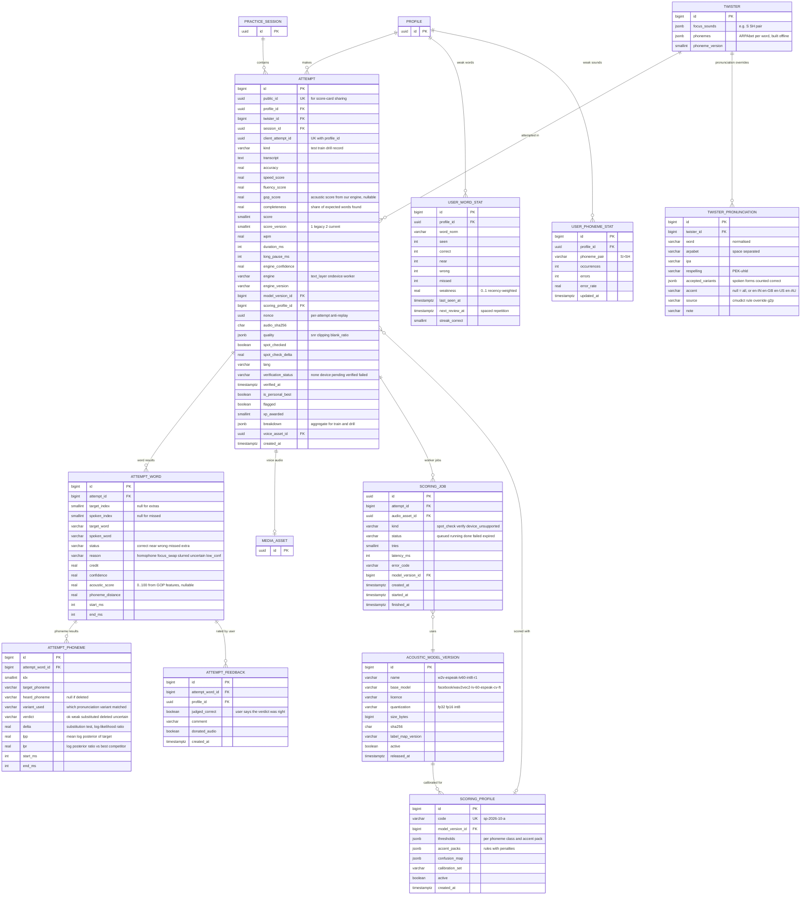

# 06b — ERD: Speak & Score (attempts, words, phonemes, engine jobs)
PRD: `03-prd-speak-and-score-mode.md` · Pipeline: `10` · Decisions: `11` (D3, D5, D8–D10)

## Traceability
| Req | Data support |
|---|---|
| S1 pre-flight | Client-only; `speak_preflight` analytics event |
| S3 alignment & statuses | `AttemptWord.status/reason/phoneme_distance`; algorithm in `10` §4 |
| S4 mistakes view | `AttemptWord` joined to `Attempt`; "what we heard" = `Attempt.transcript` + `spoken_word` |
| S5 Test vs Train | `Attempt.kind`; Train/Drill store only `breakdown` JSON (no `AttemptWord` rows) |
| S6 word drill | `UserWordStat` (weakness, `next_review_at`) drives the "practise weak words" queue |
| S7 own-voice playback | `Attempt.voice_asset_id → MediaAsset(kind=audio)`; default local-only (no row) |
| S8 history | `Attempt` + `AttemptWord` (Test/Record only) |
| S9 scoring v2 | `score_version=2`, `speed_score`, `fluency_score`, `engine_confidence`, `engine`, `verification_status` |
| S11 device / worker scoring | `verification_status`, `gop_score`, `AttemptPhoneme`, `ScoringJob`, `AcousticModelVersion`, `ScoringProfile` |
| S12 offline queue | `client_attempt_id` idempotency; `SyncBatch` (06a) |
| S13 anti-cheat / rate limit | `flagged`, `nonce`, `audio_sha256`, `spot_checked`, `spot_check_delta` |
| Feedback loop / calibration | `AttemptFeedback`, `UserConsent(model_improvement)` |
| Practice by word, sound insights (reference app) | `UserWordStat`, `UserPhonemeStat` |

## Write rules (volume control)
- **Test/Record** attempts: write `AttemptWord`; write `AttemptPhoneme` **only when scored by the device/worker engine** — ~3–4× words per twister.
- **Train/Drill**: `breakdown` JSON `{correct,near,wrong,missed,extra,words:[[idx,status]]}`, no child rows.
- `UserWordStat` and `UserPhonemeStat` are updated **in the same transaction** as the attempt (upsert), reconciled nightly from `AttemptWord`.
- `UserWordStat.weakness = 0.6·recent_error_rate + 0.4·lifetime_error_rate`; `next_review_at` follows a simple ladder (1 d, 3 d, 7 d, 14 d) reset on error.

## Constraints & indexes
- `Attempt`: `UNIQUE(profile_id, client_attempt_id)`, `UNIQUE(public_id)`; idx `(profile_id, twister_id, created_at DESC)`, `(twister_id, score DESC) WHERE verification_status='verified' AND NOT flagged AND kind='test'` (leaderboard), `(verification_status, created_at) WHERE verification_status='pending'` (retry sweeper).
- `AttemptWord`: idx `(attempt_id)`; CHECK `status IN ('correct','near','wrong','missed','extra')`.
- `AttemptPhoneme`: idx `(attempt_word_id)`; partial idx `(target_phoneme, spoken_phoneme) WHERE op='sub'`.
- `UserWordStat`: `UNIQUE(profile_id, word_norm)`; idx `(profile_id, weakness DESC)`, `(profile_id, next_review_at)`.
- `UserPhonemeStat`: `UNIQUE(profile_id, phoneme_pair)`.
- `TwisterPronunciation`: `UNIQUE(twister_id, word)`; global overrides allowed with `twister_id NULL`.
- `ScoringJob`: idx `(status, created_at)`, `(attempt_id)`; `ScoringProfile`: `UNIQUE(code)`, one active per model version; `AcousticModelVersion`: `UNIQUE(sha256)`; `AttemptFeedback`: idx `(attempt_word_id)`.

## Behaviour rules
| Rule | Detail |
|---|---|
| Trust (D8) | mastery, boards and verified-only achievements need `verified`, or `device` from a user whose spot-checks pass |
| Pending retry | `pending` older than 10 min ⇒ sweeper retries once, then `failed` (the device result stands) |
| Spot-check (D8) | ~10 % of `device` Test attempts and every would-be personal best ≥ 90 create a `ScoringJob(kind=spot_check)`; disagreement above threshold sets `flagged`; repeated disagreement disables device results for that user |
| Personal best | Computed on `verified` Test attempts only; provisional bests shown with "practice" chip |
| Version bump | Best score compared within the same `score_version`; legacy v1 shown with a badge |
| Deleting an attempt | Cascades `AttemptWord/Phoneme/Feedback`, `ScoringJob` rows, storage object removed |

## Migrations
M1: new columns on `Attempt`, `Twister.phonemes/phoneme_version`; tables `AttemptWord`, `TwisterPronunciation`. M2: backfill `kind='test'`, `score_version=1`, `verification_status='none'`, `public_id=gen_random_uuid()`. M3: `AttemptPhoneme`, `UserWordStat`, `UserPhonemeStat`, `AcousticModelVersion`, `ScoringProfile`, `ScoringJob`, `AttemptFeedback` (ahead of P2b). Build `Twister.phonemes` with a management command `build_pronunciations` (CMUdict + `TwisterPronunciation` overrides) and fail CI if any word in the seed has no pronunciation.
