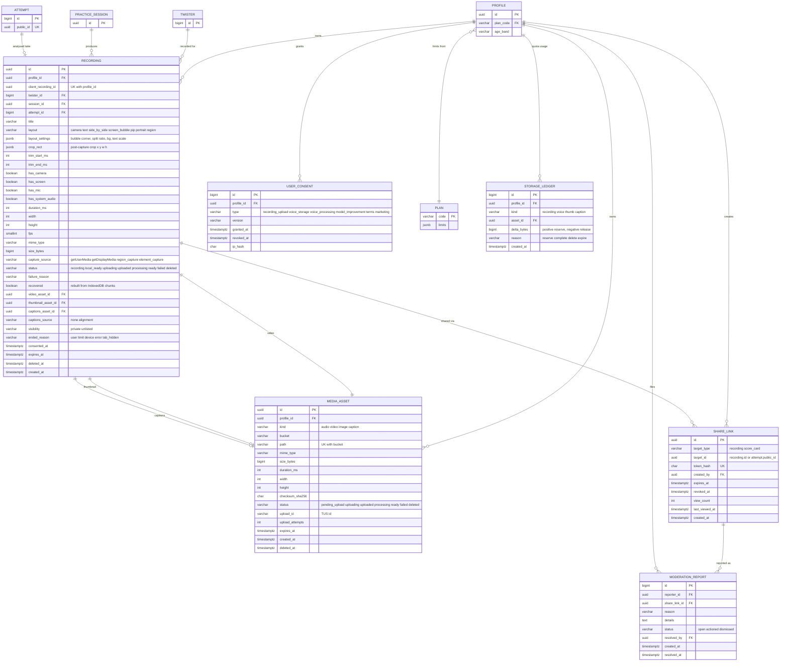

# 06c — ERD: Record mode, media, sharing & consent
PRD: `04-prd-record-mode.md` · Master model: `06` · Decisions: `11` (D1, D2, D6, D7, D14)

## Traceability
| Req | Data support |
|---|---|
| V1–V4 layouts | `Recording.layout` + `layout_settings` JSON (bubble corner, split ratio, text scale, background) — no schema change per new layout |
| V5 review page (markers) | Mistake markers derived from `AttemptWord.start_ms/end_ms` via `Recording.attempt_id`; no marker table |
| V6 download | Local only; no rows until the user saves to cloud |
| V7 chunk recovery | Client IndexedDB; on recovery the saved row gets `recovered=true` |
| V8/V9 screen / region capture | `has_screen`, `capture_source`; `crop_rect` for post-capture crop (PRD 04 §3) |
| V10 cloud save + quota | `Plan.limits`, `StorageLedger` (append-only, sum = usage), `MediaAsset` state machine, `UserConsent(recording_upload)` |
| V11 share links | `ShareLink` (hashed token, expiry, revoke, view count) |
| V12 transcode/thumbnail | `MediaAsset(kind=image/video)` derived rows; `Recording.status=processing` |
| V13 trim | `trim_start_ms/trim_end_ms` (non-destructive; applied at playback/export) |
| V14 moderation | `ModerationReport` |
| Captions | `captions_asset_id`, `captions_source='alignment'`: the target text timed by the engine's alignment (no transcription needed) |

## Fixes vs the first ERD
1. **`ShareLink.target_id` type mismatch.** `Attempt.id` is bigint but `target_id` was uuid → score cards now reference `Attempt.public_id` (uuid). Recordings use `Recording.id`.
2. **Quota accounting.** Summing `MediaAsset.size_bytes` at request time is slow and racy; the **append-only `StorageLedger`** gives atomic reserve/release (`SELECT ... FOR UPDATE` on a per-user advisory lock) and an audit trail.
3. **Idempotent creation.** `client_recording_id` prevents duplicate rows when the upload retries.

## Constraints & indexes
- `Recording`: `UNIQUE(profile_id, client_recording_id)`; idx `(profile_id, created_at DESC) WHERE deleted_at IS NULL`, `(expires_at) WHERE deleted_at IS NULL`; CHECK `trim_end_ms IS NULL OR trim_end_ms > trim_start_ms`; CHECK `duration_ms <= 600000`; plan-specific max enforced in service.
- `MediaAsset`: `UNIQUE(bucket, path)`; CHECK `size_bytes <= 100 MB`; idx `(status, created_at)`.
- `ShareLink`: `UNIQUE(token_hash)`; idx `(target_type, target_id)`; a link resolves only if `revoked_at IS NULL AND expires_at > now()` and the target is not deleted.
- `StorageLedger`: idx `(profile_id, created_at)`; usage = `SUM(delta_bytes)`; nightly compaction into a balance row.
- `UserConsent`: latest active consent per `(profile_id, type)` where `revoked_at IS NULL`.

## Behaviour rules
| Rule | Detail |
|---|---|
| Consent gate | No cloud reserve without `recording_upload` consent (current `version`); uploading voice for the worker needs `voice_processing` consent; donating audio for model improvement needs `model_improvement`; under-13 (`age_band`) blocked (D6) |
| Quota (D1) | Reserve on `POST /recordings/` (ledger `+size_estimate`), reconcile on `complete` (actual), release on delete/expire |
| Retention | `expires_at = created_at + plan.retention_days`; `expire_recordings` job soft-deletes then hard-deletes after 24 h; reminder at T-3 d |
| Share access | Playback via short-lived (≤ 1 h) signed URLs minted after token validation; never bucket-public; `noindex` |
| Account deletion (D14) | Soft-delete recordings/assets immediately; purge objects ≤ 24 h; revoke all `ShareLink`s |
| Gallery (D2) | No public listing endpoint; no `visibility='public'` value exists |

## Migrations
M4 (before P3/P4): `Recording`, `MediaAsset`, `StorageLedger`, `ShareLink`, `ModerationReport`, `UserConsent`. Storage buckets + RLS policies per `06` §5. Requires Supabase **Pro** in production (D7).
