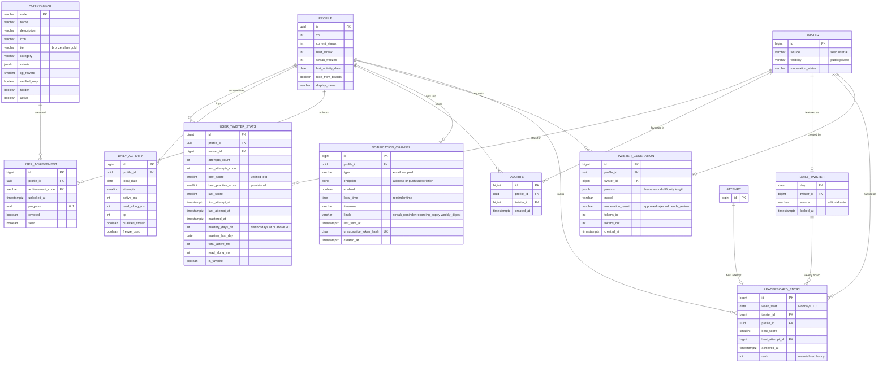

# 06d — ERD: Progress, gamification, discovery & notifications
PRD: `05-prd-progress-and-gamification.md` · Master model: `06` · Decisions: `11` (D4, D5, D11, D13, D14, D16–D19)

> **Built (core slice):** `Achievement`, `UserAchievement`, `DailyTwister`, `LeaderboardEntry`, `Profile.streak_freezes/hide_from_boards` — see `14-06d-build-spec.md`. **Not built yet:** `NotificationChannel`, `TwisterGeneration`; the `UserTwisterStats` columns `total_active_ms`, `read_along_ms`, `is_favorite` were dropped on purpose (derivable from `DailyActivity` / `Favorite`).

## Traceability
| Req | Data support |
|---|---|
| G1 home strip (mastered / streak / achievements) | `Profile.current_streak`, count of `UserTwisterStats.mastered_at IS NOT NULL`, count of `UserAchievement` |
| G2 mastery filter on Browse | `UserTwisterStats.mastered_at`; API adds `?mastery=mastered|learning|new` |
| G3 streak engine | `DailyActivity.qualifies_streak` per local date; `Profile.current_streak` is a cache; freezes: `Profile.streak_freezes` + `DailyActivity.freeze_used` |
| G4 achievements | `Achievement` catalogue (24, seeded from code) + `UserAchievement` (idempotent unlock) |
| G5 stats page | Aggregates over `DailyActivity` (activity, minutes), `Attempt` (avg score), `UserWordStat`/`UserPhonemeStat` (weak words/sounds, 06b) |
| G6 favourites / random | `Favorite`, `UserTwisterStats.is_favorite`; random = `ORDER BY random()` on a filtered id list (cached) |
| G7 facet counts + sort | Query-time on `Twister` + `Category`; no table |
| G8 score-card share | `ShareLink(target_type=score_card, target_id=Attempt.public_id)` (06c) |
| G9 Generate Twister | `TwisterGeneration` (params, model, moderation, tokens) + new `Twister(source='ai', visibility='private', moderation_status)` |
| G10 reminders | `NotificationChannel` (one-tap unsubscribe via `unsubscribe_token_hash`) |
| Daily twister (PRD 05 §2) | `DailyTwister` (editorial override else deterministic hash pick, locked at 00:00 UTC) |
| Leaderboards (D13) | `LeaderboardEntry` rebuilt hourly from verified Test attempts; opt-out via `Profile.hide_from_boards` |

## Rules (single source of truth in code; constants in config)
- **Level:** `1 + xp // 200` (function, replaceable by `200·level^1.15` later).
- **Streak day qualifies** if any: scored attempt (any kind) **or** Read-along pass ≥ 1 with ≥ 30 s active (D4). Freeze auto-consumed for one missed day (max 2 banked, earned every 7-day streak).
- **Mastery:** per D5 — verified Test ≥ 90 on `MASTERY_DAYS=2` distinct local dates inside `MASTERY_WINDOW_DAYS=30`; maintain `mastery_days_hit` + `mastery_last_day`; `mastered_at` immutable once set.
- **XP diminishing returns:** > 100 XP per twister per day earns 25 %; Read-along cap 50 XP/day.
- **Achievement evaluation** runs after the attempt transaction commits, from a small ruleset keyed by event type; unlocks are idempotent (`UNIQUE(profile_id, achievement_code)`).
- **AI-generated twisters** start `visibility='private'`; publishing publicly is not offered in v1 (D2). Prompts pass a safety filter; results pass a blocklist + length/word-count checks before save.

## Constraints & indexes
- `UserTwisterStats`: `UNIQUE(profile_id, twister_id)`; idx `(profile_id, mastered_at)`.
- `DailyActivity`: `UNIQUE(profile_id, local_date)`.
- `UserAchievement`: `UNIQUE(profile_id, achievement_code)`.
- `Favorite`: `UNIQUE(profile_id, twister_id)`.
- `DailyTwister`: PK `day`.
- `LeaderboardEntry`: `UNIQUE(week_start, twister_id, profile_id)`; idx `(week_start, twister_id, rank)`.
- `NotificationChannel`: `UNIQUE(unsubscribe_token_hash)`; idx `(enabled, local_time)`.
- `TwisterGeneration`: idx `(profile_id, created_at)`; rate limit 10/day free (config).

## Edge cases → data rules
| Case | Rule |
|---|---|
| Timezone travel | `local_date` derived from the tz sent with the attempt (validated IANA) and stored; the streak never breaks retroactively |
| Client clock skew / backdating | Server rejects `client_time` more than 5 min off from server time for scoring; `local_date` uses server time + profile tz |
| Score v1 → v2 change | Best scores compared within version; stats keep `best_score` (v2) and legacy field until backfill |
| Deleted account on leaderboard | Rows deleted (or anonymised if the user chose to keep results), then ranks recomputed |
| Achievement criteria change | Bump criteria version; never auto-revoke unlocked achievements (`revoked` only by admin) |
| Reminders vs. DND | Send within a user-chosen local hour ±30 min, max 1/day, skip if already practised today |

## Migrations
M1: `DailyActivity`, `UserTwisterStats`, `Achievement`, `UserAchievement`. M2: backfills (stats and streaks from history). M5 (P3–P5): `DailyTwister`, `NotificationChannel`, `TwisterGeneration`, `LeaderboardEntry`.
