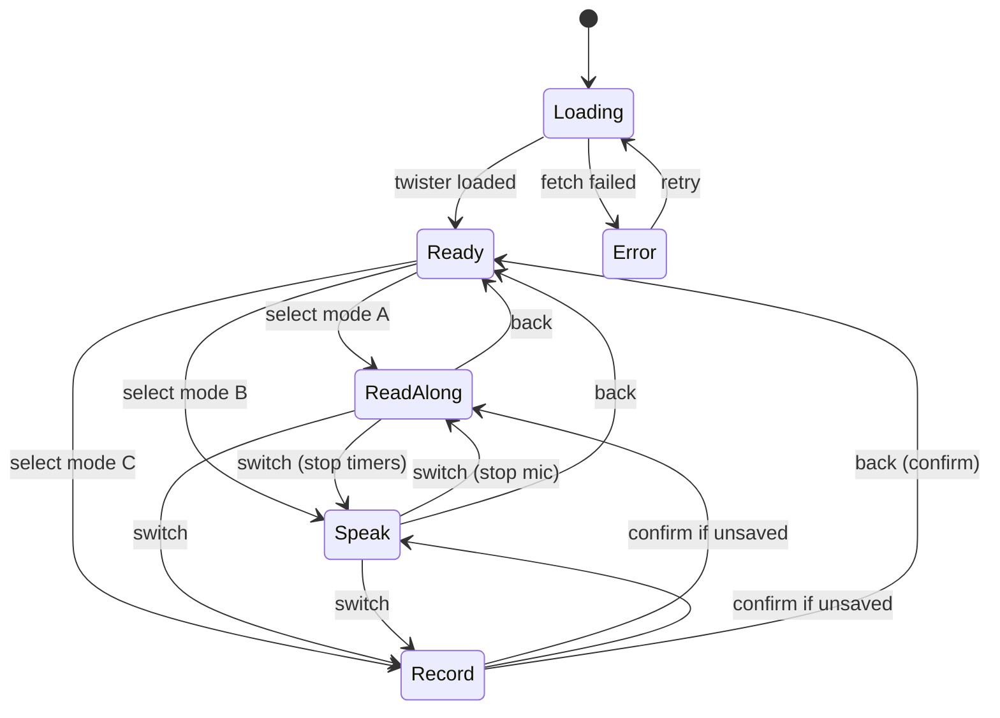
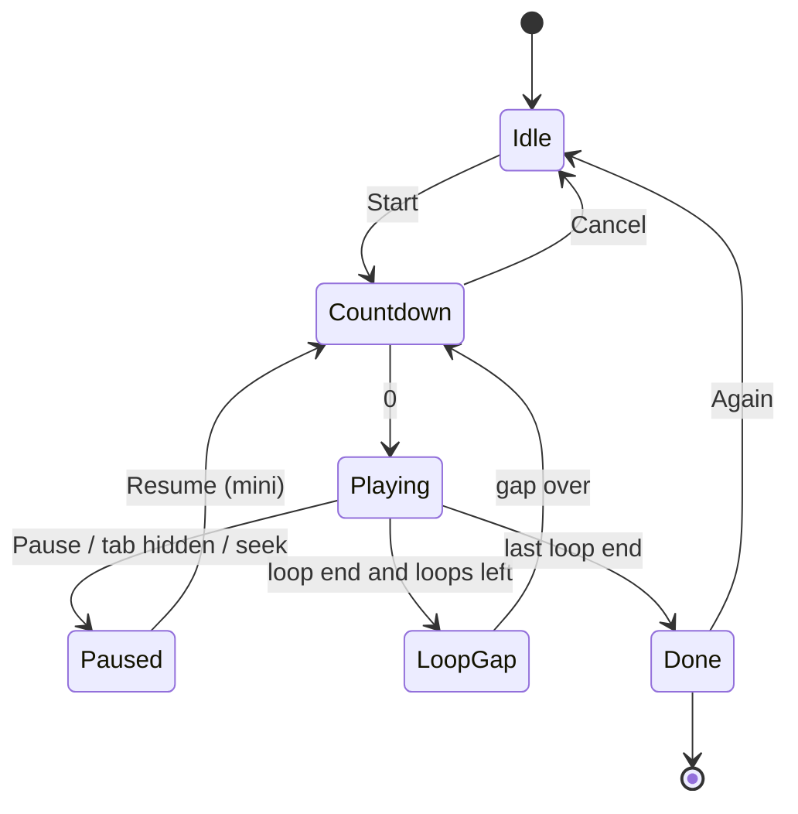
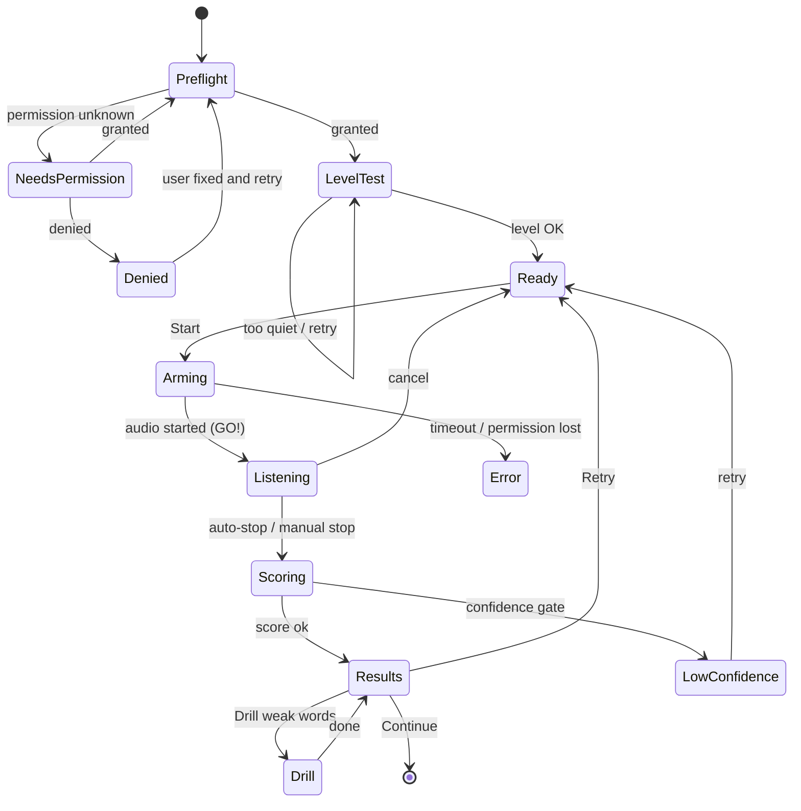
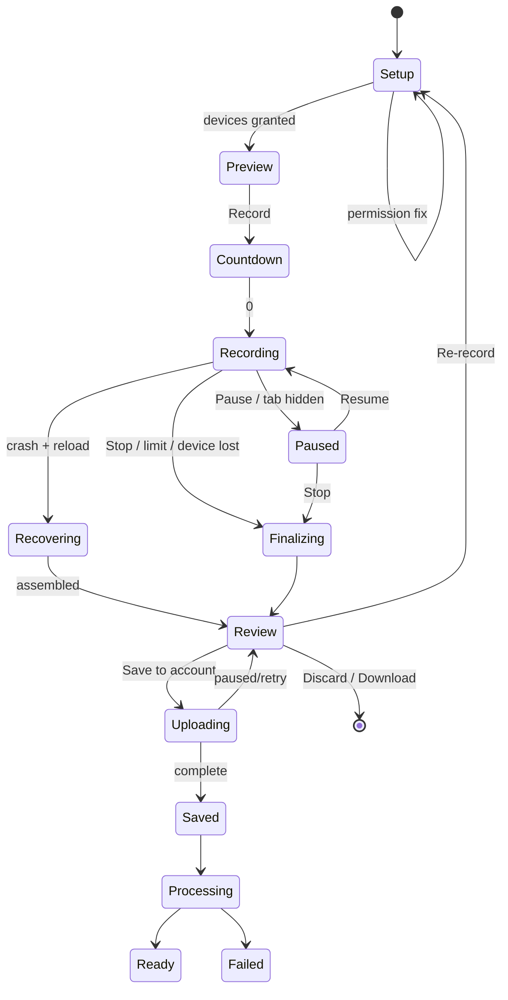

# 08 — UX Flows, State Machines, Copy & Edge-Case Catalogue

Companion to PRDs 01–05. Use this as the QA and design checklist.

## 1. Primary user journeys

### J1 — First-time guest (Aha in < 30 s)
Landing → tap **Try today's twister** → Practice Hub (Read along ready) → tap **Speak & score** → pre-flight (permission) → GO! → words light up → auto-stop → score + mistakes → "Sign in to save" soft prompt → (optional) sign in → attempt saved via `client_attempt_id`.

### J2 — Nervous beginner
Hub → **Read along** at Slow (70) → 3 loops → "Nicely paced" → **Faster +10** … → **Try Speak & score** with same pace hint → mistakes → **Drill weak words** → **Test** → mastery progress.

### J3 — Creator/presenter
Hub → **Record** → layout Side-by-side → device setup → preview → countdown → record (Read-along pacing) → stop → Review (markers, captions) → **Save** → **Share link (7 days)** → copy.

### J4 — Returning streak user
Home strip shows 🔥 4 at risk → **Random** unmastered twister → Test → score 92 (day 2 of mastery) → "Mastered ✔" celebration → achievement toast.

### J5 — Mobile, no permissions
Hub → Read along works instantly → tries Speak → mic denied → helper sheet with steps + **Stay in Read along** → later grants in settings → returns → "Mic is ready" banner.

## 2. State machines

### 2.1 Practice Hub (top-level)

### 2.2 Read along

### 2.3 Speak & score

### 2.4 Record

## 3. Copy deck (tone: warm, specific, short)

| Situation | Copy |
|---|---|
| Mic pre-permission | "We'll listen so we can check your words. Your voice stays in your browser unless you choose to save it." |
| Mic denied | "Microphone is blocked. Click the lock icon in the address bar → Site settings → Microphone → Allow, then tap Try again. Or keep going in Read along." |
| Mic busy | "Another app is using your microphone. Close it and try again." |
| Too quiet | "We can barely hear you. Move closer or raise the mic level." |
| Noisy room | "It's a bit noisy here — headphones or a quieter spot will make scoring more accurate." |
| Arming | "Getting your mic ready… wait for GO!" |
| Low confidence | "We couldn't hear you clearly, so we didn't save that score. Try again?" |
| Great score | "Tongue Titan! 96 — 8 of 8 words." |
| Mixed | "Nice — 7 of 9 words. 'pickled' tripped you twice." |
| Low | "Tangled! Let's slow down. Try the drill on 'peck', 'pickled'." |
| Camera denied | "Camera is blocked. You can still record audio only — or use Read along." |
| Tab hidden while recording | "Paused because you switched tabs. Recording needs this tab visible." |
| Recording limit | "30 seconds left of your 3-minute limit." |
| Upload failed | "Couldn't upload right now. Your recording is safe on this device — we'll retry." |
| Link expired | "This link has expired." (no owner info) |
| Quota | "You've used 4 of 5 saved recordings. Delete one to make room." |
| Offline | "You're offline. Your attempt is saved on this device and will sync later." |
| Recover | "We found an unfinished recording from earlier. Recover it?" |

## 4. Accessibility checklist
1. Mode switcher: ARIA `tablist`; arrow keys; `aria-selected`.
2. Stage text has `role="region"` + label; moving highlight uses `aria-current="true"` on the active word but announcements are throttled.
3. Results summary in plain text for screen readers; colour is never the only cue (icons, underline styles, strike).
4. Focus management: on mode switch, focus moves to the primary control; on modal open, trap focus; on close, restore.
5. All timers/recording indicators have text alternatives; no seizure-risk flashing (< 3 flashes/s).
6. Captions on recordings (`.vtt`); transcript available; speed controls in player.
7. Contrast ≥ 4.5:1 for text, ≥ 3:1 for UI; test the amber/near colour on dark and light themes.
8. Touch targets ≥ 44 × 44 px; sticky control bar respects safe-area insets.
9. Reduced motion & high-contrast preferences honoured; dyslexia font option.
10. Language attributes correct; TTS voice matches accent setting.

## 5. Edge-case catalogue (cross-mode)

### 5.1 Environment
- HTTP (non-HTTPS) origin → mic/camera APIs unavailable → show "Secure connection required" (dev on `localhost` is allowed).
- Embedded browsers (Instagram/LinkedIn in-app WebView) often block mic/camera → detect UA, show "Open in your browser" with copy-link button.
- Corporate/managed devices with mic policies → treat as denied; give admin hint.
- Privacy extensions/blocked `navigator.mediaDevices` → same as unavailable.
- Very old browsers → capability messages; Read along still works (basic ES features).
- Low bandwidth: Read along/local recording need no network after first load; uploads throttle and resume.
- Battery saver / low-power mode → frame-rate drops; show "Recording quality reduced".
- Ad blockers blocking analytics → app must never depend on analytics calls.

### 5.2 Permissions
- Denied once vs "Block" persistently: Chrome won't re-prompt; instruct via site settings.
- Permission granted then revoked mid-use: `track.onended` / `PermissionStatus.onchange` → stop cleanly and explain.
- Different devices per session: remember `deviceId` locally; if missing, fall back to default silently.
- iOS requires user gesture for every `getUserMedia`; do not call from effects.

### 5.3 Data & sync
- Guest → account merge: preferences merge by `updated_at`; favourites union; attempts submitted with `client_attempt_id`; if attempt count > 50 use batch sync.
- Clock skew (client time wrong): server time authoritative for `created_at`, streak day.
- Concurrent edits (two devices change prefs): last-write-wins with `updated_at`, no data loss on non-conflicting fields (PATCH partial).
- Twister text edited by admin after attempts exist: attempts keep a `twister_text_hash`; history shows the original text on tap (P3) to keep word statuses meaningful.
- Deleting a twister (admin) with attempts: soft-unpublish, never hard-delete.

### 5.4 Scoring
- Repeated word twisters ("toy boat toy boat") — alignment must handle repetition without double-assigning; unit test with fixtures.
- Numerals/homophones/contractions — shared normaliser & test vectors (client + server parity test in CI).
- Very quiet children voices, low-energy speakers — confidence gate tuned per-user after N samples (P3).
- Non-native accent — accent selector and accent packs (`10` §4.2); abstain rather than accuse; never claim "wrong pronunciation", only "we heard X".
- Profanity accidentally produced by recogniser on tricky twisters (a real risk!) — display transcript verbatim to the speaker only; never share/index transcripts; filter in any public surface.

### 5.5 Recording
See 04 §12 (27 items). Additional cross-cutting: never auto-play sound on load; playback volume defaults to 70 %; watermark-free in v1.

### 5.6 Sharing & abuse
- Someone shares a recording containing other people / inappropriate content → report flow, immediate disable, retention of evidence for legal hold (encrypted, restricted).
- DMCA/copyright: recordings may include copyrighted music playing in background → takedown process documented.
- Link scanning bots (Slack/WhatsApp unfurl) → OG tags show generic title + thumbnail only if the owner enabled "Show preview image"; default: generic card without face.

### 5.7 Performance
- Long lists (Attempts table with 1 000+ rows) → virtualised list + server pagination.
- Charts with > 500 points → downsample (LTTB) server- or client-side.
- Memory leaks: ensure `MediaStream` tracks stopped, `AudioContext` closed, `ObjectURL`s revoked on unmount (add leak test: 20 mode switches → heap growth < 10 MB).
- Cold-start API latency on serverless: skeletons within 100 ms; optimistic UI for favourite/prefs.

## 6. QA matrix (minimum before each phase ships)

| Area | Chrome (win/mac) | Edge | Safari mac | Firefox | Chrome Android | Safari iOS |
|---|---|---|---|---|---|---|
| Read along (all styles) | ✔ | ✔ | ✔ | ✔ | ✔ | ✔ |
| Listen-first TTS | ✔ | ✔ | ✔ | ✔ | ✔ | ✔ |
| Speak & score (Web Speech) | ✔ | ✔ | ✔ | n/a → fallback | ✔ | ⚠ verify |
| Mic pre-flight, device switch | ✔ | ✔ | ✔ | ✔ | ✔ | ✔ |
| Record L1/L2 | ✔ | ✔ | ✔ | ✔ | ✔ | ✔ |
| Record L3/L5 (canvas) | ✔ | ✔ | ✔ | ✔ | ✔ | ✔ |
| Record L4 (screen) | ✔ | ✔ | ✔ | ✔ | hidden | hidden |
| Record L7 (region) | ✔ | ✔ | hidden | hidden | hidden | hidden |
| Playback of saved video | ✔ | ✔ | ✔ (mp4) | ✔ | ✔ | ✔ (mp4) |
| Offline attempt queue | ✔ | ✔ | ✔ | ✔ | ✔ | ✔ |

Test types: unit (alignment, normaliser, timeline, streak, mastery), component (states), contract (API), e2e (Playwright with fake media devices: `--use-fake-device-for-media-stream --use-fake-ui-for-media-stream --use-file-for-fake-audio-capture=fixtures/peter-piper.wav`), visual regression on skeleton/error/empty, accessibility (axe + manual screen-reader pass on VoiceOver/NVDA), load test (k6) on attempts and recording-create, chaos (kill network mid-upload; revoke permission mid-record; unplug camera).

## 7. Empty / loading / error inventory (each must exist)
- Hub: twister skeleton, not-found, load error; prefs sync chip.
- Read along: unsupported TTS note; end-of-run state.
- Speak: unsupported browser, permission states (unknown/denied/busy/none), low-confidence, offline-saved, submit failed (kept locally).
- History: empty, loading, error, partial (offline).
- Record: unsupported, permission states, storage full, recover prompt, upload progress/failed/paused, processing, playback unsupported.
- Stats/Achievements/Favourites: empty and error for every card.
- Share: expired/revoked/removed, rate-limited.
