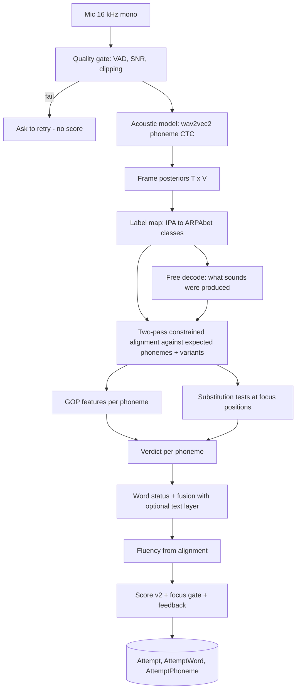

# 10 — In-house Pronunciation Engine (design)

Status: **Design — approved direction** · Owner: Pawan · Feeds: `06` (data model), `07` (API), `12` (status and plan), `11` (decisions D3, D8–D10, D15)
Supersedes the earlier vendor evaluation (removed). Facts about third-party projects were checked on 2026-09-30; items marked **(verify)** must be re-checked before relying on them.

---

## 0. Decision and constraints

We build the judge ourselves. **No paid or third-party speech APIs** (no cloud STT, no pronunciation-assessment services). We may use **open-source, permissively licensed parts** that run on our own infrastructure or on the user's device:

| Part | What we use | Licence / note |
|---|---|---|
| Acoustic model | `facebook/wav2vec2-lv-60-espeak-cv-ft` (or `…xlsr-53-espeak-cv-ft`): a CTC phoneme recogniser, IPA-like labels, no language model | Apache-2.0 (model cards) |
| Pronunciation lexicon | CMUdict (ARPAbet) + our overrides and rules | permissive licence **(verify text before redistribution)** |
| Runtime | ONNX Runtime (Web/WASM in the browser, CPU in Python) | MIT **(verify)** |
| Live word hint (optional) | Browser Web Speech API | built into the browser; Chrome sends audio to its vendor — so it is **optional and off in "private mode"** |
| Hosting for the optional worker | our own container (see §6); nothing else is required | — |

Everything below is **our code**: label mapping, lexicon variants, accent rules, CTC alignment, substitution tests, GOP features, verdict logic, fusion, scoring, feedback, calibration.

> Honest expectation. Published results for this family of methods on general learner speech are moderate: correlation with human raters ≈ 0.43–0.50 and phone-error F1 ≈ 0.41–0.62 (CTC-based GOP papers on SpeechOcean762 / MPC). We are **not** trying to grade "how native" someone sounds. Our task is narrower and easier: *given a known twister, detect the specific slips twisters provoke (S↔SH, R↔L, P↔B, dropped or swapped focus sounds) and stay quiet when the speaker is fine.* The design leans on that.

---

## 1. Why twisters break ordinary recognisers — and how we resolve each

| # | Enigma | Why it happens | Resolution in this design |
|---|---|---|---|
| E1 | **Auto-correction** ("she shells sea sells" → "she sells sea shells") | Word recognisers use a language model | Use a **phoneme CTC model with no language model**; judge sounds, not words (§4.1–4.5) |
| E2 | **Homophones** (sea/see, wood/would) | Text comparison sees different spellings | Compare **phoneme strings**; identical phonemes ⇒ correct |
| E3 | **Real-word swaps** (sells→shells) | Both are valid words | **Substitution test at the focus phoneme** using CTC likelihood of canonical vs perturbed sequence (§4.5) |
| E4 | **Confidence ≠ correctness** | A clear wrong sound has high confidence | Never use raw confidence as the verdict; use *contrast* between target and confusable (§4.5) and abstain when unsure (§4.9) |
| E5 | **Alignment slips on repetition** (twisters repeat phrases) | Forced alignment can skip or loop | **Two-pass alignment**: coarse word anchors from free decoding, then constrained Viterbi inside windows (§4.4) |
| E6 | **Accents** (en-IN, en-GB, en-US, en-AU, non-native) | Model and dictionary assume one accent | **Accent packs** = weighted rewrite rules that widen accepted variants, with **protected contrasts** so a rule can never hide the twister's own focus contrast (§4.2) |
| E7 | **Reductions in fast speech** (flapping, schwa deletion, "gonna") | Real speech ≠ dictionary form | Optional-deletion / variant arcs in the alignment graph with small penalties (§4.3) |
| E8 | **Out-of-vocabulary words** (*wuzzy*, names, AI-generated twisters) | Not in CMUdict | Suffix/compound rules → overrides file → build-time G2P for new twisters, all resolved **before** a twister is published (§4.2) |
| E9 | **Bad audio** (silence, noise, clipping, two speakers, 8 kHz Bluetooth) | Garbage in | Quality gate: VAD, SNR, clipping, sample-rate, blank-ratio → "couldn't hear you", no score (§4.9) |
| E10 | **Label mismatch** (model emits IPA/espeak, lexicon is ARPAbet) | Different phone sets | Generated, tested **label map** with posterior marginalisation (§4.1) |
| E11 | **CTC peakiness** (blank dominates; durations unreliable) | CTC is trained without timing | Use likelihood ratios and windowed posteriors, not durations, for verdicts; durations only for fluency (§4.5) |
| E12 | **Cheating / tampering** (edited client, replayed audio, TTS reading) | Client-side scoring can be forged | **Trust levels** + server spot-checks + nonces (§8) |
| E13 | **Speech differences** (lisp, stammer, child voices) | Model errors correlate with the speaker | Accessibility mode, abstention, feedback loop, fairness metrics (§7, §9) |

---

## 2. Architecture



Two runtimes execute **the same algorithm** (shared JSON fixtures; see §9):

| Runtime | Where | Role |
|---|---|---|
| **Device engine** | Web Worker in the browser (ONNX Runtime Web) | Primary accurate mode; audio never leaves the device |
| **Worker engine** | Our Python container (onnxruntime CPU) | Optional: verifies/spot-checks, serves phones that cannot run the model |
| **Tier 0** | Browser only, no model | Lexicon + text-layer comparison (Web Speech), works today |

---

## 3. Building blocks in detail

### 3.1 Acoustic model
- Output: per-frame distribution over ≈ 390 espeak-style phonetic labels (20 ms frames, 50 frames/s), blank token included. No word LM, so it reports sounds as produced.
- Size: ≈ 300 M parameters (large architecture) ⇒ ≈ 1.2 GB fp32, ≈ 300 MB int8 (arithmetic estimate, **measure after export**). Too heavy for casual phones; see §6 for gating and the plan to shrink.
- One-time task on your Mac (Hugging Face is not reachable from my sandbox): download weights, export to ONNX, quantise, publish our own copy to our storage; the app never depends on Hugging Face at runtime.

### 3.2 Lexicon
`word → [variants]`, each variant an ARPAbet list without stress. Sources in priority order: `TwisterPronunciation` override → CMUdict entry (all listed pronunciations) → suffix/compound rules (possessive, plural, -ed, -ing, compound splitting; already prototyped: 140 → 23 unknown words on the 205-twister corpus, then 7 non-words) → build-time G2P for new twisters. **A twister cannot be published while any word lacks a pronunciation** (CI + admin check).

---

## 4. Algorithms

### 4.1 Label map (IPA → ARPAbet classes)
Generated from the model's `vocab.json` by a script and frozen as `label_map.json`:
- many-to-one: `ʃ→SH`, `tʃ→CH`, `ɹ|r|ɾ→R` (with flap treated separately), `ɪ→IH`, length/stress marks stripped, `ɡ|g→G`.
- class posterior: `p_t(c) = Σ_{ℓ ∈ class(c)} p_t(ℓ)` (sum in probability space; implement as `logsumexp`). Unmapped labels go to `OTHER`.
- unit tests assert every ARPAbet phone in CMUdict is reachable and every model label is mapped or explicitly dropped.

### 4.2 Variants and accent packs
An **accent pack** is a list of rewrite rules `A → B  [context]  penalty` that add alternative variants:

| Pack | Example rules (illustrative; tuned with data) |
|---|---|
| en-IN | `TH→T (dental)`, `DH→D`, `V↔W` merged, `R` tap/trill accepted, retroflex `T/D` accepted, some vowel merger (`AE→EH`) |
| en-GB | non-rhotic `R` after vowel dropped, `T` glottalised between vowels, `AA/AO` shifts |
| en-US | flapping `T→DX` between vowels, `NT→N` ("winter") |
| en-AU | non-rhotic, vowel shifts |

**Protected contrasts (key rule):** a rule is **disabled** if it would neutralise a contrast the twister trains. If `focus_sounds` contains `th` and `f`/`t`, the en-IN `TH→T` rule is off for that twister; if it contains `w` and `v`, the `V↔W` merger is off. Accent leniency therefore never forgives the very slip the twister is about; it only stops us punishing unrelated accent features. Each pack is versioned and stored in the `ScoringProfile`.

### 4.3 Alignment graph
Expected pronunciation → a CTC token graph: for each phoneme a token node; between words optional short pause; for each word its variants as parallel branches; optional-deletion arcs for reductions (weak vowels, `/t/`,`/d/` in clusters) with penalty. Standard CTC topology (blank between repeats, self-loops) is applied on this graph. Viterbi over `T × S` states (`S` ≈ 3–4 × phoneme count); a 15 s clip (T ≈ 750) with 150 phonemes is ~10⁵–10⁶ operations — instantaneous on device.

### 4.4 Two-pass alignment (repetition-safe)
1. **Free decode**: greedy CTC (`argmax`, collapse repeats, drop blank) → recognised phone string with rough frame positions.
2. **Coarse anchors**: align the free-decoded string to the expected string with a phoneme-level edit alignment; the matched spans give a time window per word (± 150 ms, widened at edits).
3. **Constrained Viterbi inside each window** for the final phone boundaries. Monotonic; windows cannot overlap, so a repeated phrase cannot be matched to the wrong repetition. If the coarse pass finds < 50 % of words → "couldn't follow that read" (no score).

### 4.5 Features and the substitution test (the heart of it)
For phoneme `i` with aligned frames `F_i` (peak frame ± 2):

- **LPP** = mean over `F_i` of `log p_t(y_i)`.
- **LPR** = LPP − mean over `F_i` of `log max_{q≠y_i} p_t(q)`.
- **Recognised label** = highest non-blank class over `F_i` (what they actually produced).
- **Alignment-free substitution test** (robust to alignment error, cheap because only focus positions are tested): for each confusable `q ∈ C(y_i)`,

  `Δ_i(q) = log P_CTC(y | X) − log P_CTC(y[i→q] | X)`

  where `P_CTC` is the CTC forward probability of the full expected sequence vs the same sequence with phoneme `i` replaced by `q`. **`Δ_i(q)` strongly negative ⇒ the audio fits the substitution better than the target ⇒ the speaker said `q`** (e.g. `SH` where `S` was expected). `C(y_i)` comes from the confusion map: articulatory neighbours (fricative place, voicing, stop place, liquids/glides, nasals) ∪ the twister's `focus_sounds`. This is the method family of "substitution-aware alignment-free GOP"; we restrict it to a handful of positions so cost stays tiny.
- **Deletion test**: same, with the phoneme removed.
- Durations are **not** used for verdicts (E11), only for fluency.

### 4.6 Verdict per phoneme
`ok` · `weak` (slurred: LPP low but no better competitor) · `substituted(q)` (`Δ ≤ −τ_sub`) · `deleted` (`Δ_del ≤ −τ_del`) · `uncertain` (inside the abstention band). Thresholds `τ` live in the `ScoringProfile` (per phoneme class and per accent pack) and start from conservative defaults; they are **calibrated on our own labelled data** (§7). Because a false accusation is worse for retention than a missed slip, defaults favour precision: `uncertain` is shown as "not sure — try again" and never counts against the score.

### 4.7 From phonemes to words and attempts
| Condition (per word) | Status | Credit |
|---|---|---|
| all phonemes `ok` | `correct` | 1.0 |
| only non-focus `weak` | `near` (`slurred`) | 0.5 |
| any focus phoneme `substituted`/`deleted` | `wrong` (`focus_swap`) | 0 |
| non-focus substitution, one phoneme | `near` | 0.5 |
| ≥ 2 non-focus errors | `wrong` | 0 |
| word not found in its window | `missed` | 0 |
| unexpected extra speech between windows | `extra` | −0.25 |

`Score v2` unchanged: `0.7·accuracy + 0.2·speed + 0.1·fluency`. **Focus gate:** any `focus_swap` caps the attempt at **79** (below "pass" 80 and mastery 90); without it one swapped word in a six-word twister still scores ≈ 81 because speed and fluency contribute 30 points. Speed is credited only up to accuracy so mumbling fast earns nothing.

### 4.8 Fusion with the optional text layer
When Web Speech is on, its transcript is an independent second opinion on *words*:

| Acoustic verdict | Text layer | Result |
|---|---|---|
| ok | word matches | `correct` |
| ok | word differs but is a homophone/near | `correct` (acoustics win) |
| `substituted` | word differs | `wrong` (both agree, high confidence) |
| `substituted` | word matches (engine auto-corrected) | `wrong` — this is exactly E1; acoustics win |
| `uncertain` | matches | `correct` |
| `uncertain` | differs | `near`, mark uncertain |
The text layer can never turn an acoustic `substituted` into `correct`.

### 4.9 Quality gate and abstention
Reject (no score, friendly retry) when: speech shorter than 40 % of expected duration, SNR below threshold, > 1 % clipped samples, sample rate < 16 kHz before resampling (phone-call audio), blank ratio > 0.95 (nothing recognised), posterior entropy very high on > 50 % of speech frames, or coarse anchors < 50 %. Show the reason ("too quiet", "too noisy", "we couldn't follow the text — start from the top").

### 4.10 Fluency and feedback
From alignment: pauses > 700 ms between words, speech rate vs the twister's difficulty band, restarts (a free-decoded prefix repeats), hesitation sounds (filled-pause phones). Feedback is generated from the verdicts and an articulation table: *"You said /ʃ/ (as in *ship*) where /s/ was needed in **sells** — keep the tongue tip behind the top teeth and don't round your lips."* Tips are static text keyed by `(target, produced)` pairs.

---

## 5. Data contract (shared by device and worker)

```json
{
  "engine": "ondevice",
  "model_version": "w2v-espeak-lv60-int8-r1",
  "scoring_profile": "sp-2026-10-a",
  "accent": "en-IN",
  "quality": { "ok": true, "snr_db": 24.1, "clipped_pct": 0.0, "blank_ratio": 0.62 },
  "score": { "accuracy": 0.83, "speed": 0.71, "fluency": 0.9, "score": 79, "gated": true },
  "words": [
    { "i": 1, "target": "sells", "status": "wrong", "reason": "focus_swap",
      "phonemes": [
        { "t": "S", "heard": "SH", "verdict": "substituted", "delta": -4.7, "lpp": -3.1, "start_ms": 640, "end_ms": 700 },
        { "t": "EH", "heard": "EH", "verdict": "ok" }
      ] }
  ]
}
```

---

## 6. Deployment tiers, hosting and capacity

| Tier | What | When |
|---|---|---|
| 0 | Lexicon + Web Speech text layer + phoneme-aware compare (no model) | P2a, immediately |
| 1 | **Device engine**: quantised ONNX model in a Web Worker; downloaded once on opt-in ("Accurate mode"), cached (Cache Storage/IndexedDB), versioned; desktop first; needs enough memory (≥ 4 GB) — otherwise stay on Tier 0/2 | P2b |
| 2 | **Worker engine**: Python container, `onnxruntime` CPU, job queue; used for spot-checks, tamper-proof results, devices that can't run Tier 1 | P2b–P2c |
| 3 | **Our own small model**: fine-tune/distil a base-size wav2vec2 to ≤ 50 MB int8 (R&D; free GPU hours; dataset licences to review) | P5 |

**Hosting reality check (2026-09-30):** free worker hosting is unreliable — Oracle's Always Free ARM allowance was reduced from 4 OCPU/24 GB to 2 OCPU/12 GB in June 2026 without an announcement; the Hugging Face docs page I fetched lists Gradio/Docker Spaces as requiring a paid plan (free CPU Basic is 2 vCPU/16 GB but sleeps) **(verify both)**. So the design **never depends on a free host**: Tier 1 needs no server; Tier 2 is a plain container that can run on any small VPS, a home machine, or a free host that happens to exist, behind the same queue API.

**Capacity sketch:** a third-party open implementation of CTC-forced-alignment + GOP on this model reports ≈ 3.9× real-time on a single CPU core **(verify on our export)**; a 15 s clip ⇒ ≈ 4 s/core ⇒ a 2-core box ≈ 30 clips/min ≈ 40 k clips/day — ample for spot-checks of ~10 % of attempts.

Tier 1 caveats: WebGPU is not automatically faster for wav2vec2 (an ONNX Runtime issue reports it slower than WASM) — default to WASM SIMD + threads, feature-detect, benchmark per device class.

---

## 7. Calibration, evaluation and the data flywheel

We have no vendor "ground truth", so we build our own:

1. **Gold set (week 1 of P2b):** 6+ speakers (≥ 3 en-IN, plus en-US/en-GB, ≥ 2 non-native) × 12–20 twisters × {clean, fast, *scripted swap* ("say *shells* instead of *sells*"), slur}. Labels are known by construction. Recorded through a `/dev/calibrate` page inside the app behind a flag (not a separate tool).
2. **Posterior fixtures:** store the frame-posterior matrices (float16) for each gold clip so the scorer is regression-tested **without the model** and thresholds can be tuned offline in seconds.
3. **Targets (acceptance to enable Accurate mode):** focus-swap **recall ≥ 85 %**; false accusation on clean reads **≤ 5 %**; accent gap (mean clean score) **≤ 8 pts**; median device latency ≤ 3 s per 15 s clip on a mid-range laptop.
4. **Opt-in feedback loop:** per-word "Was this right? 👍/👎" (`AttemptFeedback`) and an explicit consent to donate audio for improving the model (`UserConsent(type=model_improvement)`); donated clips are human-labelled and feed threshold recalibration and, later, Tier 3 training.
5. **Fairness dashboards:** false-accusation and abstention rates by accent, age band, device class; alert when any group exceeds 1.5× the overall rate.

---

## 8. Trust, privacy and anti-cheat

| Level | Meaning | Counts toward |
|---|---|---|
| `provisional` | Tier 0 only (text layer) | practice score, history |
| `device` | Scored by the device engine | practice + streak; mastery if spot-checks pass (below) |
| `verified` | Re-scored by the worker | mastery, achievements, weekly boards |

- **Spot-checks:** for signed-in users, a random ~10 % of device-scored Test attempts (plus every attempt that would set a personal best ≥ 90 or a leaderboard entry) upload the audio (with consent) for the worker to re-score; large disagreement ⇒ `flagged`, and repeated disagreement ⇒ device results stop counting for that user.
- **Replay/edit resistance:** server issues a per-attempt nonce with the twister version; result must echo it; the audio hash is sent with the result; duplicate hashes are rejected.
- **TTS-reading detection:** cheap heuristics (perfectly regular timing, no breath/room noise) raise the spot-check probability; no claim of certainty.
- **Privacy:** Tier 1 keeps audio on the device; uploads only with `UserConsent(type=voice_processing)`; retention 24 h unless the user saves the take; 13+ only; donated audio is separate consent and separately deletable.

---

## 9. Testing strategy

- **Unit:** label map coverage, lexicon rules, variant generation, protected-contrast logic, CTC forward/Viterbi against a reference implementation, verdict thresholds.
- **Synthetic posteriors:** generate `T×V` matrices from a phoneme string with controlled noise, substitutions, deletions, repeats, reductions; assert detection and abstention behaviour. This runs with **no model and no audio** and is the first thing to build.
- **Cross-runtime parity:** the TypeScript and Python scorers consume the same fixtures and must agree on every verdict and to ±1 score point.
- **Gold-set regression:** posterior fixtures from §7 run in CI.
- **Property tests:** monotonic alignment; silence ⇒ abstain; adding noise never turns `substituted` into `ok`; identical input ⇒ identical output (no randomness).

---

## 10. Edge cases (engine-level)

| Case | Behaviour |
|---|---|
| Silence / room noise only | Quality gate fails: "We didn't hear anything" |
| Whisper / very quiet | SNR gate: "Too quiet — move closer" |
| Clipping / shouting | Clip gate with tip; score still possible if < 1 % |
| Two voices / TV in background | High-entropy frames + anchor failure ⇒ retry; never score |
| Reads only part of the twister | Missing words `missed`, honest partial score; if < 40 % covered ⇒ retry |
| Starts mid-way / skips a line | Coarse anchors find the contiguous span; skipped lines `missed` |
| Repeats a line | Extra window ⇒ `extra` words (small penalty), or ignore if the repeat is a clean re-attempt (best window wins; setting) |
| Stammer / restart mid-word | Restart detected; scored on the best complete pass; no penalty beyond fluency |
| Extra words / commentary ("um, okay") | Filler phones ignored; other extras `extra` |
| Very fast or very slow | Alignment windows adapt; speed score handles it; extreme slow ⇒ still scored |
| Child voice / low-quality mic | Higher abstention allowed; never harsher verdicts; fairness metric tracks it |
| Lisp or speech impairment | **Accessibility mode**: completion-based scoring, phoneme verdicts hidden or advisory |
| Non-native accent | Accent pack + protected contrasts; abstain rather than accuse |
| Model not downloaded / offline / low memory | Fall back to Tier 0 with a clear "Basic scoring" badge; never block practice |
| Worker down or queue slow | Device result stands; spot-check retried later; UI shows nothing alarming |
| Clock skew / replayed upload | Nonce and audio-hash checks reject; attempt saved as practice only |
| Tab hidden mid-recording | Recording pauses; resumes or discards per setting |
| New twister with unknown word | Cannot publish until pronunciation exists |
| Numbers/abbreviations in text | Normaliser expands (`10`→`ten`) before lexicon lookup |

---

## 11. Build phases (replaces the vendor plan)

| Phase | Deliverable | Needs model? |
|---|---|---|
| **E3-1** | Normaliser + lexicon + rules + `build_pronunciations`, CI check that every published word has a pronunciation; phoneme-aware text compare with focus strictness (client + server) | No |
| **E3-2** | Synthetic-posterior test bench; CTC forward/Viterbi, two-pass alignment, substitution tests, verdict logic, fusion, scoring (Python first, then TS port with shared fixtures) | No |
| **E3-3** | Model export/quantise (on your Mac), label map generation, size/latency benchmark on real devices | Yes (one-time HF download on your side) |
| **E3-4** | Device engine in a Web Worker, model cache/versioning, "Accurate mode" UI, quality gate, device gating | Yes |
| **E3-5** | Calibration page, gold-set collection, threshold tuning, feedback UI, fairness dashboards | Yes |
| **E3-6** | Worker container, queue, spot-check flow, `verified` trust level | Yes |
| **P5** | Tier 3 small-model R&D | — |

E3-1 and E3-2 need no model and no audio, so they can start immediately and de-risk most of the logic.

---

## 12. Risks

| Risk | Mitigation |
|---|---|
| Model too large for many devices | Opt-in Accurate mode, device gating, Tier 0/2 fallbacks, Tier 3 small model |
| Detection quality below targets | Restrict claims to focus-sound slips, abstention band, precision-first thresholds, calibration on own data |
| Accent bias | Protected-contrast accent packs, fairness dashboards, feedback loop |
| Free hosting disappears | No dependency: Tier 1 is serverless; Tier 2 is a portable container |
| Licence surprises (lexicon, datasets, model) | Verify before shipping; keep our own copies with licence files |
| Engineering scope | Phase gates; E3-1/E3-2 are model-free and independently valuable |

---

## Sources
- Parikh et al., *Enhancing GOP in CTC-Based Mispronunciation Detection with Phonological Knowledge* — https://arxiv.org/html/2506.02080v2
- CTC forced alignment + GOP on wav2vec2 (open implementation, ≈3.9× real-time single core, r = 0.431) — https://github.com/Victus0904/phoneme-mispronunciation-detection
- `facebook/wav2vec2-lv-60-espeak-cv-ft` — https://huggingface.co/facebook/wav2vec2-lv-60-espeak-cv-ft · `facebook/wav2vec2-xlsr-53-espeak-cv-ft` — https://huggingface.co/facebook/wav2vec2-xlsr-53-espeak-cv-ft
- torchaudio CTC forced alignment tutorial (note the API deprecation; we implement our own) — https://docs.pytorch.org/audio/stable/tutorials/forced_alignment_tutorial.html
- Oracle Always Free Ampere A1 reduction — https://www.infoq.com/news/2026/07/oracle-cloud-free-tier-limits/
- Hugging Face Spaces overview — https://huggingface.co/docs/hub/en/spaces-overview
- ONNX Runtime issue: wav2vec2 slower on WebGPU than WASM — https://github.com/microsoft/onnxruntime/issues/21618
