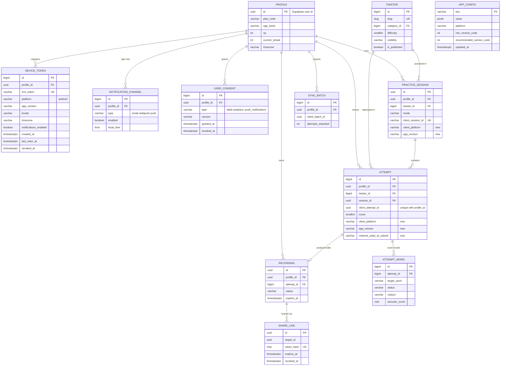

# Twister Android App: Entity Relationship Diagram

**Status:** v0.1 draft · **Owner:** Pawan · **Last updated:** 2026-10-03 · **Product requirements:** [PRD-android.md](PRD-android.md)

Extends [ERD.md](../ERD.md) and the master model in [features/06-erd-practice-features.md](../features/06-erd-practice-features.md). The Android app reuses the Supabase Postgres model that the Practice Suite already defines and adds one server table for push tokens, one for remote app configuration, and a device-local store for offline use.

## Diagram

Only `DEVICE_TOKEN` and `APP_CONFIG` are new tables. Fields marked "new" are nullable columns added to existing tables. Other existing tables (preferences, stats, achievements, boards, moderation, scoring jobs, model versions) do not change.

## 1. Server entities: new and changed

| Entity | Change | Key columns | Notes |
| --- | --- | --- | --- |
| `DeviceToken` | New | `id`, `profile_id` FK, `fcm_token` UK, `platform` (android), `app_version`, `device_model_family`, `locale`, `timezone`, `notifications_enabled`, `created_at`, `last_seen_at`, `revoked_at` | One profile has many devices; token upserted at app start and on FCM refresh; revoked on sign out, on FCM `UNREGISTERED`, and on account deletion |
| `NotificationChannel` | Extended | Add `type = push` beside `email` and `webpush`; reuses `enabled`, `local_time` | Reminder preferences stay in one place; `DeviceToken` carries delivery addresses only |
| `AppConfig` | New | `key` PK, `value` jsonb, `platform`, `min_version_code`, `recommended_version_code`, `updated_at` | Read by `GET /api/v1/app-config/`; powers forced update, kill switches and WebView minimum |
| `Attempt` | Extended | Add `app_version`, `client_platform` (web, android), `network_state_at_submit` (online, offline\_queued) | Used to analyse offline-queued attempts and spot platform specific scoring drift; nullable, no backfill |
| `PracticeSession` | Extended | Add `client_platform`, `app_version` | Same purpose as above |
| `UserConsent` | Reused | `type` gains `analytics` and `push_notifications` | Consent screen at first run writes these with a version |
| `Profile` | Reused | No change | Keeps `id = Supabase user id`; `age_band` required before cloud features |
| `MediaAsset`, `Recording`, `ShareLink`, `ModerationReport` | Reused | No change | Cloud recording stays behind flags `record_cloud` and `share_links` |

## 2. Relationships and rules that matter on mobile

- A `Profile` has many `DeviceToken` rows and many `Attempt` rows; deleting a profile cascades to both, as the 30-day deletion purge already does for the other tables.
- `Attempt.client_attempt_id` plus `profile_id` is unique, so an attempt retried five times from a flaky connection creates exactly one row. The API replays the original response with `Idempotent-Replay: true`.
- `PracticeSession.client_session_id` is unique per profile for the same reason.
- `DeviceToken.fcm_token` is globally unique; registering a token that belongs to another profile (shared device) moves it to the new profile and revokes the previous link in one transaction.
- Attempts made offline by a guest are imported once through `SyncBatch` (`client_batch_id`), then attached to the profile; the local copies are marked synced, not deleted, until the next successful pull.
- Row level security stays deny-all on every public table, with Django as the only database client (existing rule).
- Indexes added: `DeviceToken(profile_id)`, `DeviceToken(fcm_token)` unique, `DeviceToken(last_seen_at)` for stale token pruning, `Attempt(profile_id, client_attempt_id)` unique.
- Retention: prune `DeviceToken` rows with no `last_seen_at` in 60 days; keep `Attempt` metadata per the existing deletion policy; audio and video follow the plan limits (5 recordings, 3 min, 100 MB, 30 days).

## 3. Device-local store (IndexedDB, version 1)

The local store is a cache and a write-ahead queue, never the source of truth for XP, level, streak, mastery or verification status.

| Local store | Key | Fields | Purpose | Cleanup |
| --- | --- | --- | --- | --- |
| `twisters` | `slug` | Public catalogue row, `etag`, `fetched_at` | Browse, Daily and Read along offline | Replace on delta refresh |
| `categories` | `slug` | Name, emoji, sort order | Filters offline | Replace on refresh |
| `attempts` | `client_attempt_id` | Full attempt, words, `sync_status` (pending, synced, rejected), `server_id` | History offline and the source for the outbox | Keep 90 days after sync |
| `outbox` | `id` | `type`, payload, `idempotency_key`, `attempts`, `next_retry_at`, `status` | Retry-safe writes | Remove on success; dead-letter after 3 consecutive 422 |
| `preferences` | `profile_id` or `guest` | All `UserPreference` fields, `updated_at` | Settings available at launch | Never purged |
| `session_state` | `session_id` | Current take, loop count, active ms | Survive process death | Delete on completion |
| `take_chunks` | `take_id`, `index` | Audio or video chunk blob | Crash recovery for Record | Delete after save or 24 h for guests |
| `model_cache` | `sha256` | ONNX model bytes, `label_map_version` | On-device engine | Evict old versions |
| `flags` | `code` | Evaluated flag map, `fetched_at` | Flags work offline for 24 h | Replace on refresh |

## 4. Migration plan

1. Add `DeviceToken`, `AppConfig` and the nullable columns on `Attempt` and `PracticeSession` in one backward compatible Django migration (additive, no table rewrites; add indexes `CONCURRENTLY` on production).
2. Deploy the API first, then the app; the web client continues to work because every new field is optional.
3. Seed `AppConfig` with `min_version_code`, `recommended_version_code`, `min_webview_major`, and kill switches for push and cloud recording.
4. Run `manage.py migrate --plan` in CI against a Postgres copy; keep the rollback as dropping the new columns and tables, which does not affect existing features.

## Sources

 Repository documents read for this plan: `docs/PRD.md`, `docs/ERD.md`, `docs/ARCHITECTURE.md`, `docs/features/00-overview-and-roadmap.md`, `docs/features/06-erd-practice-features.md`, `docs/features/07-api-contract.md`, `docs/features/11-decisions-log.md`, `docs/features/12-implementation-status.md`, `docs/features/15-rollout-and-flags.md`. Play requirements checked on 2026-10-03: [target API level](https://developer.android.com/google/play/requirements/target-sdk), [testing requirement for new personal accounts](https://support.google.com/googleplay/android-developer/answer/14151465?hl=en), [account deletion](https://support.google.com/googleplay/android-developer/answer/13327111?hl=en-GB).
